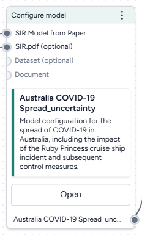
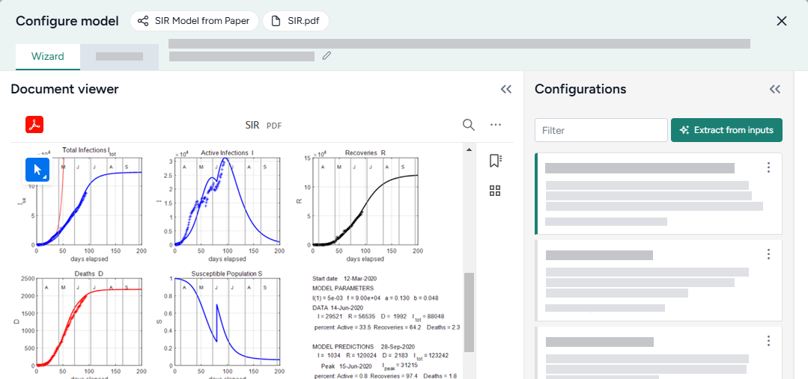
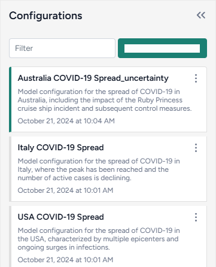
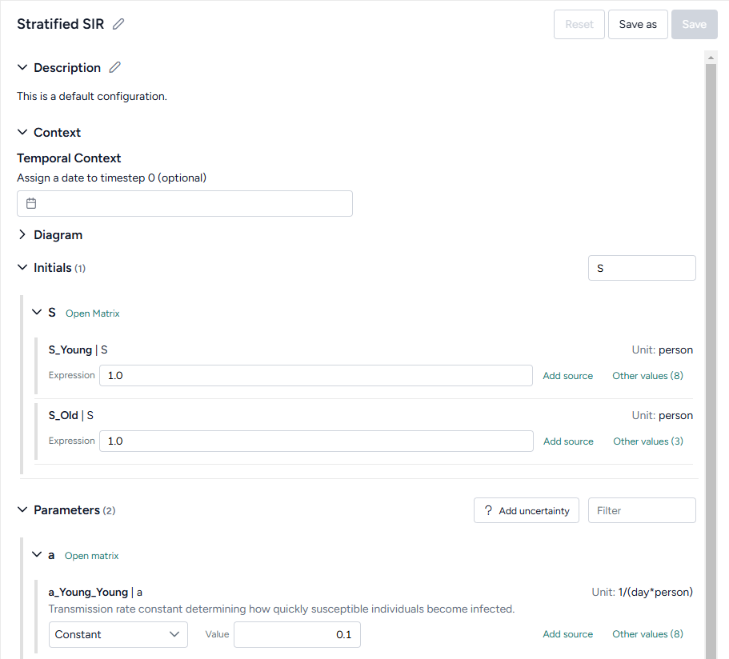
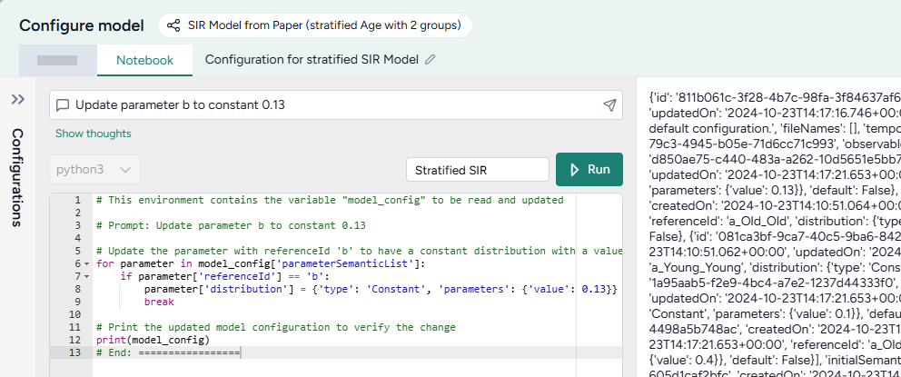

# Configure a model

Before running a simulation, you need to configure your model by setting the initial values and parameters for the condition you want to test. You can use the Configure model operator to:

- Automatically extract a configuration from an optional document or dataset.
- Manually enter values and account for uncertainty in any downstream simulations.
- Select from previously saved configurations in the current project.

## Configure model operator

In a workflow, the Configure model operator takes a model as an input and outputs a model configuration. You can also input an optional document or dataset (such as a contact matrix or initial populations) from which to automatically extract variable and parameter values.

Once you have selected a configuration, the operator in the workflow shows its name and description.



<div class="grid cards" markdown>

-   :material-arrow-collapse-right:{ .lg .middle aria-hidden="true" } __Inputs__

    ---

    - [Model](../modeling/index.md)
    - Documents (optional)
    - [Datasets](../datasets/index.md) (optional)

-   :material-arrow-expand-right:{ .lg .middle aria-hidden="true" } __Output__

    ---

    - Model configuration

</div>

??? list "Add the Configure model from equations operator to a workflow"

    1. Do one of the following actions:
    
        - On a resource or operator that outputs a model, click <span class="sr-only" id="link-icon-label">Link</span> :octicons-plus-24:{ title="Link" aria-labelledby="link-icon-label" } > **Configure model**.
        - Right-click on the workflow graph, select **Config & Intervention** > **Configure model**, and then connect the output of a model to the Configure model input.
    
    2. If needed, connect the output of a Document or Dataset to the Configure model inputs.

## Configure a model

Configuring a model tailors it to meet the requirements of your simulations, calibrations, and analyses. The Configure model operator adapts to your level of coding experience. You can configure a model using:

- A [wizard view](#use-the-wizard-to-configure-a-model) with the most common settings.
- A [code notebook](#use-the-notebook-to-configure-a-model) with an interactive AI assistant.

??? list "Open the Configure model operator"

    - Make sure you've connected a model to the Configure model operator and then click **Open**.

??? list "Edit the name and description of a configuration"

    To help you understand your workflow at a glance, the name and description of the selected model configuration appear on the Configure model operator in the notebook. You can update these in the wizard to provide more context.

    1. To change the title, click <span class="sr-only" id="edit-icon-label">Edit</span> :octicons-pencil-24:{ title="Edit" aria-labelledby="edit-icon-label"}, enter a unique name, and press ++enter++.
    2. To change the description: 

        1. Click <span class="sr-only" id="expand-icon-label">Expand</span> :fontawesome-solid-angle-right:{ title="Expand" aria-labelledby="expand-icon-label"} to expand the Description section if necessary.
        2. Click <span class="sr-only" id="edit-icon-label">Edit</span> :octicons-pencil-24:{ title="Edit" aria-labelledby="edit-icon-label"}, enter a unique name, and then click <span class="sr-only" id="apply-icon-label">Apply</span> :octicons-check-24:{ title="Apply" aria-hidden="true" aria-labelledby="apply-icon-label"}.
        3. Click **Save**.

### Use the wizard to configure a model

Use the wizard view of the Configure model operator to:

- [Extract a configuration from project resources](#extract-a-model-configuration-from-a-document-or-dataset).
- [Select from previously saved configurations](#choose-an-existing-model-configuration).
- [Manually enter or edit configurations](#edit-or-create-a-model-configuration).

#### Extract a model configuration from a document or dataset

You can use the wizard to automatically attempt to extract variable and parameter values from any attached documents or datasets.



??? list "Extract a configuration from a document or dataset"

    1. Click **Extract from inputs**.
    2. Review and edit any of the extracted initial or parameter values as needed.

#### Choose an existing model configuration

Each time you create a configuration for a model, Terarium saves it to your project. Whenever you add or edit a Configure model operator, you can quickly select any of the existing configurations.



??? list "Search the available model configurations"

    - In the Configurations panel, use the Filter field to search for keywords in configuration names and descriptions.

??? list "Choose an existing model configuration"

    1. Review the Configurations on the left. Click a configuration name to select it and review its values.
    2. Close the Configure model wizard.

#### Edit or create a model configuration

When you edit or create a model configuration, you can set a start date for its timeline, customize initial state and values, and apply uncertainty.



???+ tip

    - The card for the selected configuration in the Configurations panel shows if any of the initials or parameters are missing values. Review this before you finish your configuration to make sure you don't miss anything.
    - To manually copy configuration values from an attached document, click <span class="sr-only" id="expand-icon-label">Expand</span> :fontawesome-solid-angles-right:{ title="Expand" aria-labelledby="expand-icon-label" } to expand the Document viewer so you can review the paper while making your updates.

??? list "Set a start date for the model's timeline"

    ???+ tip

        Before setting the start date for the model, make sure you've [edited the model metadata](../modeling/review-and-enrich-model.md) to specify the units (days, months, or years) for each timestep.

    If your model includes a time component, you can assign a date to the starting timestep (*0*). This allows you to view and select start and end dates in downstream simulations, calibrations, or interventions.

    - Click inside the <span class="sr-only" id="date-icon-label">Date</span> :octicons-calendar-24:{ title="Date" aria-labelledby="date-icon-label"} field and choose a start date from the calendar. 

??? list "Search the model states and parameters"

    - Click inside the **Filter** field for Initials or Parameters and type the name of the state or parameter you're looking for.

        ???+ note

            The filter works only with original, unstratified state and parameter names. To find a stratified state or parameter, search using the name of the original state or parameter it was derived from.

??? list "Edit the initial value of a model state"

    You can edit the initial values of model state variables either as numeric values or as expressions involving other states or parameters. Initials written as expressions must follow [SymPy](https://docs.sympy.org/latest/tutorials/intro-tutorial/basic_operations.html) :octicons-link-external-24:{ alt="External link" title="External link" } syntax.

    1. If your state variable is stratified, click <span class="sr-only" id="expand-icon-label">Expand</span> :fontawesome-solid-greater-than:{ title="Expand" aria-labelledby="expand-icon-label" } to show the stratified states.

        ???+ tip

            To set all the stratified variables at once, copy a range of values from a spreadsheet, click **Open matrix**, and then click **Paste**.

    2. Do one of the following actions:

        - Enter a numeric value or a [SymPy](https://docs.sympy.org/latest/tutorials/intro-tutorial/basic_operations.html) :octicons-link-external-24:{ alt="External link" title="External link" } expression in the **Expression** field.
        - Click **Other values**, select a value from another model configuration, and then click **Apply selected value**.

    3. (Optional) Click **Add source** and enter an explanation for how or why you came up with the value.

??? list "Edit the value of a parameter"

    1. If your parameter is stratified, click <span class="sr-only" id="expand-icon-label">Expand</span> :fontawesome-solid-greater-than:{ title="Expand" aria-labelledby="expand-icon-label" } to show the stratified parameters.

        ???+ tip

            To set all the stratified parameters at once, copy a range of values from a spreadsheet, click **Open matrix**, and then click **Paste**.

    2. Choose the type of value to enter:

        - To enter a single unchanging value, select **Constant** and enter the value.
        - To enter a range of possible values, select **Uniform** and enter the minimum and maximum possible values.
        - Alternatively, click **Other values**, select a value from another model configuration, and then click **Apply selected value**.

    3. (Optional) Click **Add source** and enter an explanation for how or why you came up with the value.

??? list "Add uncertainty to parameters"

    You can quickly add uncertainty to all or some of your parameters with constant values.

    1. Click :fontawesome-solid-question:{ aria-hidden="true" } **Add uncertainty**.
    2. Enter a percentage value for the uncertainty range. For example, if the parameter's value is `1` and you set the uncertainty to `10%`, the parameter becomes a uniform distribution between `0.9` (Min) and `1.1` (Max).
    3. Select the parameters that you want to apply uncertainty to and then click :octicons-pencil-24:{ aria-hidden="true"} **Apply**.

        ???+ note

            You cannot apply uncertainty to parameters that are already uniform distributions.

### Use the notebook to configure a model

In the notebook, you can prompt an AI assistant to: 

- Describe the model's configuration
- Modify parameters, initial conditions, and other attributes of the model.



You can edit anything the assistant creates or add your own custom code.

???+ tip

    The assistant can be helpful when you need to set expressions or values that are the product of complicated formulas. 

??? list "Open the Configure model notebook"

    - Click **Notebook**.

#### Prompt the AI assistant to configure a model

The Configure model AI assistant interprets plain language to answer questions about or stratify your model.

???+ tip

    The AI assistant can perform more than one command at a time.

??? list "Ask the AI assistant a question about your model configuration"

    1. Click in the text box at the top of the page, enter your question, and then click <span class="sr-only" id="submit-icon-label">Submit</span> :octicons-paper-airplane-24:{ style="transform: rotate(-45deg);" title="Submit" aira-labelledby="Submit" }.
    2. Click **Show thoughts** to view the answer.

??? list "Prompt the AI assistant to configure your model"

    1. Click in the text box at the top of the page and then do one of the following actions:
        - Select a suggested prompt and edit it to fit your model and the configuration you want to make.
        - Describe the configuration you want to make. 
    2. Click <span class="sr-only" id="submit-icon-label">Submit</span> :octicons-paper-airplane-24:{ style="transform: rotate(-45deg);" title="Submit" aira-labelledby="Submit" }.
    3. Review and edit (if necessary) the generated configuration code.

        ???+ note

            In some cases, the AI assistant may ask for clarifying questions before generating code. For example, if you ask to update a stratified parameter by its original name, it may ask if you want to update all the stratified parameters or only one. In these cases, update your prompt as needed and then click <span class="sr-only" id="submit-icon-label">Submit</span> :octicons-paper-airplane-24:{ style="transform: rotate(-45deg);" title="Submit" aira-labelledby="Submit" } again.

    4. Click :material-play-outline:{ aria-hidden="true" } **Run**.
    5. Click **Wizard** and find the modified initials or parameters to verify that they were correctly updated. 

#### Add or edit code

At any time, you can edit the code generated by the AI assistant or enter your own custom code.

??? list "Add or make changes to model configuration code"

    1. Directly edit the python code. 
    2. Click :material-play-outline:{ aria-hidden="true"} **Run**.

#### Examples of AI-assisted model configurations

The following examples show how to prompt the Configure model AI assistant to make commonly used configurations.

??? list "Ask a question about the current model configuration"

    ```{ .text .wrap }
    What are the model parameters and current values?
    ```

??? list "Set a range of values for a model parameter to account for uncertainty"

    ```{ .text .wrap }
    Update parameter beta to a uniform distribution with max 0.5 and min 0.2
    ```

## Save a model configuration

By default, any changes you make to initials or parameters are automatically saved to the configuration selected in the Configurations panel. Saved model configurations appear any time you connect the model to a Configure model operator in your project. The selected configuration becomes the output of the Configure model operator.

??? list "Save your edits as a new model configuration"

    1. Click **Save as**.
    2. Enter a unique name for your configuration and click **Save**.

??? list "Undo your edits"

    - Click **Reset**.

??? list "Choose a different output for the Configure model operator"

    - Select a configuration from the Configurations panel.

??? list "Download a model configuration"

    ???+ note

        You can import downloaded model configurations into other projects. Doing so recreates the model from which the configuration was derived.

    - In the Configurations panel, click <span class="sr-only" id="menu-icon-label">Menu</span> :fontawesome-solid-ellipsis-vertical:{ title="Menu" aria-labelledby="menu-icon-label" } > :octicons-download-24:{ aria-hidden="true" } **Download**.

## Use the model configuration output

With the configure model output, you can:

- [Edit a model](../modeling/edit-model.md)
- [Stratify a model](../modeling/stratify-model.md)
- [Validate a model configuration](validate-model-configuration.md)
- [Simulate a model](../simulation/simulate-model.md)
- [Simulate ensemble](../simulation/simulate-ensemble.md)
- [Calibrate a model configuration](../simulation/calibrate-model.md)
- [Calibrate ensemble](../simulation/calibrate-ensemble.md)
- [Optimize an intervention policy](../modeling/edit-model.md)