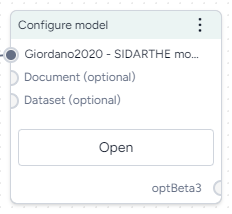
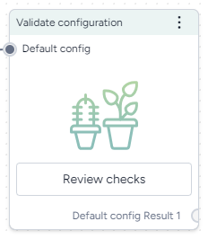

# Configure and validate a model

Before you can simulate a model, you need to configure it to set the initial values and parameters for the condition you want to test. You can use the Configure model operator to:

- Select from previously saved configurations used in the current project.
- Automatically extract a configuration from an optional document or dataset.
- Manually enter values and account for uncertainty in any downstream simulations.

## Create a model configuration

### Configure model operator

The Configure model operator takes a model as an input and outputs a model configuration. You can manually enter the variable and parameter values for the output configuration or automatically extract them from an optional document or dataset (such as a contact matrix or initial populations) input.

-   :material-arrow-collapse-right:{ .lg .middle aria-hidden="true" } __Inputs__

    ---

    - Model
    - Document (optional)
    - Dataset (optional)

-   :material-arrow-expand-right:{ .lg .middle aria-hidden="true" } __Outputs__

    ---

    - Model configuration

???+ list "To configure a model"

    1. Add the model to a workflow graph.
    2. (Optional) Add a document or dataset from which you want to extract configuration values.
    2. Right-click anywhere on the workflow graph and select **Config & Intervention** > **Configure model**.
    3. Connect the Model and any Document and Dataset operator outputs to the corresponding inputs on the Configure model operator. 
    4. On the Configure model operator, click **Open**.
    5. Choose or edit the model configuration:
    
        === "Edit or create a model configuration"
        
            1. Scroll down to the Initials and Parameters sections and edit any of the values. If needed, describe the source that informed your changes.
                + To change the type, use the dropdown list to select one of the following options: 
                    - **Constant**: Enter a single value and (optionally) increase/decrease it by a certain percent.
                    - **Uniform**: Enter a minimum and maximum value.
                + To edit matrix values, click :fontawesome-solid-greater-than:{ alt="Expand" title="Expand" } at the beginning of the row and then click :fontawesome-solid-table-cells-large:{ aria-hidden="true" } **Open matrix**.    
            2. Repeat for each initial condition or parameter you want to change.
            3. To save the configuration for re-use, click **Save** to update the selected configuration or **Save as** to create a new configuration.
    
        === "Extract configurations from inputs"
    
            ???+ tip
    
                Extractions work best when the parameters in the inputs have descriptions and concepts.
    
            1. Click **Extract from inputs** to attempt to extract variable and parameter values from any attached documents or datasets.
            2. Edit any of the variable or parameter values as needed.
    
        === "Choose an existing model configuration"
        
            - Review the Configurations on the left. Click a configuration name to select it and review its values.

### Use the model configuration output

With the configure model output, you can:

- [Edit a model](../modeling/edit-model.md)
- [Stratify a model](../modeling/stratify-model.md)
- [Validate a model configuration](#validate-a-model-configuration)
- [Simulate a model](../simulation/simulate-model.md)
- [Calibrate a model configuration](../simulation/calibrate-model.md)
- [Optimize an intervention policy](../modeling/edit-model.md)

## Validate a model configuration

You can use the Validate configuration operator to check if a population remains constant and identify non-negativity. You can also add more constraints to check additional conditions.

<figure markdown>

<figcaption markdown>How it works: [funman](https://github.com/siftech/funman) :octicons-link-external-24:{ alt="External link" title="External link" }</figcaption> 
</figure>

-   :material-arrow-collapse-right:{ .lg .middle aria-hidden="true" } __Inputs__

    ---

    - Model configuration
    - Dataset (optional)

-   :material-arrow-expand-right:{ .lg .middle aria-hidden="true" } __Outputs__

    ---

    Validated model configuration

???+ list "To validate a model configuration"

    1. [Configure the model](#create-a-model-configuration).
    
        ??? tip
    
            The input configuration should include some distribution on the parameters to allow for an exploration of the parameter space.
    
    2. Right-click anywhere on the workflow graph and select **Config & Intervention** > **Validate configuration**.
    3. Connect the Configure model output to the Validate configuration input.
    5. Edit the validation parameters:

        - **Parameters of interest**: stricter checks are performed on selected parameters.
        - **Start** and **End time** 
        - **Number of timepoints**
        - **Tolerance**: the lower the value, the more potential boxes will be split from each variable's range, introducing more sampling and more dynamics.

        ??? tip
    
            Lowering the tolerance and checking parameters of interest can significantly increase the time it takes to run the Validate configuration operator.

    6. Click **Add new check** to specify a new constraint against which to test model configurations. Edit the constraint parameters.
        - **Constraint type** and **name of constant**
        - **Target**
        - **Start** and **End time**
        - **Lower** and **Upper bound**:
    7. Click :material-play-outline:{ aria-hidden="true" } **Run**.