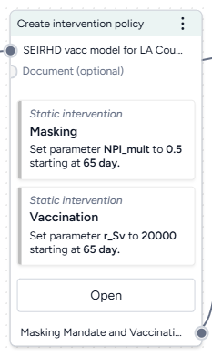
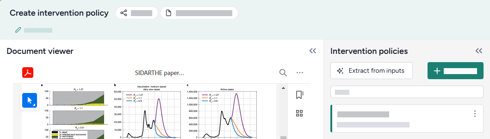
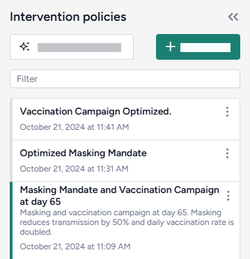
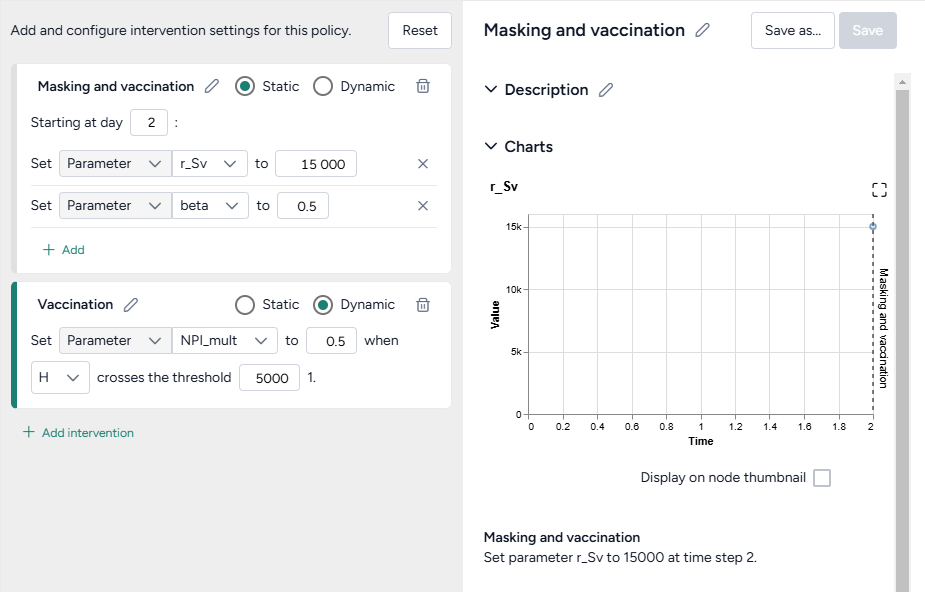
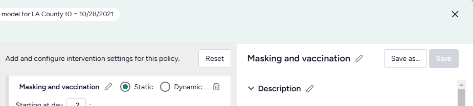

# Create an intervention policy

You can define intervention policies to specify changes in state variables or parameters at specific points in time. This can help you answer key decision-maker questions like: 

> *How does increasing vaccination rate affect cases and hospitalizations?*

## Create intervention policy operator

In a workflow, the Create intervention policy operator takes a model and an optional document as inputs and outputs an intervention policy.

Once you've created the intervention policy, the thumbnail preview shows brief descriptions of the interventions you set up.

<figure markdown><figcaption markdown></figcaption></figure>

-   :material-arrow-collapse-right:{ .lg .middle aria-hidden="true" } __Inputs__

    ---

    - Model
    - Document (optional)
    - Dataset (optional)

-   :material-arrow-expand-right:{ .lg .middle aria-hidden="true" } __Outputs__

    ---

    Intervention policy

??? list "Add the Create intervention policy operator to a workflow"

    - Do one of the following actions:
    
        - On an operator that outputs a model, click Link :octicons-plus-24:{ title="Link" aria-labelledby="link-icon-label" } > **Create intervention policy**.
        - Right-click anywhere on the workflow graph, select **Config & intervention** > **Create intervention policy**, and then connect the output of a model to the Create intervention policy inputs.

## Create an intervention policy

Use the Create intervention policy operator to: 

- [Extract an intervention policy from a project resource](#extract-an-intervention-policy-from-a-project-resource).
- [Select from previously saved interventions](#choose-an-existing-intervention).
- [Manually edit or create an intervention](#edit-or-create-an-intervention).

??? list "Open the Create intervention policy operator"

    - Make sure you've connected a model to the Create intervention policy operator and then click **Open**.

### Extract an intervention policy from a project resource

You can automatically attempt to extract intervention policies from any attached documents or datasets.

??? list "Extract an intervention policy from a document or dataset"

    1. Click **Extract from inputs**.
    2. Review and edit any of the extracted intervention policy settings as needed.

#### Choose an existing intervention

Each time you create an intervention for a model, Terarium saves it to your project. Whenever you add or edit a Create intervention policy operator, you can quickly select any of the existing interventions.

??? list "Search the available intervention policies"

    - In the Intervention policies panel, use the Filter field to search for keywords in intervention policy names and descriptions.

??? list "Choose an existing intervention policy"

    1. Review the Intervention policies on the left. Click a intervention policy name to select it and review its values.
    2. Close the Create intervention policy operator.

### Edit or create an intervention

Terarium simplifies the process of building interventions by reducing them to readable sentences from which you select your preferred options. As you select the policy settings, the Output panel visualizes your changes on a chart.

You can create:

- **Static interventions** that take place at a fixed point in time (*start masking in one week*).
- **Dynamic interventions** that trigger based on conditions such as when state variables cross a threshold (*start masking when hospitalizations exceed 5,000*).

    ???+ note
  
        Dynamic interventions take place the first time the trigger state crosses the selected threshold&mdash;whether it's crossing from above or below.

 

??? list "Add a new intervention"

    1. Click :octicons-plus-24:{ aria-hidden="true" } **Create new**.
    2. Click :octicons-plus-24:{ aria-hidden="true" } **Add intervention**.
    3. Click Edit :octicons-pencil-24:{ title="Edit" aria-labelledby="edit-icon-label"}, enter a unique name, and then click Apply :octicons-check-24:{ title="Apply" aria-hidden="true" aria-labelledby="apply-icon-label"}.

??? list "Set up a static intervention"

    A static intervention sets a parameter or state to a specific value at a specific time. You can add multiple static interventions to start on a given day.
    
    1. Select the **Static** checkbox.
    2. Enter the starting day timestep to specify when the intervention should begin.
    3. Select the type and name of the parameter or state variable you want to change.
    4. Enter a new value for the parameter or state variable.
    5. (Optional) To change another parameter or variable at the same time, click :octicons-plus-24:{ aria-hidden="true" } **Add** and then repeat steps 2&ndash;4.
    6. Review the charts in the Output panel to verify your policy is set up correctly.
    
??? list "Set up a dynamic intervention"

    A dynamic intervention sets a parameter or state to a specific value when a state crosses a specific threshold.

    1. Select the **Dynamic** checkbox.
    2. Select the type and name of the parameter or state variable you want to change.
    3. Enter a new value for the parameter or state variable.
    4. Select the state and enter the value that should trigger the change.
    5. Review the charts in the Output panel to verify your policy is set up correctly.

??? list "Preview an intervention policy chart on the Create intervention policy operator in the workflow graph"

    - Select **Display on node thumbnail**.

## Save an intervention policy

By default, any changes you make are automatically applied to the output of the Create intervention policy operator. You can also save intervention policies so they appear any time you connect the model to a Create intervention policy in your project.

??? list "Save your edits to the selected intervention policy"

    - Click **Save**.

??? list "Save your edits as a new intervention policy"

    1. Click **Save as**.
    2. Enter a unique name and click **Save**.

??? list "Undo your edits"

    - Click **Reset**.

??? list "Choose a different output for the Create intervention policy operator"

    - Select an intervention policy from the Intervention policies panel.