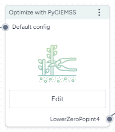

# Create and optimize an intervention policy

## Create an intervention policy

More info coming soon.

## Optimize an intervention policy

When you optimize an intervention policy, you specify a set of constraints to find the optimal combination of parameters that match your objective.

<figure markdown><figcaption markdown>How it works: [PyCIEMSS](https://github.com/ciemss/pyciemss/blob/main/pyciemss/interfaces.py#L747) :octicons-link-external-24:{ alt="External link" title="External link" }</figcaption></figure>

-   :material-arrow-collapse-right:{ .lg .middle aria-hidden="true" } __Inputs__

    ---

    - Model configuration
    - Intervention policy

-   :material-arrow-expand-right:{ .lg .middle aria-hidden="true" } __Outputs__

    ---

    Optimized model configuration

???+ list "To optimize an intervention policy"

    1. [Configure the model](../config-and-intervention/configure-model.md).
    2. Right-click anywhere on the workflow graph and select **Simulation** > **Optimize intervention policy**.
    3. Connect the Configure model output to the Optimize input.
    4. Click **Edit**.
    5. Configure the optimization settings as needed:

        - **Start** and **End time**: Specify the simulation time range.
        - **Number of samples to simulate model**: Enter the number of stochastic samples to draw from the model.
        - **Solver method**: Choose whether to solve ordinary differential equations using [dopri5](https://en.wikipedia.org/wiki/Dormand-Prince_method) or [euler](https://en.wikipedia.org/wiki/Euler_method).

    6. Specify your intervention policies:

        - **Parameter**: the parameter you want to optimize.
        - **Initial guess**: your initial guess for the optimization.
        - **Lower** and **Upper bound**: how much the parameter can vary.
        - **Start time**: the start time of the model.
        
        To set additional interventions, click :octicons-plus-24:{ aria-hidden="true" } **Add more interventions**.
    
    7. Add a constraint that limits the optimized configuration:
        - Select the **target variables**.
        - Set the **Acceptable risk of failure** and **Threshold**.
    8. Click :material-play-outline:{ aria-hidden="true" } **Run**.
    9. Save the the results:
        - Enter a **Model config name** and click **Save as new model configuration**.
        - Click :fontawesome-solid-floppy-disk:{ aria-hidden="true" } **Save as new dataset**. 