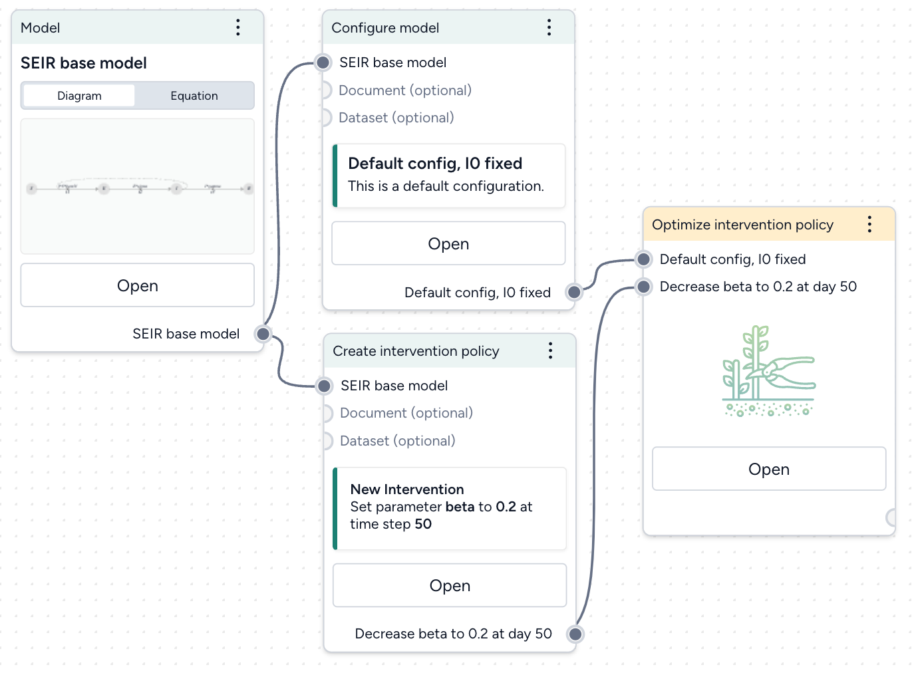
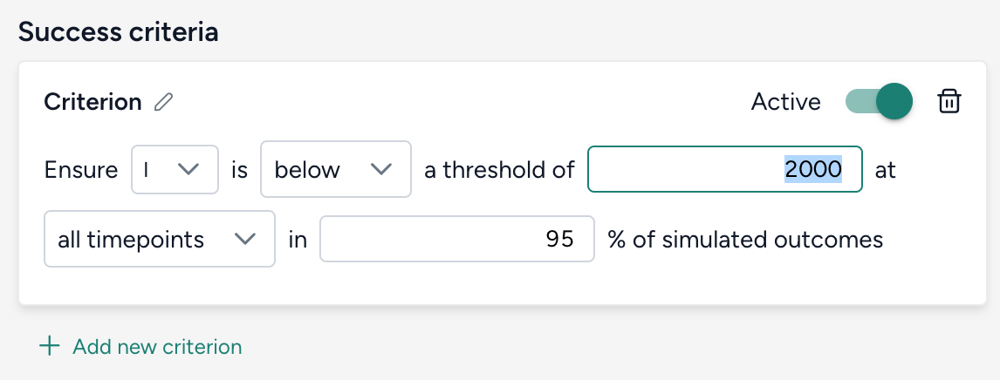
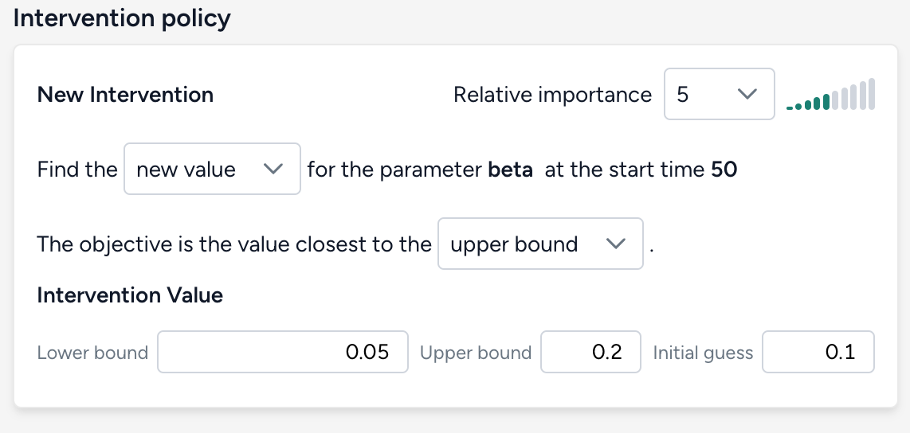
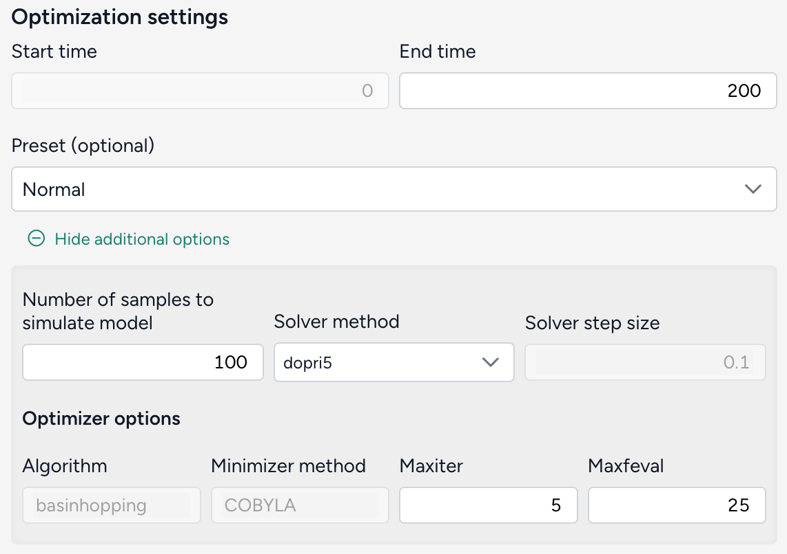
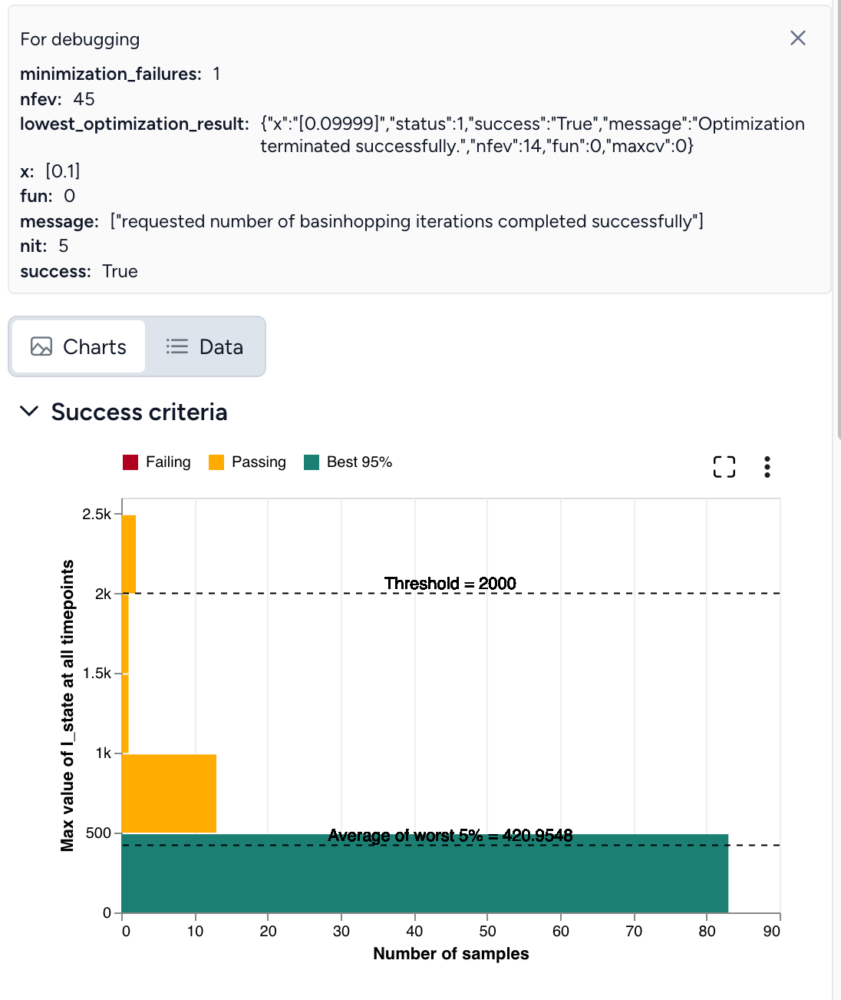
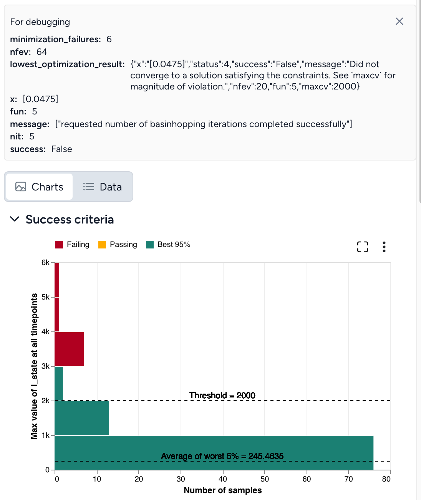
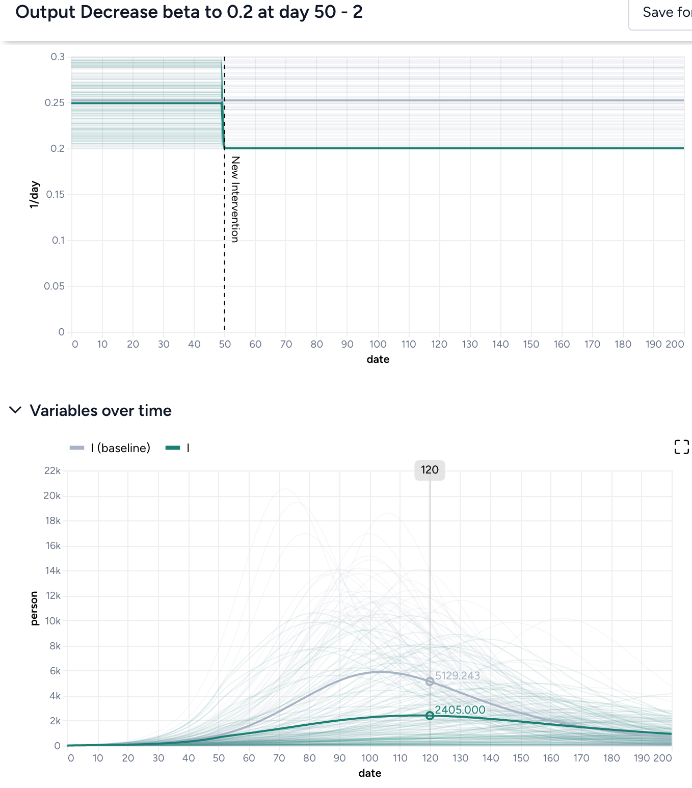

# Optimize an intervention policy

Given a model configuration and a proposed intervention policy, you can identify the optimal parameter values and/or times to implement an intervention that satisfy specified constraints. This helps you make informed decisions when faced with questions like:

> *What is the smallest possible transmission rate reduction that will keep infections below 1000 over the next 100 days?*

> *When is the latest possible time an intervention that reduces the transmission rate by half may be implemented in order to ensure infections remain below 1000 over the next 100 days?*

> *What is the minimal reduction in transmission rate, and the latest time it can be applied in order to keep infections below 1000 over the next 100 days?*

???+ note

    In addition to this help, you can find more examples and information about intervention policy optimization in: 

    - The [PyCIEMSS `optimize` interface](https://github.com/ciemss/pyciemss/blob/6a41b1a8247dd76f929488a479f4d27671120b36/pyciemss/interfaces.py#L818).
    - The [PyCIEMSS `optimize` interface notebook](https://github.com/ciemss/pyciemss/blob/main/docs/source/optimize_interface.ipynb).

## Create an optimize intervention policy operator

Assuming you have a [model configuration](configure-model.md) and an [intervention policy](create-intervention-policy.md) in your workflow, add an Optimize intervention policy operator: 

1. Right-click the workflow and select **Simulation** > **Optimize intervention policy**. 
2. Connect your model configuration and proposed intervention policy as inputs. 

The output of the Optimize intervention policy operator is an optimized intervention policy.

## Set your success criteria

Select a threshold and tolerance for simulated outcomes from the dropdowns.

> Ensure **A** is **B** a threshold of **C** at **D** in **E**% of simulated outcomes.

- **A**: *State variable* or *observable* from your model.
- **B**: Should the selected state variable remain *above or below* the threshold?
- **C**: *Threshold value* for the chosen state variable.
- **D**: *Time period of interest*, should the threshold constraint be met for *all timepoints* or is it only required for the end of the simulation at the *last timepoint*?
- **E**: *Risk tolerance* as the percentage of simulated trajectories for which the threshold constraint must be met to adopt the intervention policy.

## Select how to optimize the intervention policy

Choose which aspects of your intervention policy to optimize and how. Provide an initial guess along with minimum and maximum values to guide your optimization. Adjust the relative importance to create a weighted objective function when there are multiple parameters or start times being optimized.

There are three possible targets for optimization.

??? list "Parameter value"

    > Find the **new value** for the parameter *parameter in intervention policy* at the start time *time of intervention in policy*. The objective is the value closest to the **initial guess, lower bound, or upper bound**.

??? list "Intervention start time"

    > Find the **new start time** for the parameter *parameter in intervention policy* when the value is *value in intervention policy*. The objective is the **initial guess, lower bound, or upper bound** start time.
    
    ???+ note

        - `Start time` and `End time` should be interpreted as the lower bound and upper bound of the time when the intervention is applied, respectively.
        - If your goal is to find the *latest time* an intervention could be implemented and still satisfy the constraint, make your objective the value closest to the **upper bound**.

??? list "Intervention start time and parameter value"

    > Find the **new value and start time** for the parameter *parameter in intervention policy*. The objective is the value closest to the **initial guess, lower bound, or upper bound** and at the **initial guess, lower bound, or upper bound** start time.

## Choose your optimization settings

Choose the duration of your simulation. Advanced settings let you specify how many sample trajectories to run, the differential equation solver method, and the optimizer optiopns.

<figure markdown><figcaption markdown>Simulation to run for 200 days and keep the default solver and optimization settings.</figcaption></figure>

??? list "Configure the run settings"

    1. Set the **End time** to specify the duration of simulation. The **Start time** always begins at time t = 0.
    2. Choose a **Preset**. The default recommended setting is `Normal`, which uses the `dopri5` solver. `Fast` uses the `euler` method.

??? list "Advanced settings"

    - **Number of samples**: Each simulation draws this number of samples from the model distribution. Select the number of samples to use. The default value of 100 is great for testing and understanding whether the given optimization will work. Higher values like 1,000 samples give more accurate results and a better sense of uncertainty in the model.
    - **Solver method**: The default differential equation solver is `dopri5`, an adaptive step-size, 5th-order explicit Runge-Kutta method. The `euler` and `rk4` method requires you to also specify the **Solver step size**.
      
        ???+ note
    
            For the best balance of speed and accuracy, the `rk4` or `dopri5`  solver method is recommended.
    
    - **Optimizer options**
          - **Algorithm**: [SciPy `basinhopping` algorithm](https://docs.scipy.org/doc/scipy/reference/generated/scipy.optimize.basinhopping.html).
          - **Minimizer method**: `COBYLA` is the chosen [minimization method](https://docs.scipy.org/doc/scipy/reference/generated/scipy.optimize.minimize.html#scipy.optimize.minimize) used in the basinhopping algorithm.
          - **Maxiter**: The maximum number of iterations used in the basinhopping algorithm. Increasing `Maxiter` explores the parameter space more thoroughly and better avoids getting trapped in local minima, but will take longer to run.
          - **Maxfeval**: The maximum number of times the optimization function is evaluated during each iteration of the basinhopping process. Increasing `Maxfeval` may improve accuracy, but also increases computation time.

## Run the optimization

Once you've configured all the optimization settings, click **Run**. When the optimization completes, you can view and compare the results of your model simulations with and without the optimized intervention.

A successful optimization looks like this:

If the optimization does not complete successfully (as shown below), you need to adjust your settings.

## Troubleshooting a failed optimization

Intervention policy optimization is extremely complex. The following tips describe reasons why your optimization may fail and how get a successful optimization. When you encounter failures, repeat as necessary and try combinations of these tips.

### Optimal intervention policy is out of bounds
Try the following:
- Expand the bounds for your intervention policy 
- Use a different initial guess for the interventions.

### Optimaization not satisfying set constraints
The other issue one could encounter is the following message:
`lowest_optimization_result: message: Did not converge to a solution satisfying the constraints. See maxcv for magnitude of violation.` This message means that the optimizer did not find a feasible solution within the set bounds for the interventions or the risk bound is too strict to staisfy or the optimizer ran out of resources (stopped too early).
Try the following:
- Check if the threshold value is appropriate for given problem
- Use a different initial guess for the interventions
- Increase `Maxiter` and `Maxfeval` to provide more time for the optimizer to converge
- Increase `Number of samples` to improve accuracy of Monte Carlo risk estimation

### Seeing yellow

If the results of your optimization look close to successful but aren't quite there yet, try increasing:

- Rerun the simulation only with the intervention set to the optimal value and with *more number of samples*
- `Maxiter` and `Maxfeval`.

### Double check your inputs

- Does your model configuration have the correct parameter values and initial states? Are the distributions around your uncertain parameters reasonable or too large?
- As a sanity check, remove or tighten unnecessary sources of uncertainty. For example, if the default configuration of a SEIR model includes substantial uncertainty in the initial infectious population, try setting a fixed number of infectious individuals initially. This can help you investigate how changing the tranmission rate impacts infections and discover a successful optimization. 
- Is the proposed intervention policy correct? Does the parameter you are intervening have the intended effect on the state variable of interest?

**Simulate the model with your proposed intervention applied as a check and compare the results:** Thicker solid lines represent the *mean trajectory* of the simulations, while the optimization focuses on "worst case scenarios" defined by your *risk tolerance*. Even if the peak of the intervened simulations is close to your desired threshold value, the range of all simulations (shown in lighter gray or green) can be much wider. Asking that the threshold not be exceeded in 95% of simulations is different than it might appear, as the mean being close to the threshold doesn't fully account for the variability, as shown below.

### Adjust your threshold

Is the threshold too low or too high? It may be preferable to have a higher threshold if you can be more certain it will not be exceeded.

### Adjust your risk tolerance

Depending on the situation, it might be okay for infections to remain below a certain threshold only 75% of the time. But if the threshold for hospitalizations is the number of available beds, it may not be appropriate to become more risk tolerant.

### Reassess the bounds of your intervention value or time.

Are the bounds: 

- Reasonable? If the lower bound of your parameter is zero, try using a lower bound like 0.01 or 0.001 instead.
- Too restrictive?
- Not restrictive enough? If you want to search a wide swath of the parameter space, consider increasing the number of basinhopping iterations (`Maxiter`). This gives you more chances to find the global minima of your objective function.

