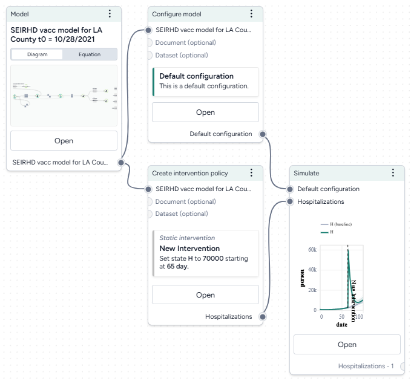

# Simulate an intervention policy

You can simulate an intervention policy to assess the impact of your intervention on a variable of interest. For example, you can see how increasing vaccination rate affects hospitalizations.

<video controls>
  <source src="https://videos.terarium.ai/simulating-intervention-policies.mp4" type="video/mp4">
  Your browser does not support HTML5 video. <a href="https://videos.terarium.ai/simulating-intervention-policies.mp4" download>Download the video</a>.
</video>

## Build an intervention policy simulation workflow

You can build a workflow to simulate an intervention policy manually. 

<figure markdown><figcaption markdown></figcaption></figure>

Before you get started, you'll need a:

- [Model](../modeling/index.md).
- [Model configuration](../config-and-intervention/configure-model.md).

Once you've set up and run the workflow, you'll have a set of intervention policy simulation results, which you can use as a dataset.

??? list "Build an intervention policy simulation workflow"

    1. Add your model to a workflow, hover over its output, and click Link :octicons-plus-24:{ title="Link" aria-labelledby="link-icon-label" } > **Configure model**. Click **Open** on the Configure model operator to [select or create a new configuration](configure-model.md).
    2. Hover over the Model output again and click Link :octicons-plus-24:{ title="Link" aria-labelledby="link-icon-label" } > **Create intervention policy**. Click **Open** on the Create intervention policy operator to [select or create a new intervention policy](create-intervention-policy.md).
    3. Hover over the Create intervention policy output and click Link :octicons-plus-24:{ title="Link" aria-labelledby="link-icon-label" } > **Simulate**.
    4. Click the output of the Configure model operator and connect it to the Simulate model configuration input.
    5. Connect the model configuration output to the simulate input.

## Run a simulation

Once you've built your workflow, you can edit the Simulate run and output settings to generate the intervention policy simulation.

??? list "Run an intervention policy simulation"

    1. Click **Open** on the Simulate operator.
    2. Select the Simulate [run settings](../simulation/simulate-model.md).
    3. Click **Run** to start the simulation.
    4. Preview the intervention policy results. To add variables or parameters, use the **Output** settings. 

## View and save simulation results with interventions

[Simulation results](../simulation/simulate-model.md) are summarized on the operator in the workflow and in the operator details. When you simulate with an intervention you can see the impacts of the intervention. There are visual representations of:

  - The parameter you changed in your intervention. 
 
    <figure markdown><figcaption markdown>At day 2, vaccination rate increases from 10,000 people per day to 25,000 people per day.</figcaption></figure>
    
  - Simulation results with the intervention shown in green and results for the baseline (no intervention) in gray.
  
    <figure markdown><figcaption markdown>Increasing vaccination rate from 10,000 people per day to 25,000 people per day decreases hospitalization rate from ~13,000 to ~10,000.</figcaption></figure>

??? list "Save the simulation results as a new dataset"

    - On the Output panel, click **Save for re-use**.
    
        ???+ tip

            Using a descriptive naming convention for your datasets will help you keep track of them when you want to compare multiple scenarios.

## Troubleshooting

If the simulation fails and shows an `AssertionError: underflow in dt 0.0` error, the configuration has made the model unsolvable with the selected solver **Method**. This often happens with the *dopri5* solver method.

**Workaround**: Try using a different solver method, such as *rk4* or *euler*. These solvers are be less efficient than *dopri5*, but they are also less likely to get caught in an unworkable state