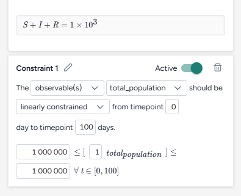

# Validate a model configuration

At the beginning of your modelling workflow, you may be faced with multiple candidate models, some of which contain mistakes and thus make unphysical predictions. You can use the Validate configuration operator to do "sanity" or model checks on the outputs of these models. In the case of compartmental models, the operator can run the basic sanity check wherein the population of every compartment, for all timepoints, is non-negative and less than or equal to the sum of the initial condition values. 

The Validate configuration operator supports several types of constraints such that you can check for additional assumptions on the inputs and outputs of the model
1. "greater/less than or equal to": that a model quantity (state variable, parameter, or observable) be bounded below/above by some threshold value
2. "increasing/decreasing": that the time derivative of a model quantity is positive or negative
3. "linearly constrained": that several parameters satisfy a linear constraint of the form `L ≤ a_1 * p_1 + a_2 * p_2 + ... + a_k * p_k ≤ U`
4. "following": that a model quantity remains within some range of a given time-series dataset for all given timepoints (not yet supported)

The output of this operator is a new model configuration that represents the largest region in the parameter space (as defined by the input configuration) which satisfies _all_ the given constraints.

This Terarium feature is powered by the `run_validate` function of the [Functional Model Analysis (Funman)](https://github.com/siftech/funman) package.


??? example

    You are given a SIR-type compartmental model where the state variables represents relative fraction of a total population. You would want to check that (1) all the state variables are greater than zero, (2) they are less than one, (3) the `S(t)` state variable is decreasing monotonically (assuming no births), and (4) the `R(t)` state variable is increasing monotonically (assuming no deaths).

??? example

    Given some model with parameters `β, γ`, you want to find what model configuration would satisfy the linear inequality `β ≤ 2 * γ`. You can create a constraint of the form "the parameters β, γ should be linearly constrained from timepoint 0 timepoint 30 days" with inequality `0 ≤ -1 * β + 2 * γ`. The result would be a model configuration where the parameters `β, γ` are uniform distributions, covering a region of parameter space where the inequality is satisfied.


## Validate configuration operator

The Validate configuration operator takes a model configuration as an input and returns a validated model configuration as output. The latter can be used simulation operators downstream.

???+ tip
    
    When [setting up the input configuration](configure-model.md#edit-or-create-a-model-configuration):

    - For each parameter of interest, specify a wide uniform distribution in the input configuration such that the Validate configuration operator has a sufficiently large parameter space to search for regions that satisfy all the given constraints.
    - You can use the [Edit model operator](../modeling/edit-model.md#edit-a-model-in-the-edit-model-code-notebook) to define some observables for quantities that do not correspond to any existing model state variables or parameters.

<figure markdown>

<figcaption markdown>How it works: [funman](https://github.com/siftech/funman) :octicons-link-external-24:{ alt="External link" title="External link" }</figcaption> 
</figure>

<div class="grid cards" markdown>

-   :material-arrow-collapse-right:{ .lg .middle aria-hidden="true" } __Inputs__

    ---

    - Model configuration
    - Dataset (optional)

-   :material-arrow-expand-right:{ .lg .middle aria-hidden="true" } __Outputs__

    ---

    Validated model configuration

</div>

??? list "Add the Validate configuration operator to a workflow"

    - Do one of the following actions:
    
        - On an operator that outputs a model configuration, click <span class="sr-only" id="link-icon-label">Link</span> :octicons-plus-24:{ title="Link" aria-labelledby="link-icon-label" } > **Validate configuration**.
        - Right-click anywhere on the workflow graph, select **Config & Intervention** > **Validate configuration**, and then connect a model to the Validate configuration input.

## Validate a model configuration

The Validate configuration operator allows you to define model checks and produce validate model configurations using: 

- A [wizard view](#use-the-wizard-to-validate-a-model-configuration) with the most common settings.
- A [notebook view](#use-the-notebook-to-validate-a-model-configuration) with structured JSON inputs and outputs.

??? list "Open the Validate configuration operator"

    - Make sure you've connected a model configuration to the Validate configuration operator and then click **Open**.

### Use the wizard to validate a model configuration

Use the wizard view of the Validate configuration operator to apply validation settings. You can:

- Include [common compartmental constraints](#use-compartmental-constraints).
- Build your own [custom constraints](#add-a-custom-constraint).
- Choose how to [run the validation](#configure-the-run-settings).

#### Use compartmental constraints

Compartmental constraints provide a simple validation layer for your model configuration by enforcing basic physical that make sure:

- The state variables do not become negative for all timepoints.
- The total population of the model are conserved and constant for all timepoints.


??? tip "Troubleshooting the compartmental constraint"

    In the case where the compartmental constraint prevents results from being returned, try defining it as a custom constraint:

    1. Prompt the [Edit model](../modeling/edit-model.md#use-the-ai-assistant-to-edit-a-model) AI assistant to:

        ```{ .text .wrap }
        Create an observable that is the sum of all the state variables
        ```
    2. Create a new [configuration](configure-model.md) for the edited model.
    3. Add a custom constraint that **linearly constrains** the new observable above and below the total population.

        <figure markdown><figcaption markdown>Custom version (bottom) of the compartmental constraint (top) limiting the new observable above and below the total population.</figcaption></figure>

??? list "Turn the compartmental constraints on or off"

    - Turn the **Active** toggle on or off.

#### Add a custom constraint

By building custom constraints, you can tailor the validation process to your specific needs. You can constrain state variables, parameters, and observables to adhere to rules or trends critical for your analysis.


Terarium simplifies the process of building constraints by reducing them to readable sentences from which you select your preferred options. When you're done, the constraint is summarized as one or more mathematical expressions.

??? list "Add a constraint"

    1. Click :octicons-plus-24:{ aria-hidden="true" } **Add constraint**.
    2. Click <span class="sr-only" id="edit-icon-label">Edit</span> :octicons-pencil-24:{ title="Edit" aria-labelledby="edit-icon-label"}, enter a unique name, and then click <span class="sr-only" id="apply-icon-label">Apply</span> :octicons-check-24:{ title="Apply" aria-hidden="true" aria-labelledby="apply-icon-label"}.

??? list "Keep a model quantity above or below a value"

    1. Select the type and name of the quantity you want to constrain.
    2. Select the condition that the quantity should satisfy&mdash;**less than**, **less than or equal to**, or **greater than**&mdash;and then specify the value.
    3. Choose the timepoints between which the condition should be enforced.

??? list "Keep a model quantity from increasing or decreasing"

    1. Select the type and name of the quantity you want to constrain.
    2. Select the condition that the quantity should satisfy&mdash;**increasing** or **decreasing**.
    3. Choose the timepoints between which the condition should be enforced.

??? list "Enforce a linear relationship between model quantitys"

    1. Select the type and name of the quantitys you want to constrain.
    2. Select the **linearly constrained** condition and then in the formula below, enter: 

        - The weights for each quantity.
        - The lower and upper bounds between which the weighted quantitys should stay.

    3. Choose the timepoints between which the condition should be enforced.

??? list "Turn off a constraint"

    - Turn the **Active** toggle off.

??? list "Delete a constraint"

    - Click <span class="sr-only" id="delete-icon-label">Delete</span> :octicons-trash-24:{ title="Delete" aria-labelledby="delete-icon-label"}

#### Configure the run settings

Run settings let you customize the scope and precision of the validation process. To help you get started, you can choose between fast or precise presets.


??? list "Configure the run settings"

    1. Select a **Preset**, Fast or Precise, to balance between run time and precision in parameter space and prediction error
    2. Select the **Parameters of interest**. Model checks applied on parameters that are not selected will be ignored.

        ???+ note

            You can only select parameters that are represented by a uniform distribution. Parameters with constant values cannot be selected.

    3. Choose the **Start** and **End time**.

??? list "Advanced settings"

    Using the following advanced settings, you can further optimize the computational efficiency and thoroughness of the validation:

    - **Number of timesteps**: More timesteps provide a detailed view of how the model behaves over time and smaller prediction error, while fewer timesteps simplify the analysis and reduce run time when precision isn't as critical.
    - **Tolerance**: Controls how finely the operator segments the parameter space for validation; the value is the relative size of the smallest sub-region that will be checked for satisfiability; `1.0` means "do not segment the input parameter space at all"  while `0.1` means "segment the space down to 10% of the parameter ranges". 

        ???+ tip
    
            Start with <10 timesteps, a high tolerance (~0.5), and select 2 or 3 parameters of interest for reduced run time; increase the number of timesteps and lower the tolerance towards 0.01 for higher precision and lower prediction error.

### Use the notebook to validate a model configuration

The notebook exposes structured JSON that describes the model, its configuration, and the same settings available in the Wizard. You can directly edit the JSON and then run it to create a new validated configuration (also represented as a structued JSON).


???+ note

    Changes you make to the validation JSON do not automatically copy over to the wizard.

??? list "Edit code"

    - Directly edit the JSON.

??? list "Sync code with wizard settings"

    - Click :material-refresh:{ aria-hidden="true" style="transform: rotate(315deg);" } **Sync with Wizard**.

## Create the validated configuration

Once you've configured the validation settings, you can run the operator to generate a new validate configuration. The new configuration becomes a temporary output for the Validate configuration operator; you can connect it to other operators in the same workflow. If you want to use it in other workflows, you can save it for reuse. 


??? list "Create a new validate model configuration"

    - Click :material-play-outline:{ aria-hidden="true" } **Run**.

        ???+ tip

            The run progress of the Validate configuration operator is displayed in the workflow. Close the operator to view it.

??? list "Choose a different output for the Validate configuration operator"

    - Use the **Select an output** dropdown.

??? list "Save the new configuration for selection in Configure model operators"

    - Click **Save for reuse**, enter a unique name for the configuration, and then click **Save**.

## Understand the validation result

The validation result is displayed as a series of plots showing the satisfactory and unsatisfactory state and parameter values over time. The following sections show how to interpret these.

??? list "Only show furthest results"

    When analyzing model behavior, intermediate results can sometimes make it hard to focus on the most comprehensive outcomes. You can instead display only the most extensive calculations performed for each combination of parameter values. This shows the final iteration where the model has computed the farthest timepoint necessary to ensure all checks either pass or fail.

    - Click **Only show furthest results**.

### States variables and observables

State variable and observables plots provide a time-series view of how these model quantities evolve over time. The simpler constraints (greater/less than some threshold value) are shown as light blue rectangles. Altogether, the plots show how and when each model quantity visually passes or fails the given constraints. Each trajectory is mapped from a single sampled point in parameter space is mapped:

- Dark green lines satisfy all model checks.
- Yellow lines do not satisfy all model checks.
- Light green lines are ambiguous within the precision of the validation.
- Light blue boxes show the constraints you set up.

<div class="grid cards" markdown>

- 
- 

</div>
??? list "Show or hide state variable or observable plots"

    1. Click <span class="sr-only" id="expand-icon-label">Expand</span> :fontawesome-solid-angles-left:{ title="Expand" aria-labelledby="expand-icon-label" } to expand the Output settings.
    2. Do one of the following actions:

         - Use the dropdown to search, select, or clear different variables.
         - Click **X** to remove a variable plot.

??? list "Focus on model checks"

    In some cases, the results of the validation may not approach the constraints you set up. In these instances, the model checks do not appear on the plots. To expand a plot to view the full extent of the model checks:

    1. Click <span class="sr-only" id="expand-icon-label">Expand</span> :fontawesome-solid-angles-left:{ title="Expand" aria-labelledby="expand-icon-label" } to expand the Output settings.
    2. Click **Focus on model checks**.

### Parameter plots

Parameter plots allow you to explore how variations in model parameters influence the outcome of validation checks. These plots highlight which parameter ranges are valid and where constraints are violated:

- Dark green lines satisfy all model checks.
- Yellow lines do not satisfy all model checks.
- Light green lines are ambiguous within the precision of the validation.


??? list "Show or hide parameter plots"

    1. Click <span class="sr-only" id="expand-icon-label">Expand</span> :fontawesome-solid-angles-left:{ title="Expand" aria-labelledby="expand-icon-label" } to expand the Output settings.
    2. Do one of the following actions:

         - Use the dropdown to search, select, or clear different parameters.
         - Click **X** to remove a parameter plot.

??? list "Only show furthest results"

    The validation algorithm is efficient and only solves the model ODEs incrementally. It compute outcomes with the minimum timepoints that is necessary to guarantee that all the model checks either pass or fail. These intermediate results can sometimes make it hard to focus on the trajectories that are actually validated. You can instead restrict the plot to only these trajectories by toggling on this option.

    - Click **Only show furthest results**.

## Troubleshooting

### Long run times

If your validation is taking too long, try reducing the complexity of the validation problem: 

- Reduce the number of timesteps to ~5.
- Reduce the number of parameters of interest to 2 or 3 of the most important.
- Increase the tolerance to be ~0.5.
- Crop out parameter ranges that cause numerical instability. For example, if you have SIR-type model and a recovery rate `γ` that is an uniform distribution between `-1.0` and `1.0`, the model may become unstable near `γ = 0` as the basic reproduction number `R₀ → ∞`. You can narrow the distribution of `γ` to exclude the singularity at the origin.

Following these steps can help you reduce the run time or produce non-trivial validation results.

### No satisfactory conditions

If the results contain no satisfactory conditions, it often means the entire parameter range is unsatisfactory. Try running validation again on an input configuration with wider parameter ranges.

## Next steps

You can use the new validated configuration in [simulations](../simulation/simulate-model.md) to forecast, analyze, or explore system behavior based on the validated parameters. Validation reduces the need to repeatedly reconfiguring a model to find physical starting points for simulations, calibrations, and optimizations.
