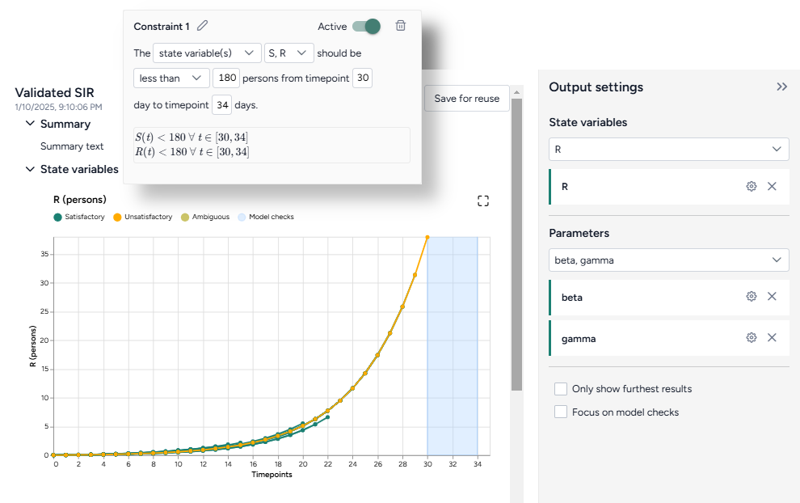

# Validate a model configuration

You can use the Validate configuration operator to check a model for various errors and constraints that might be encountered during simulation. This includes ensuring the population remains constant and making sure the states remain non-negative. You can also add more constraints to check additional conditions.

The results provide the valid parameter space as a new configuration.

??? example

    With an SEIRD model that has an infection rate configured between 0.1 and 0.3, you want to find the maximum infection rate needed to keep the infected population under 1,200. Using the model and its initial conditions, validation can indicate whether this is feasible or identify the required infection rate.

## Validate configuration operator

The Validate configuration operator takes a model configuration and an optional dataset as an input and outputs validated model configuration.

???+ tip
    
    When [setting up the input configuration](configure-model.md#edit-or-create-a-model-configuration):

    - Include some distribution on the parameters to allow for an exploration of the parameter space.
    - For better results, you can set constant parameter values as distributions rather than point values. For example, instead of setting a parameter to `0`, set it to a Uniform distribution from `0` to `0`. 

<figure markdown>

<figcaption markdown>How it works: [funman](https://github.com/siftech/funman) :octicons-link-external-24:{ alt="External link" title="External link" }</figcaption> 
</figure>

<div class="grid cards" markdown>

-   :material-arrow-collapse-right:{ .lg .middle aria-hidden="true" } __Inputs__

    ---

    - Model configuration
    - Dataset (optional)

-   :material-arrow-expand-right:{ .lg .middle aria-hidden="true" } __Outputs__

    ---

    Validated model configuration

</div>

??? list "Add the Validate configuration operator to a workflow"

    - Do one of the following actions:
    
        - On a operator that outputs a model configuration, click <span class="sr-only" id="link-icon-label">Link</span> :octicons-plus-24:{ title="Link" aria-labelledby="link-icon-label" } > **Validate configuration**.
        - Right-click anywhere on the workflow graph, select **Config & Intervention** > **Validate configuration**, and then connect a model to the Validate configuration input.

## Validate a model configuration

The Validate configuration operator allows you to assess and refine model configurations using: 

- A [wizard view](#use-the-wizard-to-validate-a-model-configuration) with the most common settings.
- A [notebook view](#use-the-notebook-to-validate-a-model-configuration) with structured JSON output.

??? list "Open the Validate configuration operator"

    - Make sure you've connected a model configuration to the Validate configuration operator and then click **Review checks**.

### Use the wizard to validate a model configuration

Use the wizard view of the Validate configuration operator to apply validation settings. You can:

- Include [common compartmental constraints](#use-compartmental-constraints).
- Build your own [custom constraints](#add-a-custom-constraint).
- Choose how to [run the validation](#configure-the-run-settings).

#### Use compartmental constraints

Compartmental constraints provide a simple validation layer for your model configuration by enforcing basic physical that make sure:

- The model states don't go negative.
- The model state populations are preserved.


???+ tip

    In cases where the compartmental constraint doesn't work properly, try defining it as a custom constraint:

    1. Prompt the [Edit model](../modeling/edit-model.md#use-the-ai-assistant-to-edit-a-model) AI assistant to:

        ```{ .text .wrap }
        Create an observable that is the sum of all compartments
        ```
    2. Create a new [configuration](../configure-model.md) for the edited model.
    2. Add a custom constraint with the following values:

        - 

??? list "Turn the compartmental constraints on or off"

    - Turn the **Active** toggle on or off.

#### Add a custom constraint

By building custom constraints, you can tailor the validation process to your specific needs. You can constrain state variables, parameters, and observables to adhere to rules or trends critical for your analysis.


Terarium simplifies the process of building constraints by reducing them to readable sentences from which you select your preferred options. When you're done, the constraint is summarized as one or more formulas.

??? list "Add a constraint"

    1. Click :octicons-plus-24:{ aria-hidden="true" } **Add constraint**.
    2. Click <span class="sr-only" id="edit-icon-label">Edit</span> :octicons-pencil-24:{ title="Edit" aria-labelledby="edit-icon-label"}, enter a unique name, and then click <span class="sr-only" id="apply-icon-label">Apply</span> :octicons-check-24:{ title="Apply" aria-hidden="true" aria-labelledby="apply-icon-label"}.

??? list "Keep a model component above or below a value"

    1. Select the type and name of the component you want to constrain.
    2. Select the condition that the component should satisfy&mdash;**less than**, **less than or equal to**, or **greater than**&mdash;and then specify the value.
    3. Choose the timepoints between which the condition should be enforced.

??? list "Keep a model component from increasing or decreasing"

    1. Select the type and name of the component you want to constrain.
    2. Select the condition that the component should satisfy&mdash;**increasing** or **decreasing**.
    3. Choose the timepoints between which the condition should be enforced.

??? list "Enforce a linear relationship between model components"

    1. Select the type and name of the components you want to constrain.
    2. Select the **linearly constrained** condition and then in the formula below, enter: 

        - The weights for each component.
        - The lower and upper bounds between which the weighted components should stay.

    3. Choose the timepoints between which the condition should be enforced.

??? list "Turn off a constraint"

    - Turn the **Active** toggle off.

??? list "Delete a constraint"

    - Click <span class="sr-only" id="delete-icon-label">Delete</span> :octicons-trash-24:{ title="Delete" aria-labelledby="delete-icon-label"}

#### Configure the run settings

Run settings let you customize the scope and precision of the validation process. To help you get started, you can choose between fast or precise presets.


??? list "Configure the run settings"

    1. Select a **Preset**, Fast or Precise.
    2. Select the **Parameters of interest**. Stricter checks are performed on selected parameters.

        ???+ note

            You can only select parameters that have uniform (range) values. Parameters with constant values can't be selected.

    3. Choose the **Start** and **End time**.

??? list "Advanced settings"

    Using the following advanced settings, you can further optimize the computational efficiency and thoroughness of the validation:

    - **Number of timesteps**: More timesteps provide a detailed view of how the model behaves over time, while fewer timesteps simplify the analysis and speed up the process when precision isn't critical.
    - **Tolerance**: Controls how finely the operator segments the model's input space for validation. Values below 0.5 increase sampling and dynamics by dividing variable ranges into finer segments, while values above 0.5 result in coarser segmentation.

        ???+ tip
    
            Lowering the tolerance and checking parameters of interest can significantly increase the time it takes to run.

### Use the notebook to validate a model configuration

The notebook exposes structured JSON that describes the model, its configuration, and the same settings available in the Wizard. You can directly edit the JSON and then run it to create a new validated configuration.


???+ note

    Changes you make to the validation JSON do not automatically copy over to the wizard.

??? list "Edit code"

    - Directly edit the JSON.

??? list "Sync code with wizard settings"

    - Click :material-refresh:{ aria-hidden="true" style="transform: rotate(315deg);" } **Sync with Wizard**.

## Create the validated configuration

Once you've configured the validation settings, you can run the operator to generate a new validate configuration. The new configuration becomes a temporary output for the Validate configuration operator; you can connect it to other operators in the same workflow. If you want to use it in other workflows, you can save it for reuse. 


??? list "Create a new validate model configuration"

    - Click :material-play-outline:{ aria-hidden="true" } **Run**.

        ???+ tip

            The run progress of the Validate configuration operator is displayed in the workflow. Close the operator to view it.

??? list "Choose a different output for the Validate configuration operator"

    - Use the **Select an output** dropdown.

??? list "Save the new configuration for selection in Configure model operators"

    - Click **Save for reuse**, enter a unique name for the configuration, and then click **Save**.

## Understand the validated configuration

The validated configuration is displayed as a series of plots showing the satisfactory and unsatisfactory state and parameter values over time. The following sections show how to interpret these.

??? list "Only show furthest results"

    When analyzing model behavior, intermediate results can sometimes make it hard to focus on the most comprehensive outcomes. You can instead display only the most extensive calculations performed for each combination of parameter values. This shows the final iteration where the model has computed the farthest timepoint necessary to ensure all checks either pass or fail.

    - Click **Only show furthest results**.

### State variable time-series

State variable plots provide a time-series view of how model variables evolve over time. They offer a visual representation of how well the model satisfies constraints and checks under different parameter combinations. There is one trajectory per sampled point in the parameter space:

- Dark green lines satisfy all model checks.
- Yellow lines do not satisfy all model checks.
- Light green lines are ambiguous.
- Light blue boxes show the constraints you set up.



??? list "Show or hide state variable plots"

    1. Click <span class="sr-only" id="expand-icon-label">Expand</span> :fontawesome-solid-angles-left:{ title="Expand" aria-labelledby="expand-icon-label" } to expand the Output settings.
    2. Do one of the following actions:

         - Use the dropdown to search, select, or clear different state variables.
         - Click **X** to remove a state variable plot.

??? list "Focus on model checks"

    In some cases, the results of the validation may not approach the constraints you set up. In these instances, the model checks do not appear on the plots. To expand a plot to view the full extent of the model checks:

    1. Click <span class="sr-only" id="expand-icon-label">Expand</span> :fontawesome-solid-angles-left:{ title="Expand" aria-labelledby="expand-icon-label" } to expand the Output settings.
    2. Click **Focus on model checks**.

### Parameter plots

Parameter plots allow you to explore how variations in model parameters influence the outcome of validation checks. These plots highlight which parameter ranges are valid and where constraints are violated:

- Dark green lines satisfy all model checks.
- Yellow lines do not satisfy all model checks.
- Light green lines are ambiguous.


??? list "Show or hide parameter plots"

    1. Click <span class="sr-only" id="expand-icon-label">Expand</span> :fontawesome-solid-angles-left:{ title="Expand" aria-labelledby="expand-icon-label" } to expand the Output settings.
    2. Do one of the following actions:

         - Use the dropdown to search, select, or clear different parameters.
         - Click **X** to remove a parameter plot.

??? list "Only show furthest results"

    When analyzing model behavior, intermediate results can sometimes make it hard to focus on the most comprehensive outcomes. You can instead display only the most extensive calculations performed for each combination of parameter values. This shows the final iteration where the model has computed the farthest timepoint necessary to ensure all checks either pass or fail.

    - Click **Only show furthest results**.

## Troubleshooting

### Long run-times

If your validation is taking too long, try editing your constraints to run on a small number of timepoints, such as 0&ndash;5 days. This can help you find: 

- Parameter ranges to drop. For example, if you have an infection rate of 0.1&ndash;0.9, you may notice during early validation that values above 0.8 result in immediate system instability. In this case, you can narrow the parameter range to 0.1&ndash;0.8.
- More required constraints. For example, if early validation results are unexpected or inconsistent, there may be missing constraints, such as one limiting initial values or ensuring consistency between parameters.

Resolving either of these cases can help you reduce the time required for the full validation.

### Missing boxes

If no boxes are returned, it often means the entire parameter range is unsatisfactory. Try running validation again with a wider parameter ranges.

## Next steps

You can use the new validated configuration in [simulations](../simulation/simulate-model.md) to forecast, analyze, or explore system behavior based on the validated parameters. The validation eliminates the need to manually reconfigure or adjust inputs between these steps.