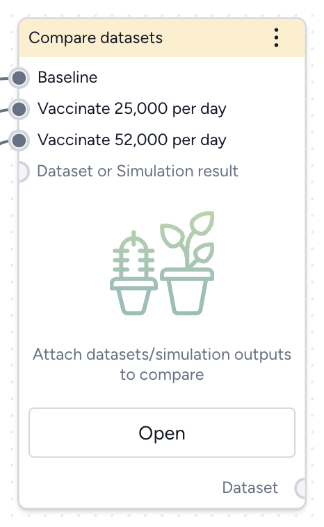
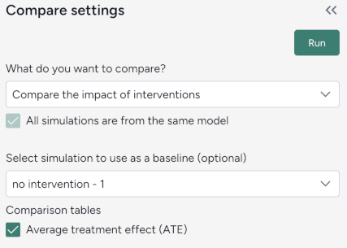
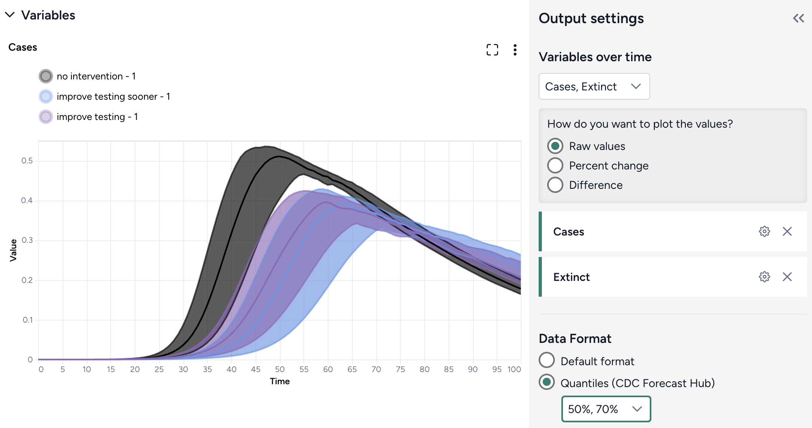

# Compare datasets

You can compare the impacts of two or more interventions or rank interventions using the Compare datasets operator.

## Compare datasets operator

In a workflow, the Compare datasets operator takes two or more datasets or simulation results as inputs and plots them. It outputs a dataset comparison, which can be used as a dataset in other operators.



<div class="grid cards" markdown>

-   :material-arrow-collapse-right:{ .lg .middle aria-hidden="true" } __Inputs__

    ---

    Two or more datasets or simulation results

    ???+ tip 

        Use descriptive names for your datasets and simulation results. This will help you interpret the comparison.

-   :material-arrow-expand-right:{ .lg .middle aria-hidden="true" } __Outputs__

    ---

    Dataset comparison

</div>

??? list "Add the Compare datasets operator to a workflow"

    - Perform one of the following actions:
    
        - On a resource or operator that outputs a dataset or simulation result, click <span class="sr-only" id="link-icon-label">Link</span> :octicons-plus-24:{ title="Link" aria-labelledby="link-icon-label" } > **Compare datasets**.
        - Right-click anywhere on the workflow graph, select **Data** > **Compare datasets**, and then connect the output of two or more datasets or simulation results to the Compare datasets inputs. 

## Compare datasets

You can visually compare the [impact of interventions](#compare-the-impact-of-interventions) or [rank interventions](#rank-interventions) based on multiple criteria.

??? list "Open the Compare datasets operator"

    - Make sure you've connected two or more datasets or simulation results to the Compare datasets operator and then click **Open**.

### Compare the impact of interventions

You can assess how different interventions influence outcomes by directly comparing their effects on key variables.

#### Define the comparison

You can set up your dataset comparison by selecting a baseline and adjusting key options to align with your analysis goals.



??? list "Define the comparison"

    1. Select **Compare scenarios**.
    2. (Optional) Specify which dataset is the baseline simulation.
    3. (Optional) Select **Average treatment effect** to include a summary of the overall impact of interventions in the resulting comparison tables.

### Customize the comparison plot

You can tailor the resulting comparison plots to highlight the most relevant aspects of your interventions.



??? list "Customize the comparison plots"

    1. Select the variables you want to plot.
    2. Select how to plot the values. You can show:

        - **Raw values**.
        - **Percent change** with respect to the baseline.
        - **Difference** from the baseline.

    3. Select the data format to be displayed in the plot:

        - **Default** (mean)
        - **Quantiles** (specify upper and lower bounds). 

### Annotate charts

Adding annotations to charts helps highlight key insights and guide interpretation of data. You can create annotations manually or using AI assistance.

??? list "Add annotations that call out key values and timesteps"

    To highlight notable findings, you can manually add annotations that label plotted values at key timesteps.

    1. Click anywhere on the chart to add a callout.
    2. To add more callouts without clearing the first one, hold down ++shift++ and click a new area of the chart.

??? list "Prompt an AI assistant to add chart annotations"

    You can prompt an AI assistant to automatically create annotations on the variables over time and comparison charts. Annotations are labelled or unlabelled lines that mark specific timestamps or peak values. Examples of AI-assisted annotations are listed below.

    1. Click <span class="sr-only" id="options-icon-label">Options</span> :octicons-gear-24:{ title="Options" aria-labelledby="options-icon-label" }.
    2. Describe the annotations you want to add and press ++enter++.

        ```{ .text .wrap }
        Draw a vertical line at day 100
        ```
        ```{ .text .wrap }
        Draw a line at the peak S after calibration
        ```
        ```{ .text .wrap }
        Draw a horizontal line at the peak of default configuration Susceptible after calibration. Label it as "important"
        ```
        ```{ .text .wrap }
        Draw a vertical line at x is 10. Don't add the label
        ```
        ```{ .text .wrap }
        Draw a line at x = 40 only for ensemble after calibration

#### Display options

You can customize the appearance of your charts to enhance readability and organization of the results.

??? list "Access additional chart settings"

    To access additional options for each chart: 

    - Click <span class="sr-only" id="options-icon-label">Options</span> :octicons-gear-24:{ title="Options" aria-labelledby="options-icon-label" }.

??? list "Change the chart scale"

    By default, charts are shown in linear scale. You can switch to log scale to view large ranges, exponential trends, and improve visibility of small variations.

    - Select or clear **Use log scale**.

??? list "Hide in node"

    The variables you choose to plot appear in the results panel and as thumbnails on the Compare datasets operator in the workflow. You can hide the thumbnail preview to minimize the space the Compare datasets node takes up.

    - Select **Hide in node**.

??? list "Change parameter colors"

    You can change the color of any variable to make your charts easier to read.

    - Click the color picker and choose a new color from the palette or use the eye dropper to select a color shown on your screen.

## Rank interventions

More info coming soon.