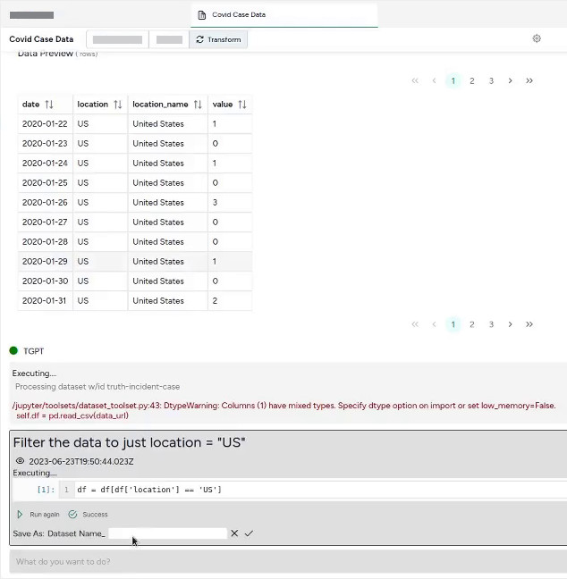

You can create workflows to calibrate or to configure models that leverage:

- Data from the Terarium database.
- Custom data from your uploaded from your computer.
- Data stored in a GitHub repository. 

## Add a dataset to your project

For information on finding or uploading datasets, see [Gather modeling resources](../modeling-resources)

## Dataset descriptions

Terarium relies on large language models (LLMs) to make sense of datasets and enable data transformations of:

- Descriptions
- Annotations
- Features

To view the raw data in a dataset

1. Open the dataset in a new tab.
2. Click the :octicons-file-24:{ aria-hidden="true" } **Data** tab.

### Enrich dataset descriptions

Terarium also has an enrichment service that can automatically populate dataset descriptions based on related publications you've identified. When you choose to enrich a dataset, the service looks at your related publications to find and apply definitions for concepts.

To enrich a dataset description

1. Open the dataset in a new tab.
1. Click :octicons-plus-24:{ aria-hidden="true" } **Add resources**.
2. Select the resources you want to use and click **Use these resources to enrich descriptions**.

## Transform a dataset

Terarium has a large language model interface, TGPT, to help you transform data to suit your modeling and simulation processes. With TGPT, you can use simple language to explain the changes you want to make and quickly save the transformed data as a new resource within your project. 

Each subsequent transformation you make builds off your previous changes. TGPT can perform multiple commands at once. With it, you can:

+ Perform math
+ Add or drop columns
+ Describe the dataset
+ Sort the data
+ Plot the data
+ Undo changes coming soon

??? example "Example prompts"

    * Filter the data to just location = "US"
    * Convert the date column to timestamps and plot the data
    * Create a new census column that is a rolling sum of 'value' over the previous 10 days
    * Add a new column that is the cumulative sum of the values 
    * Plot the data
    * Rename column 'cases' to 'I', column 'hospitalizations' to 'H', and 'deaths' to 'E' 

To use TGPT to transform a dataset

1. Click :fontawesome-solid-arrows-rotate:{ aria-hidden="true" } **Transform**.
2. Use the text box at the bottom of the page to describe the transformation you want to make and then press ++enter++.
3. Scroll to the data preview below your prompt to inspect the transformation.
4. To make changes to the transformation, edit the provided python code and click :material-play-outline:{ aria-hidden="true" } **Run again**.
5. Repeat steps 2&ndash;4 to make additional transformations. 
6. At any time, save the transformed data:
    - Save the dataset as a new dataset in Terarium by clicking :material-content-save-outline:{ aria-hidden="true" } **Save as**, entering a unique name in the text box and clicking :octicons-check-24:{ title="Save" }.
    - Download the dataset to your computer by clicking :octicons-download-24:{ aria-hidden="true" } **Download**.

### Understand how TGPT interprets your prompt

To give you a sense whether it correctly interpreted your prompt, TGPT displays the following information while it's running: 

- Its thoughts about your prompt (*I need to filter the dataset to only include rows with location equal to 'US'*)
- How it intends to perform the transformation (*DatasetToolset.generate_python_code*)

You can show/hide these thoughts at any time by clicking :fontawesome-regular-eye:{ title="Show/Hide Thought"}.

??? tip "Always show/hide thoughts"

    To always show or hide thoughts, click :octicons-gear-24:{ title="Chat options" } > **Auto hide chat thoughts** / **Do not auto hide chat thoughts**.

When the transformation is complete, TGPT shows:

- A preview of the transformed data.
- Any python code used to complete the transformation.
- Error codes (if applicable).
- Any visualizations (if prompted).