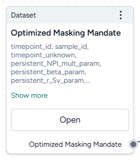

# Working with data

You can use uploaded datasets or simulation results to [configure](../config-and-intervention/configure-model.md) and [calibrate](../simulation/calibrate-model.md) models. If the data doesn't align with your intended analysis, you can [transform](transform-dataset.md) it by:

- Creating new variables
- Calculating summary statistics
- Filtering data
- Joining datasets

The Transform data operator can also serve as a place to visually plot and compare multiple datasets or simulation results.

!!! note

    For information about uploading datasets, see [Gather modeling resources](../upload-resources/index.md).

## Dataset resource

A dataset resource can represent:

- A dataset you've uploaded.
- A dataset you've modified and saved.
- The output of a simulation or an optimized intervention policy.
 
In a workflow graph, a dataset resource lists the columns it contains. You can use it to: 

- [Open and explore the raw data](review-and-enrich-dataset.md).
- Run data transformations, model configurations, and model calibrations.

-   :material-arrow-collapse-right:{ .lg .middle aria-hidden="true" } __Inputs__

    ---

    - None

-   :material-arrow-expand-right:{ .lg .middle aria-hidden="true" } __Outputs__

    ---

    - Dataset

???+ list "Add a dataset resource to a workflow"

    - Drag the resource from the Datasets section of the Resources panel.

### What can I do with a dataset resource?

Hover over the output of the Dataset resource and click link :octicons-plus-24:{ title="Link" aria-labelledBy="link-icon-label" } to use the dataset as an input to one of the following operators.

-   __Data__

    ---

    - [Transform dataset](transform-dataset.md)  
      Guide an AI assistant to modify or visualize the dataset. 

-   __Configuration and intervention__

    ---

    - [Configure model](../config-and-intervention/configure-model.md)  
      Use the dataset to extract initial values and parameters for the condition you want to test.
    - [Validate configuration](../config-and-intervention/validate-model-configuration.md)  
      Use the dataset to validate a configuration

-   __Simulation__

    ---

    - [Calibrate](../simulation/calibrate-model.md)  
      Use the dataset to improve the performance of a model by updating the value of configuration parameters.
    - [Calibrate ensemble](../simulation/calibrate-ensemble.md)  
      Use the dataset to improve the performance of a model by updating the value of configuration parameters.

