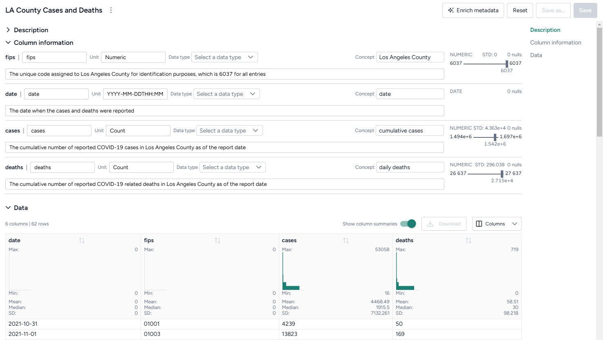

# Review and enrich a dataset

Once you have [uploaded a dataset into your project](../upload-resources/index.md), you can open it to:

- Explore and summarize its data and columns.
- Manually add metadata that explains the data in each column.
- Automatically enrich metadata using documents in your dataset or without additional context.

## Review a dataset

To get an understanding of your data, you can open a dataset and review its columns and a selection of its rows. A dataset resource previews up to 100 rows of data.

??? list "Open a dataset"

    - Perform one of the following actions:
      
        - In the Resources panel, click the name of the dataset.
        - On a Dataset node in the workflow graph, click **Open**.

??? list "View the raw data in a dataset"

    - Click **Data** in the navigation list on the right.

??? list "Download a dataset"

    - Next to the dataset name, click Menu :fontawesome-solid-ellipsis-vertical:{ title="Menu" aria-labelledBy="Menu" } > :octicons-download-24:{ aria-hidden="true"} **Download**.

## Enrich a dataset

If your dataset lacks descriptive details about what each column contains, you can use Terarium's dataset enrichment capability to complete the:

- **Units**: What the column measures (dates, cases, people) or contains (text).
- **Descriptions**: A short plain language explanation of the column's contents. 
- **Concepts**: Epidemiological concepts that relate to the data in the column. Helpful in mapping data to model variables.
- **Distributions of values** 

Terarium's enrichment service uses an AI language model to generate column details based on either:

- Contextual clues in the contents of a document in your project. 
- The column headers in the dataset. In this case, the language model attempts to define the columns as if they relate to a general epidemiological context.

???+ note

    - Curating concepts improves structural comparison and alignment of models and data.
    - If Terarium can't determine what a column represents, it fills out the description to summarize distribution of values it contains.

??? list "Enrich dataset metadata"

    1. Click **Enrich metadata**.
    2. Perform one of the following actions:
    
        - To enrich metadata without selecting a document, click **Generate information without context**.
        - To use a document, select the document title.
    
    3. Click **Enrich**.
    4. Review the updated description and column information. 
    5. Click **Save**.

??? list "Add or edit dataset metadata"

    1. Edit the **Name**, **Unit**, **Data type**, **Concept**, or **Description** of any field.
    2. Click **Save**.