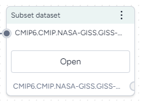

# Subset dataset

The Subset dataset operator allows you to generate a subset of an Earth System Grid Federation (ESGF) dataset. You can generate subsets by specifying geo-boundaries or temporal slices.

<figure markdown><figcaption markdown>How it works: [climate-data](https://github.com/DARPA-ASKEM/climate-data/blob/main/api/processing/filters.py#L48) :octicons-link-external-24:{ alt="External link" title="External link" }</figcaption></figure>

-   :material-arrow-collapse-right:{ .lg .middle aria-hidden="true" } __Inputs__

    ---

    Dataset

-   :material-arrow-expand-right:{ .lg .middle aria-hidden="true" } __Outputs__

    ---

    Dataset subset

To generate a subset of an ESGF dataset

1. From the Resources panel, drag the Dataset resource into the workflow graph.

    ???+ note "To find ESGF datasets"

        On the Datasets tab of the :fontawesome-regular-compass:{ aria-hidden="true" } [Explorer](../modeling-resources/index.md#find-papers-models-and-datasets), change the **Source** to ESGF.

2. Right-click anywhere on the workflow graph and select **Work with dataset** > **Transform dataset**.
3. Connect the output of the Dataset resource to the input of the Subset dataset operator.
4. Click **Open**.
5. Choose the subset of data you want to include:
    - **Geo-boundaries**: Specify a pair of **Latitude** and **Longitude** coordinates that define a bounding box around an area of interest. 
    - **Temporal slide**: Specify the earliest (**From**) and latest (**To**) dates to include.
6. To sample the data from the subset: 
    1. Select **Spatial** or **Time Skipping**. 
    2. Enter the number of datapoints or time slices you want to include. For example, enter *5* to keep every fifth entry.
6. Click :material-play-outline:{ aria-hidden="true" } **Run**.
7. Click **Save as new dataset** to add the subset to your project resources.  