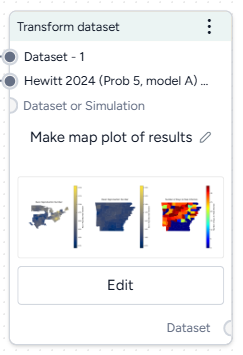
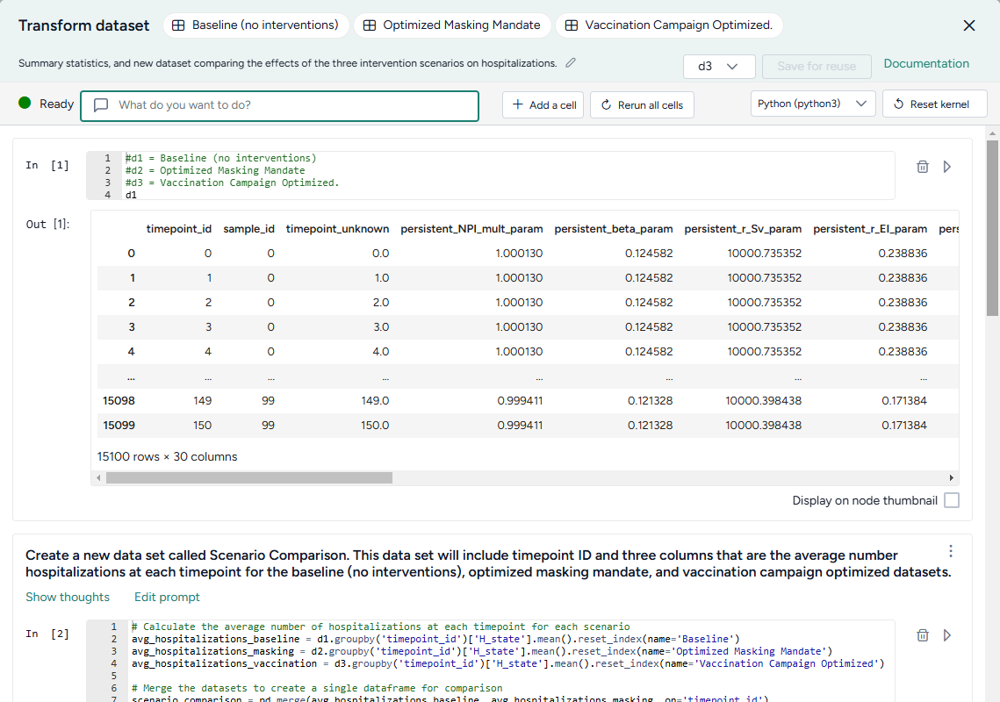
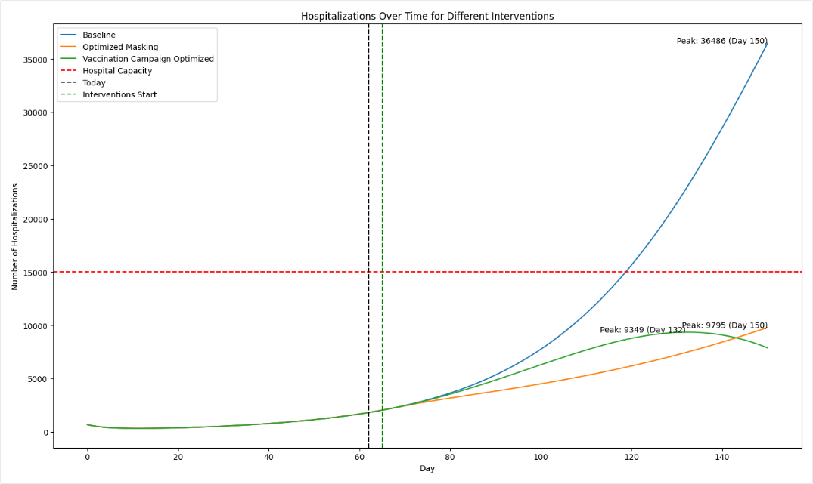
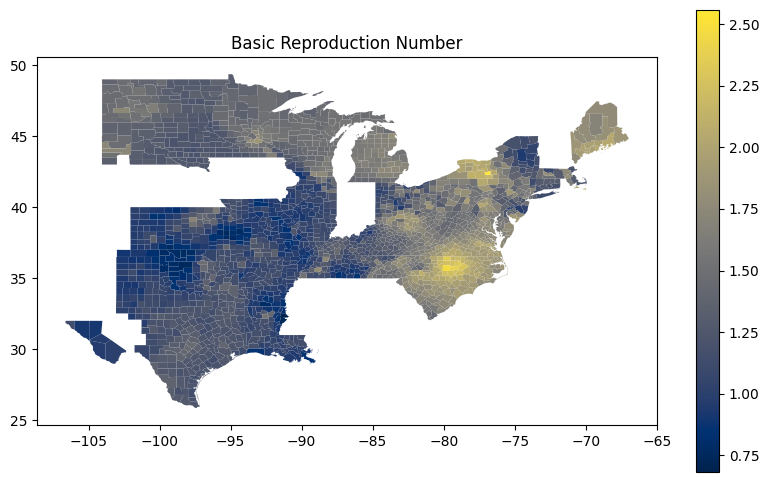

# Transform a dataset

If a dataset doesn't align with your modeling goals, you can transform it by cleaning and modifying it or combining it with other datasets. Supported transformations include: 

<div class="grid cards" markdown>

-   __Manipulation__

    ---

    - Creating new variables.
    - Filtering the data.
    - Joining two or more datasets.
    - Performing mathematical operations.
    - Adding or dropping columns.
    - Sorting the data.
    - Handling missing values.
    - Converting incidence data (such as daily new case counts) to prevalence data (total case counts at any given time).

-   __Visualization and summarization__

    ---

    - Calculating summary statistics.
    - Describing the dataset.
    - Plotting the data.
    - Answering specific questions about the data.

</div>

The Transform dataset operator is a code notebook with an interactive AI assistant. You describe in plain language the changes you want to make, and the large language model (LLM)-powered assistant automatically generates the code for you.

!!! note

    The Transform dataset operator adapts to your level of coding experience. You can: 

    - Work exclusively by prompting the assistant with plain language.
    - Edit and rerun any of the assistant-generated code. 
    - Enter your own executable code to make custom transformations.

## Transform dataset operator

In a workflow, the Transform dataset operator takes one or more datasets or simulation results as inputs and outputs a transformed dataset.

???+ tip

    For complex transformations with multiple steps, it can be helpful to chain multiple Transform dataset operators together. This allows you to:

    - Keep each notebook short and readable.
    - Isolate transformations that take a long time so you don't have to rerun them multiple times.
    - Access intermediate results for testing or comparison.

You can choose any step in your transformation process as the thumbnail preview.

<figure markdown><figcaption markdown>**How it works**: The Transform dataset operator is an interactive code notebook with a [pandas](https://pandas.pydata.org/) :octicons-link-external-24:{ aria-hidden="true" alt="External link" title="External link" } dataframe. See the [pandas User Guide](https://pandas.pydata.org/docs/user_guide/index.html#user-guide) :octicons-link-external-24:{ aria-hidden="true" alt="External link" title="External link" } for information on using pandas to work with data.</figcaption></figure>

<div class="grid cards" markdown>

-   :material-arrow-collapse-right:{ .lg .middle aria-hidden="true" } __Inputs__

    ---

    - [Dataset](index.md#dataset-resource)
    - Simulation output

-   :material-arrow-expand-right:{ .lg .middle aria-hidden="true" } __Outputs__

    ---

     - [Dataset](index.md#dataset-resource)

</div>

???+ list "Add the Transform dataset operator to a workflow"

    - Perform one of the following actions:
    
        - On a resource or operator that outputs a dataset, hover over the output and click <span class="sr-only" id="link-icon-label">Link</span> :octicons-plus-24:{ title="Link" aria-labelledby="link-icon-label" } > **Transform dataset**.
        - Right-click anywhere on the workflow graph, select **Data** > **Transform dataset**, and then connect the output of one or more Datasets or Simulations to the Transform dataset inputs.

## Modify data in the Transform dataset code notebook

Inside the Transform dataset operator is a code notebook. In the notebook, you can prompt an AI assistant to answer questions about or modify your data. If you're comfortable writing code, you can edit anything the assistant creates or add your own custom code.



Prompts and responses are written to cells where you can preview, edit, and run code. Each cell builds on the previous ones, letting you gradually make complex changes and save the history of your work. You can insert prompts or cells at any point in the chain of transformations.

???+ tip

    Wait until the status of the AI assistant is :green_circle:{ aria-hidden="true" title="" style="margin: 0;" } Ready (not :red_circle:{ aria-hidden="true" title="" style="margin: 0;" } Offline or :orange_circle:{ aria-hidden="true" title="" style="margin: 0;" } Busy) before attempting to make any transformations. 

??? list "Open the Transform dataset code notebook"

    - Make sure you've connected one or more datasets to the Transform dataset operator and then click **Edit**.

??? list "Rerun a code notebook"

    When you reopen a Transform dataset notebook, the code environment is completely fresh. The initial datasets may be preloaded, but none of the transformations you previously made will be. To load them all:

    - Click :material-refresh:{ aria-hidden="true" style="transform: rotate(315deg);" } **Rerun all cells**.

??? list "Reset the kernel"

    From time to time, the AI assistant may get caught in a loop or stuck in a long-running transformation. To reset it:

    ???+ note

        Resetting the kernel doesn't delete your prompts or the code cells in the notebook. You can still access and reload them at any time.

    1. Click :material-refresh:{ aria-hidden="true" style="transform: rotate(45deg) scaleX(-1);" } **Reset kernel**.
    2. To reload the transformations in the notebook, click :material-refresh:{ aria-hidden="true" style="transform: rotate(315deg);" } **Rerun all cells**.

### Prompt the AI assistant to transform data

The Transform dataset AI assistant interprets plain language to answer questions about or transform your data.

???+ tip

    The AI assistant can perform more than one command at a time.

??? list "Prompt or question the AI assistant"

    1. Click in the text box at the top of the page and then perform one of the following actions:
        - Select a suggested prompt and edit it to fit your dataset and the transformation you want to make.
        - Enter a question or describe the transformation you want to make. 
    2. Click <span class="sr-only" id="submit-icon-label">Submit</span> :octicons-paper-airplane-24:{ style="transform: rotate(-45deg);" title="Submit" aira-labelledby="Submit" }.
    3. Scroll down to the new code cell to inspect the transformation.

??? list "Choose where to insert a prompt"

    By default, new prompts and responses appear at the bottom of the notebook. To go back and insert intermediate steps in your transformation, you can change where your prompts appear. Note that if you do this, you will need to rerun any downstream transformations.

    1. Select the cell above where you want to insert the new prompt and response.
    2. Submit your new prompt.

#### How to write better prompts

The AI assistant generates better code when given specific instructions. Unintended actions or hallucinations are more likely to occur when instructions are vague. Describe what you want in steps, and clearly identify source datasets, columns, and actions.

The assistant often doesn't create previews or new datasets unless prompted. Include in your prompts whether you want to:

- Preview your data:

    > `Add a new column that keeps a running total of infections. Show me the first 10 rows.`

- Create an intermediate dataset: 

    > `Create a new dataset named "result". The first column is named "fips" and its values are...`

If you're not satisfied with a response, you can generate a new one or modify your prompt to refine what you'd like to see.

???+ tip

    If the assistant doesn't produce the desired results, you can keep your transformation process well organized by adding more details to your prompt and then regenerating the responses. This ensures that any unnecessary results don't get saved in the notebook.

??? list "Change your prompt"

    - Click **Edit prompt**, change the text as needed, and then press ++enter++.

??? list "Get a new response to your prompt"

    - Click <span class="sr-only" id="menu-icon-label">Menu</span> :fontawesome-solid-ellipsis-vertical:{ title="Menu" aria-labelledby="menu-icon-label" } > **Re-run answer**.

#### How the AI assistant interprets prompts

To give you a sense whether it correctly interpreted your prompt, the assistant: 

- Records its thoughts about your prompt (`I need to filter the dataset to only include rows with location equal to 'US'`).
- Shows how it intends to perform the transformation (`DatasetToolset.generate_python_code`).
- Presents commented code that explains what it's done. 

When the response is complete, the code cell may also contain:

- A direct answer to your question.
- A preview of the transformed data.
- Any applicable error codes.
- Any requested visualizations.

??? list "Show or hide the assistant's thoughts about your prompt"

    - Click **Show/Hide thoughts**.

### Add or edit code

At any time, you can edit the code generated by the AI assistant or enter your own custom code. The notebook environment supports the following languages, each extended with commonly used data manipulation and scientific operation libraries.

???+ note

    The use of Julia is currently disabled.

<div class="grid cards" markdown>

-   :simple-python:{ .lg .middle aria-hidden="true" } __[Python](https://docs.python.org/3.10/) :octicons-link-external-24:{ aria-hidden="true" alt="External link" title="External link" } libraries__

    ---

    - [pandas](https://pandas.pydata.org/pandas-docs/version/1.3/user_guide/index.html) :octicons-link-external-24:{ aria-hidden="true" alt="External link" title="External link" } for organizing, cleaning, and analyzing data tables and time series.
    - [numpy](https://numpy.org/doc/1.24/user/absolute_beginners.html) :octicons-link-external-24:{ aria-hidden="true" alt="External link" title="External link" } for handling of large arrays of numbers and performing mathematical operations.
    - [scipy](https://docs.scipy.org/doc/scipy-1.11.4/index.html) :octicons-link-external-24:{ aria-hidden="true" alt="External link" title="External link" } for performing advanced scientific operations, including optimization, integration, and interpolation.
    - [pickle](https://docs.python.org/3/library/pickle.html) :octicons-link-external-24:{ aria-hidden="true" alt="External link" title="External link" } for saving and reloading complex data structures.

-   :simple-julia:{ .lg .middle aria-hidden="true" } __[Julia](https://docs.julialang.org/en/v1.10/) :octicons-link-external-24:{ aria-hidden="true" alt="External link" title="External link" } libraries__

    ---

    - [DataFrames](https://dataframes.juliadata.org/stable/man/getting_started/) :octicons-link-external-24:{ aria-hidden="true" alt="External link" title="External link" } for manipulating data tables.
    - [CSV](https://csv.juliadata.org/stable/#Overview) :octicons-link-external-24:{ aria-hidden="true" alt="External link" title="External link" } for reading, writing, and processing CSV files.
    - [HTTP](https://juliaweb.github.io/HTTP.jl/stable/) :octicons-link-external-24:{ aria-hidden="true" alt="External link" title="External link" } for sending and receiving data over the Internet.
    - [JSON3](https://github.com/quinnj/JSON3.jl) :octicons-link-external-24:{ aria-hidden="true" alt="External link" title="External link" } for working with JSON data.
    - [DisplayAs](https://github.com/tkf/DisplayAs.jl) :octicons-link-external-24:{ aria-hidden="true" alt="External link" title="External link" } for displaying data.

-   :simple-r:{ .lg .middle aria-hidden="true" } __[R](https://cran.r-project.org/doc/manuals/r-release/R-intro.html) :octicons-link-external-24:{ aria-hidden="true" alt="External link" title="External link" } libraries__

    ---

    - [data.frame](https://www.rdocumentation.org/packages/base/versions/3.6.2/topics/data.frame) :octicons-link-external-24:{ aria-hidden="true" alt="External link" title="External link" } for manipulating data tables.


</div>

???+ tip 

    More libraries are available in the code notebook, but you may need to import them before use.

    1. To list the available packages, click :octicons-plus-24:{ aria-hidden="true" } **Add a cell** and then enter and run:

        === "Python"

            ```bash
            pip list 
            ```

        === "Julia"

            ```julia
            Pkg.installed() 
            ```

        === "R"

            ```r
            installed.packages() 
            ```

    2. To import a package, click :octicons-plus-24:{ aria-hidden="true" } **Add a cell** and then enter and run:

        === "Python"

            ```bash
            import <package_name>
            ```

        === "Julia"

            ```julia
            using <package_name> 
            ```

        === "R"

            ```r
            library(<package_name>) 
            ```

    ??? tip "Additional libraries that may be useful for data transformations"

        <div class="grid cards" markdown>

        -   __Data manipulation and analysis__
        
            ---
        
            - [dask](https://docs.dask.org/en/stable/) :octicons-link-external-24:{ aria-hidden="true" alt="External link" title="External link" } for handling large datasets and computations efficiently.
            - [geopandas](https://geopandas.org/en/v0.13.2/docs.html) :octicons-link-external-24:{ aria-hidden="true" alt="External link" title="External link" } for working with geographic data in tables.
            - [xarray](https://docs.xarray.dev/en/v0.19.0/) :octicons-link-external-24:{ aria-hidden="true" alt="External link" title="External link" } for managing and analyzing multidimensional datasets.


        -   __Data visualization__
        
            ---
        
            - [cartopy](https://scitools.org.uk/cartopy/docs/latest/) :octicons-link-external-24:{ aria-hidden="true" alt="External link" title="External link" } for creating maps and visualizing geographic data.
            - [matplotlib](https://matplotlib.org/3.7.5/users/index.html) :octicons-link-external-24:{ aria-hidden="true" alt="External link" title="External link" } for creating static, animated, and interactive visualizations.

        -   __Machine learning__
        
            ---
        
            - [scikit-learn](https://scikit-learn.org/1.4/user_guide.html) :octicons-link-external-24:{ aria-hidden="true" alt="External link" title="External link" } for creating machine learning models. 
            - [torch](https://pytorch.org/docs/2.5/) :octicons-link-external-24:{ aria-hidden="true" alt="External link" title="External link" } for building, training, and experimenting with machine learning models.

        -   __Image processing__
        
            ---
        
            - [scikit-image](https://scikit-image.org/docs/stable/) :octicons-link-external-24:{ aria-hidden="true" alt="External link" title="External link" } for processing and analyzing images.

        -   __Graph and network analysis__
        
            ---
        
            - [networkx](https://networkx.org/documentation/stable/reference/) :octicons-link-external-24:{ aria-hidden="true" alt="External link" title="External link" } for working with networks and graphs.

        </div>

??? list "Change the language of the code notebook"

    The Transform dataset AI assistant writes Python code by default. You can switch between Python, R, or Julia code at any time.

    - Use the **language** drop down above the code cells.

??? list "Make changes to a transformation"

    - Directly edit the code in the In cell and then click <span class="sr-only" id="run-icon-label">Run</span> :material-play-outline:{ title="Run" aria-LabelledBy="run-icon-label"}.

??? list "Add your own custom code"

    1. Scroll to the bottom of the window and click :octicons-plus-24:{ aria-hidden="true" } **Add a cell**.
    2. Enter your code in the In cell and then click <span class="sr-only" id="run-icon-label">Run</span> :material-play-outline:{ title="Run" aria-LabelledBy="run-icon-label"}.

??? list "Choose where to insert your custom code"

    By default, new code cells appear at the bottom of the notebook. You can add intermediate steps in your transformation by changing where your code cells appear. Note that if you do this, you will need to rerun any downstream transformations.

    1. Select the cell above where you want to insert the new code cell.
    2. Click :octicons-plus-24:{ aria-hidden="true" } **Add a cell**.

## Save transformed data

At times in your transformation or whenever specifically prompted, the AI assistant creates new transformed datasets as the output for the Transform dataset operator. This lets you return to previous versions of your dataset or choose the best one to save and use in your workflow.

When you're done making changes, you can connect the chosen output to any operators in the same workflow that take datasets as an input. 

To use a transformed dataset in other workflows, save it as a project resource.

??? list "Choose a different output for the Transform dataset operator"

    - Use the **Select a dataframe** dropdown.

??? list "Save a transformed dataset to your project resources"

    You can save your transformations as a new dataset at any time.

    1. (Optional) If you created multiple outputs during your transformations, **Select a dataframe** to save.
    2. Click **Save for reuse**, enter a unique name in the text box, and then click **Save**.

??? list "Preview a transformation on the Transform dataset operator in the workflow graph"

    - Select **Display on node thumbnail**.

??? list "Download a transformed dataset"
    
    1. Save the transformation output as a new dataset.
    2. Close the Transform dataset code notebook.
    3. In the Resources panel, click the name of the new dataset.
    4. Click <span class="sr-only" id="menu-icon-label">Menu</span> :fontawesome-solid-ellipsis-vertical:{ title="Menu" aria-labelledby="menu-icon-label" } > :octicons-download-24:{ aria-hidden="true" } **Download**.

## Transformation examples

The following sections show examples of how to prompt the Transform dataset AI assistant to perform commonly used transformations. 

???+ example "Example prompts"

    Some simple prompts that can be used as part of larger transformation processes include:

    * `Filter the data to just location = "US"`
    * `Convert the date column to timestamps and plot the data`
    * `Create a new census column that is a rolling sum of 'value' over the previous 10 days`
    * `Add a new column that is the cumulative sum of the values`
    * `Plot the data`
    * `Rename column 'cases' to 'I', column 'hospitalizations' to 'H', and 'deaths' to 'E'` 

??? list "Clean a dataset"

    You can use the AI assistant to clean your dataset by specifying column types, reformatting dates, and performing other common data preparation tasks.
    
    **Specify the type of data in a column**
    
    Reformat a column of numeric IDs to, for example, add back leading zeroes that were stripped off: 
    
    ```{ .text .wrap }
    Set the data type of the column "fips" to "string". Add leading zeros to the "fips" column to a length of 5 characters.
    ```
    
    **Reformat dates**
    
    Datasets with inconsistent date formats can interfere with accurate interpretation and integration into model parameters:
    
    ```{ .text .wrap }
    Set the data type of the column "t0" to datetime with format like YYYY-MM-DD hh:mm:ss UTC
    ```

??? list "Combine datasets"

    Before you combine datasets, make sure they share at least one common column like name, ID, date, or location. You can ask the AI assistant to link them by matching records based on the common data so that information aligns correctly.
    
    1. Connect the outputs of each dataset to the input of a Transform dataset operator and then click **Edit**.
    2. Ask the assistant to:

        ```{ .text .wrap }
        Join d1 and d2 where date, county, and state match. Save the result as a new dataset and show me the first 10 rows.
        ```

        ???+ tip
    
            You can also specify what type of join (such as inner join, left join, right join, or full outer join) you want the assistant to perform.
    
    3. To save the dataset as a new resource in your project, change the dataframe and click **Save for reuse**.

??? list "Plot a dataset"

    You can visualize your data to explore patterns, compare quantities, identify relationships, analyze distributions, and capture insights tailored your analysis. Supported visualizations include:
    
    <div class="col-container" markdown>
    <div class="text-col" markdown>

    - Line plots  
    - Bar charts  
    - Scatter plots  
    - Box plots  
    - Histograms  
    - Pie charts  
    - Heatmaps  
    - Violin plots  
    - Bubble charts  
    - Area charts  

    </div>
    <div class="image-col" markdown>
    
    </div>
    </div>
    
    ???+ tip
    
        To refine your visualizations, edit your prompt to add more details about what you want to see (for example, add `Insert a legend` to a prompt that initially only requests a plot).
    
    1. Ask the assistant to plot your data. For the best results, be as specific as possible about what you want to see:

        ```{ .text .wrap }
        plot the number of hospitalizations over the 150 days for the baseline, masking, and vaccination interventions.
        ```

    2. To refine the visualization, perform one of the following actions:

        - Edit your prompt to add more information that explains the changes you want.
        - Edit the generated code and then click <span class="sr-only" id="run-icon-label">Run</span> :material-play-outline:{ title="Run" aria-LabelledBy="run-icon-label"}.
    
    3. (Optional) To share the image:

        - Select **Display on node thumbnail** to use the image as the thumbnail on the Transform dataset operator in the workflow.
        - Right-click the image, select **Copy image**, and then paste it into your project overview.

??? list "Create a map-based visualization"

    The AI assistant can connect to third-party code repositories and data visualization libraries to incorporate geolocation data and then create map plots.
    
    
        
    These prompts ask the assistant to get U.S. county-level data from plotly and then use using matplotlib and geopandas handle and visualize geographic data structures.
    
    ```{ .text .wrap }
    Write me code that downloads the US counties geojson from plotly GitHub using urlopen
    ```

    ```{ .text .wrap }
    Use matplotlib to make a figure. Create a choropleth map from the column "Rl" in the geopandas dataframe "new_df_all". Use the "cividis" colormap. Add a legend.
    ```

??? list "Compare datasets"

    You can use the AI assistant to compare multiple datasets or simulation results. 
    
    See the [Working with Data](https://app.terarium.ai/projects/a9462f60-14bc-4ca3-869e-8a7e5a8600e2/workflow/33433e99-6c34-446b-83fa-41bad1440dd8){ target="_blank" } workflow in the [Terarium Sample Project](https://app.terarium.ai/projects/a9462f60-14bc-4ca3-869e-8a7e5a8600e2/overview){ target="_blank" }. It takes three datasets generated by optimizing intervention policies and then:
        
    - Combines them into a new scenario comparison dataset.
    - Calculates summary statistics for hospitalizations in each dataset.
    - Identifies the timepoint at which the maximum number of hospitalizations occur in each dataset.
    - In a separate data transformation, plots hospitalizations for each intervention over time.

??? list "Convert incidence data to prevalence data"

    If you have an epidemiological dataset that contains incidence data (such as new cases per day), you can prompt the AI assistant to convert it to prevalence data (such as total cases at any given time). You will need to specify:
    
    - How long it takes people to recover.
    - The susceptible population.
    
    This prompt converts daily case counts into prevalence data. It uses user-supplied recovery and population data to calculate total cases: 
    
    ```{ .text .wrap }
    let's assume avg time to recover is 14 days and time to exit hosp is 10 days. Can you convert this data into **prevalence** data? please map it to SIRHD. Assume a population of 150 million.
    ```
    
    For more information on the logic of how the AI assistant converts from incidence to prevalence data, see the [instructions](https://github.com/DARPA-ASKEM/askem-beaker/blob/4c17fc262e01badb4427a5f3e529940c17510677/src/askem_beaker/contexts/dataset/incidence_to_prevalence.md){ target="_blank" } the assistant follows in these cases.

??? list "Calculate peak times"

    Calculating peak times can help you identify critical periods of disease spread, enabling targeted interventions.
    
    This prompt takes a collection of daily infection rates for various FIPs codes and identifies the peak time for each one:
    
    ```{ .text .wrap }
    Create a column named "peak_time". The first column is "fips". The second column is "peak_time", and its values are the values of the "timepoint" column for which the values of the FIPS columns are at a maximum.
    ```