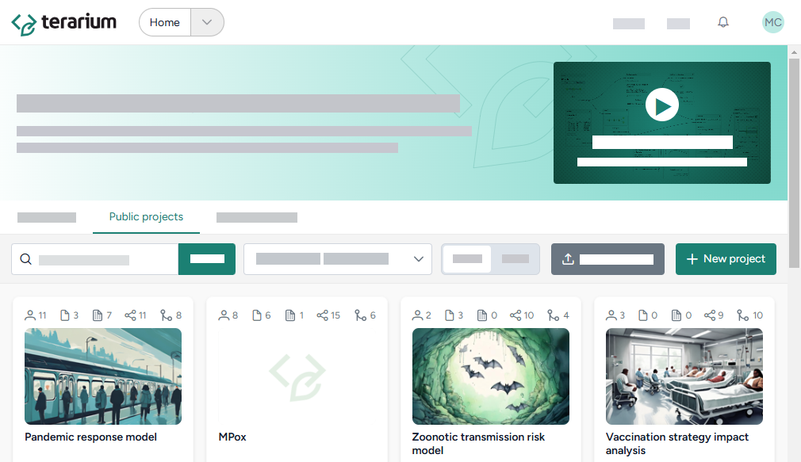
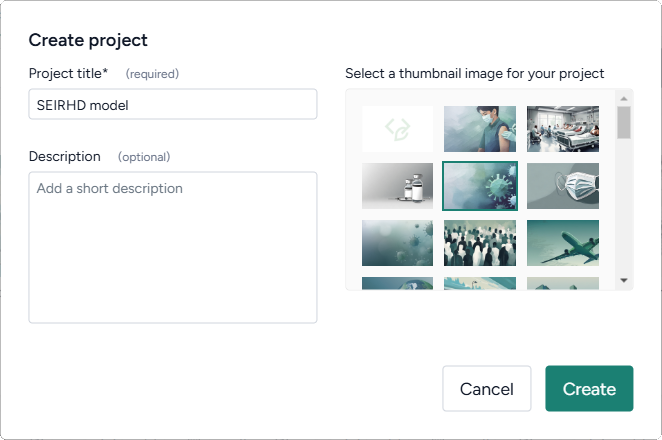
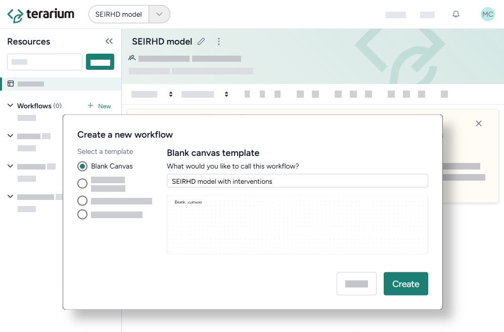
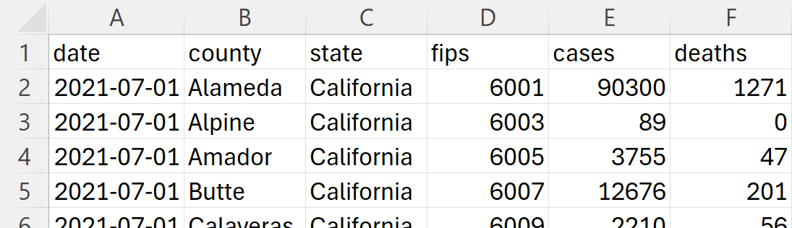
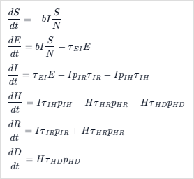

# Recreate, modify, and simulate a model

This workflow tutorial is designed to help you learn how in a few steps&mdash;all without needing to code&mdash;you can recreate, refine, and analyze models in Terarium. 

You'll start with only a dataset of COVID cases and deaths and a set of LaTeX equations that describe an SEIRHD (1) model. You'll bring these into Terarium to recreate the model, incorporate vaccination information, calibrate the model to LA county data, and create intervention policies. Throughout the workflow, you'll learn how to:
{ .annotate }

1. Susceptible, Exposed, Infected, Recovered, Hospitalized, and Deceased

<div class="grid cards" markdown>

-   **Upload and modify models and data**

    ---


    - [Create a project](#create-a-project)
    - [Upload resources](#upload-resources)
    - [Work with data](#work-with-data)
    - [Create models from equations](#create-models-from-equations)
    - [Edit models](#edit-models)

-   **Simulate models and explore intervention policies**

    ---

    - [Configure and simulate models](#configure-and-simulate-models)
    - [Calibrate model configurations](#calibrate-model-configurations)
    - [Create and simulate intervention policies](#create-and-simulate-intervention-policies) to run what-if scenarios
    - [Optimize intervention policies](#optimize-intervention-policies)
    - [Stratify models](#stratify-models) to account for different dimensions

</div>

## Upload and modify models and data

### Create a project

A project is a space to explore a problem or scenario. It stores your modeling resources (models, datasets, and documents) and various workflows that modify and simulate your models and data.

??? list "Create a project for modifying the SEIRHD model"

    <div class="grid cards" markdown>

    - 
    - 

    </div>

    1. On the Home page, click :octicons-plus-24:{ aria-hidden="true" } **New project**.
    2. Give the project the title *SEIRHD model*, select a thumbnail image, and then click **Create**.

??? list "Create a workflow to capture your modeling and simulation work"

    

    1. Click :octicons-plus-24:{ aria-hidden="true" } **New** in the Workflows section of the Resources panel.
    2. Make sure **Blank Canvas** is selected, call the workflow *SEIRHD model with interventions*, and click **Create**.

### Upload resources

Begin setting up your project by gathering resources such as models, datasets, and documents. Upload the following dataset that records COVID cases and deaths in California.

<figure markdown>

<figcaption markdown>:material-download:{ aria-hidden="true" } [Download](../assets/ca-counties-2021.csv)</figcaption>
</figure>

??? list "Upload the California COVID case data"

      

      1. Save the CSV to your computer.
      2. In the Resources panel, click **Upload** and drag in or browse to the location of the CSV file.
      3. Click **Upload**.

??? list "Enrich the case data with information the describes the columns"

    1. Open the dataset by clicking its name in the Resources panel. 
    2. Add information that helps you understand what the columns contain by clicking **Enrich metadata**.

        ???+ note

             Because you don't have any documents in your project yet, Terarium assumes the dataset relates to epidemiology when it attempts to explain the columns. When you have documents in your project, you can use them to provide context for the columns.


### Work with data

The uploaded dataset covers COVID cases and deaths in all of California for the second half of 2021. Use Terarium's data transformation tools to filter down to focus on LA county in the last two months of the year.

??? list "Filter the case data to focus on LA county"

      2. Drag the dataset from the Resources panel onto the canvas, hover over its output, click <span class="sr-only" id="link-icon-label">link</span> :octicons-plus-24:{ title="Link" aria-labelledBy="link-icon-label" } > **Transform dataset**, and then click **Edit**.
      3. Preview the data by clicking <span class="sr-only" id="run-icon-label">Run</span> :material-play-outline:{ title="Run" aria-labelledBy="run-icon-label" }.
      4. Ask the assistant to filter the data: 
      
         ``` markdown
         Filter the data to LA county from October 31st to December 31st and show me
         the new dataset.
         ```
      
      5. Ask the assistant to create a timestep column in the new dataset `filtered_d1`:
      
         ``` text
         Add a new "timestep" column to filtered_d1. Make the value for the earliest
         date equal 0 and add 1 for each subsequent date. Show me the result.
         ```
      
      6. Ask the assistant to plot the data over time:
            
         ``` text
         Plot deaths over time for filtered_d1.
         ```
      
      7. Inspect the generated code, change the following line to include `COVID` in the title, and then click <span class="sr-only" id="run-icon-label">Run</span> :material-play-outline:{ title="Run" aria-labelledBy="run-icon-label" } to redraw the plot.
      
         ``` { .python .no-copy }
         plt.title('Deaths Over Time in Los Angeles County')
         ```
      
      8. At the top of the window, select *filter_d1* and click **Save for reuse**.

Doing your data transformations in Terarium helps make your modeling process more transparent and reproducible.

### Create models from equations

{ align="right" }

Terarium can automatically recreate a model from a set of ordinary differential equations. You can extract equations from a document or pasted image or manually enter them as LaTeX.

The equations in the image to the right define a COVID SEIRHD model. You can copy and paste it into Terarium to automatically recreate the model with a visual representation that shows how people progress between disease states.

??? list "Create an SEIRHD model from a screenshot of equations"

      1. Copy the image above by right-clicking and selecting **Copy image**.
      2. Right-click anywhere on the workflow canvas, select **Modeling** > **Create model from equations**, and then click **Edit**.
      3. Right-click inside the text box and select **Paste**.
      4. When the LaTeX versions of the pasted equations appear, click :octicons-plus-24:{ aria-hidden="true" } **Add** and then click **Run** to create the model.
      5. At the top of the window, click **Save for reuse**.

### Edit models

To account for vaccination within the SEIRHD model, you can use Terarium's AI-assisted Edit model notebook. The assistant simplifies the process of changing or building off an existing model so you don't need to be familiar with specialized modeling libraries.

??? list "Add a new state variable and parameter for vaccination"

      1. Hover over the output of the Create model from equations operator, click <span class="sr-only" id="link-icon-label">link</span> :octicons-plus-24:{ title="Link" aria-labelledBy="link-icon-label" } > **Edit model**, and then click **Edit**.
      2. Add a new state variable for vaccination to the SEIRHD model by asking the AI assistant to:
      
          ``` text
          Create a new state variable named V and add a transition named T6 from S to V 
          with the rate law rv*S.
          ```
      
      3.  Add a new parameter by asking the assistant to:
      
          ``` text
          Add a new parameter rv with the description vaccination rate and the initial 
          value set to 0.
          ```
      
      4. Click **Run** to apply the changes. Compare the edited model to the previous state by changing the output in the top right.
      5. Click **Save for reuse**.

## Simulate models and explore intervention policies

### Configure and simulate models

Before you can simulate your new model, you need to set values for its state variables and parameters.

??? list "Configure the SEIRHDV model"

      1. Hover over the output of the Edit model operator, click <span class="sr-only" id="link-icon-label">link</span> :octicons-plus-24:{ title="Link" aria-labelledBy="link-icon-label" } > **Configure model**, and then click **Edit**.
      2. Edit the initial values of the state variables and set the parameter values. Set at least one parameter to be a uniform distribution with a min and max value.
      3. Click **Save as**, enter a unique for the configuration, and click **Save**. 
   
??? list "Simulate the SEIRHDV model"

      1. Hover over the output of the Configure model operator, click <span class="sr-only" id="link-icon-label">link</span> :octicons-plus-24:{ title="Link" aria-labelledBy="link-icon-label" } > **Simulate**, and click **Edit**.
      2. Change the End time to **150** days and click :material-play-outline:{ aria-hidden="true" } **Run**. 

The base SEIRHD model configured against calibrated data shows hospitalizations peaking at ~38,000 at day 150.

### Calibrate model configurations

To improve the performance of the edited model, you can adjust its parameters by calibrating it against the context of the LA county data. When you calibrate a model, Terarium provides immediate visual feedback to help you spot issues quickly.

??? list "Calibrate the SEIRHD model to the LA county data"

      1. Hover over the output of the Configure model operator and then click <span class="sr-only" id="link-icon-label">link</span> :octicons-plus-24:{ title="Link" aria-labelledBy="link-icon-label" } > **Calibrate**.
      2. Click the output of the Transform dataset operator and then click the Dataset input of the Calibrate Operator.
      3. Map the model variables to the dataset variables:
      
         - Set the **Dataset: Timeline variable** to *timestep*.
         - Map model variables `I` and `D` to dataset variables `cases` and `deaths` respectively.
      
      4. Change the **End time** to *150* and click :material-play-outline:{ aria-hidden="true" } **Run**.

When the calibration is complete, you can review:

- A loss chart showing error over time.
- Cases and deaths data over time, with observations from the dataset and the projected number of cases before and after the calibration.

### Create and simulate intervention policies

You can configure complex intervention policies to create and visualize the impact of different what-if scenarios.

The base SEIRHD model configured against calibrated data shows hospitalizations peaking at ~38,000 at day 150. Given the high number of hospitalizations, you want to explore the impacts of different interventions:

??? list "Create and simulate a intervention policy to increase the vaccination rate"

      1. Hover over the output of the Edit model operator, click <span class="sr-only" id="link-icon-label">link</span> :octicons-plus-24:{ title="Link" aria-labelledBy="link-icon-label" } > **Create intervention policy**, and then click **Open**.
      2. Create a new **Static** intervention policy starting at day *65* that sets *Paramater* *r_Sv* to *70,000*.
      3. Click **Save** and call the new intervention policy *Vaccination Campaign*.
      4. Hover over the output of the Create intervention policy operator and click <span class="sr-only" id="link-icon-label">link</span> :octicons-plus-24:{ title="Link" aria-labelledBy="link-icon-label" } > **Simulate**.
      5. Connnect the output of the Configure model operator to the Model configuration input of the Simulate operator and then click **Edit**.
      6. Change the End time to **150** days and click :material-play-outline:{ aria-hidden="true" } **Run**.
      7. To see the impacts on hospitalizations, add a chart for H and hover over the graph to see that hospitalizations peak around 8,795 at day 126 with vaccination.

This contrasts with 38,000 hospitalizations when the vaccination rate is only 10,000 per day.

### Optimize intervention policies

In Terarium, you can optimize interventions to meet specified constraints, allowing you to get answers to key decision maker questions faster. To find how many people may need to be vaccinated per day (minimum increase in daily vaccinations) to prevent hospitalizations from exceeding capacity:

??? list "Optimize the intervention policy to find how many daily vaccinations are needed to reduce hospitalizations"

      1. Set the daily vaccination rate parameter r_SV to 20,000 per day starting at day 65.
      2. Connect to an Optimize intervention policy operator.
      3. Set the success criteria:
      
         - Ensure hospitalizations (H) are below 20,000 at all timepoints in 95% of simulated outcomes.
      
      4. Specify a new intervention:
      
         - Find a new value for the parameter r_SV (vaccination rate) with the objective being closest to the lower bound (10,000 per day -- no change).
         - Set the upper bound to 60,000 per day and the initial guess to 20,000.

      5. Simulate for 150 days and click **Run**.

By simulating the optimized intervention policy, you can see how the estimates of daily vaccinations affect peak hospitalizations:

- **Initial guess**: 20,000 vaccinations per day, which leads to peak hospitalizations of 31,208.
- **Optimization**: 47,429 vaccinations per day, which leads to peak hospitalizations of 15,569.

### Stratify models

In Terarium, you can leverage an error-proof approach to stratify your model along dimensions such as age, sex, and location.

??? list "Stratify the SEIRHD model by age"

      1. Hover over the output of the Edit model operator, click <span class="sr-only" id="link-icon-label">link</span> :octicons-plus-24:{ title="Link" aria-labelledBy="link-icon-label" } > **Stratify model**, and then click **Edit**.
      2. Name the strata *Age*. 
      3. Select to stratify the *S*, *E*, *I*, *R*, *H*, and *D* state variables and the *b* (transmission) parameter.
      5. List the labels for each strata group:

         ``` text
         Young, Old
         ```

      6. Choose the allowed transitions and interactions between strata:

         - Select **Allow existing interactions between strata** to allow young and old people to interact with and infect each other.
         - Clear **Create new transitions between strata** to prevent young people from turning into old people and vice versa.

      7. Click **Stratify**.

Looking at the stratified model graph and state variables, you can see that Susceptible is stratified by young and old groups that can interact with each other.

## What's next?

You've completed the sample SEIRHD model workflow! You now have the tools you need to start uploading, transforming, and simulating models and model resources in Terarium.