# Recreate, modify, and simulate a model

This tutorial is designed to help you learn how&mdash;all without needing to code&mdash;you can recreate, refine, and analyze models in Terarium. You can follow along by looking at the shared [Terarium help sample project](https://app.terarium.ai/projects/cc51dd40-f08a-4085-9eb1-ae22d7483839/overview).

The goal of the modeling exercise in the project is to reduce COVID hospitalizations in LA county. Starting with only a dataset of cases and deaths and a few scientific papers describing disease models, it shows how to:

<div class="grid cards" markdown>

-   **Upload and modify models and data**  

    ---

    - [Upload resources](#upload-resources)
    - [Create and compare models from equations](#create-and-compare-models-from-equations)
    - [Edit a model](#edit-models)
    - [Stratify a model](#stratify-models) to account for dimensions like vaccination status
    - [Work with data](#work-with-data)

-   **Simulate models and explore intervention policies**

    ---

    - [Configure and calibrate a model](#configure-and-calibrate-a-model)
    - [Run a sensitivity analysis](#run-a-sensitivity-analysis)
    - [Create and simulate intervention policies](#create-and-simulate-intervention-policies) to run what-if scenarios
    - [Optimize intervention policies](#optimize-intervention-policies)
    - [Compare datasets](#compare-datasets)

</div>

??? tip "Try it out yourself!"

    To better understand the described modeling processes, see the sample workflow link at the top of each section. To try something out yourself, copy the models, documents, or datasets from the sample workflow into your own project.

    To copy a model or dataset:

    1. Click its name in the Resources panel.
    2. Click <span class="sr-only" id="menu-icon-label">Menu</span> :fontawesome-solid-ellipsis-vertical:{ title="Menu" aria-labelledBy="menu-icon-label" } > :octicons-plus-24:{ aria-hidden="true" } **Add to project** and select your project.

    To copy a document:

    1. Click its name in the Resources panel.
    2. Click <span class="sr-only" id="menu-icon-label">Menu</span> :fontawesome-solid-ellipsis-vertical:{ title="Menu" aria-labelledBy="menu-icon-label" } > :octicons-download-24:{ aria-hidden="true"} **Download this file** and save it to your computer.
    3. Drag the file into the Resources panel of your prroject.

## Upload and modify models and data

### Upload resources

Begin setting up your project by uploading the models, papers (documents), and datasets you need for your modeling processes. In this case, that includes a dataset of U.S. COVID cases and deaths from 2021 and a set of papers describing different disease models.

<figure markdown>
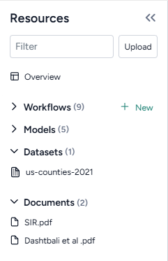
<figcaption markdown></figcaption>
</figure>

??? list "Upload modeling resources"

      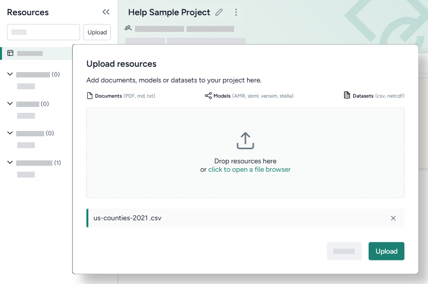

      - Drag the dataset and document files into the Resources panel and then click **Upload**.

### Create and compare models from equations

> [Sample workflow](https://app.terarium.ai/projects/cc51dd40-f08a-4085-9eb1-ae22d7483839/workflow/78688b6d-9932-4d24-b090-16ba03c7d255)

Terarium can automatically recreate a modelfrom a set of ordinary differential equations. In this case, we create models by extracting equations from the uploaded documents, but you could also get equations from pasted images or manually enter them as LaTeX.

When the extraction and creation is complete, Terarium builds visual representations of the extracted SIR and SEIRHD models that show how people progress between disease states.

<div class="grid cards" markdown>

- 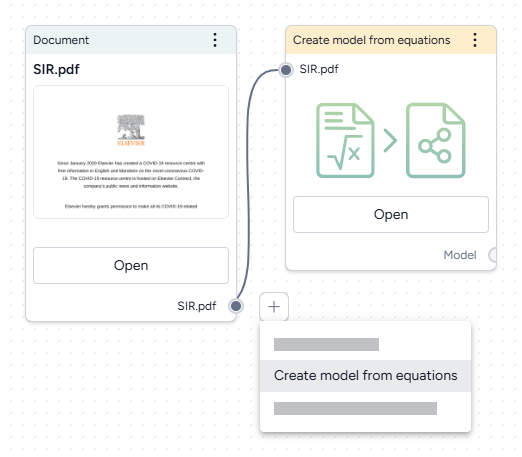
- 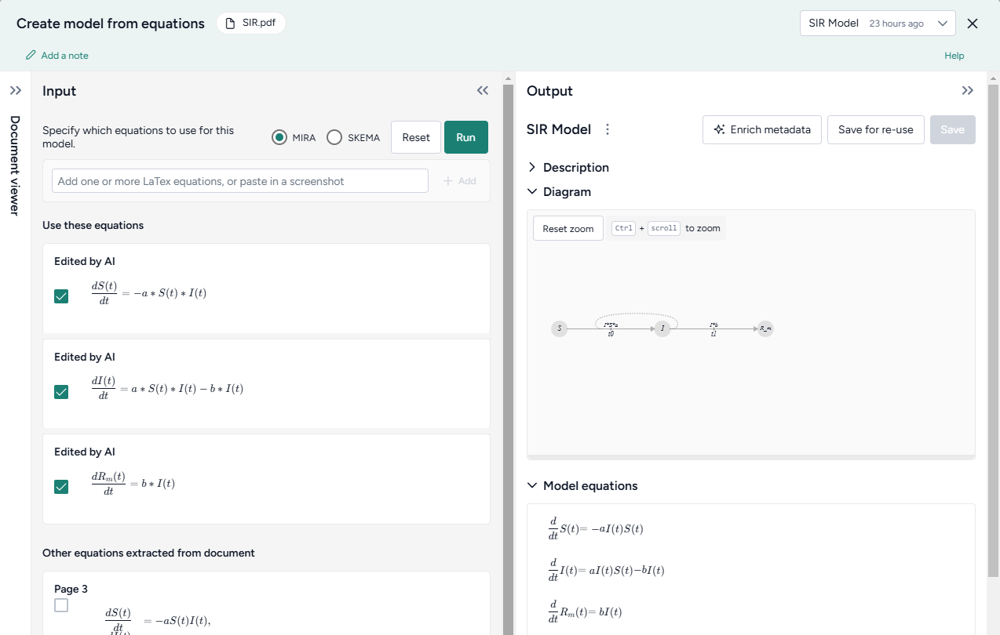

</div>

??? list "Recreate a model from a paper"

      1. Drag each document into the workflow canvas, hover over its output, click <span class="sr-only" id="link-icon-label">Link</span> :octicons-plus-24:{ title="Link" aria-labelledby="link-icon-label" } > **Create model from equations**, and then click **Open**.
      2. Review the equations automatically extracted from the document. To make changes or correct extraction errors, click an equation to edit the LaTeX version.
      3. Select each equation you want to include in the model and then click **Run** > **Mira**.
      4. At the top of the Output panel, click **Save for re-use**, and then enter a unique name.

To understand the extracted SIR and SEIRHD models better and decide which one to use, we pipe them into a Compare models operator. This uses an AI assistant to create side-by-side model cards for each according to our modeling goal of reducing hospitalizations

<div class="grid cards" markdown>

- 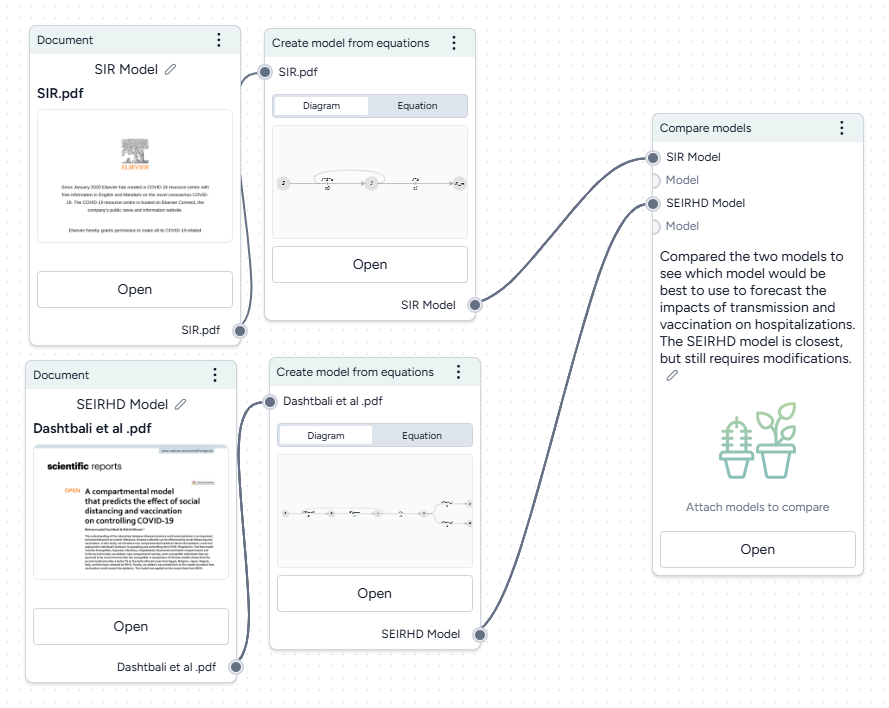
- 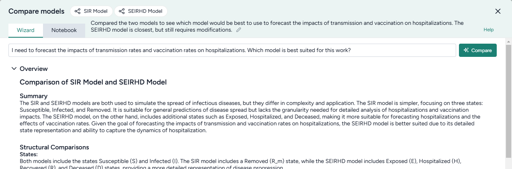

</div>

??? list "Compare models"

    1. Hover the output of a Create model from equations operator and click <span class="sr-only" id="link-icon-label">Link</span> :octicons-plus-24:{ title="Link" aria-labelledby="link-icon-label" } > **Compare models**.
    2. Click the output of the other Create model from equations operator and connect it to the new Compare models operator.
    3. Click **Open**.
    4. Enter your goal for making the comparison. In this case:

        > I need to forecast the impacts of transmission rates and vaccination rates on hospitalizations. Which model is best suited for this work? 

    5. Click **Compare** and review the summary tailored to the specified goal.

The AI-generated summary indicates that the SEIRHD model would be best for forecasting the impacts of transmission and vaccination on hospitalizations.

### Edit models

> [Sample workflow](https://app.terarium.ai/projects/cc51dd40-f08a-4085-9eb1-ae22d7483839/workflow/d0a259d7-55fa-4438-93e0-807b5e2824fc)

Now we want to update the SEIRHD model to allow people to move from infected to recovered without becoming hospitalized. Even if you don't have any coding experience, you can use Terarium's AI-assisted Edit model notebook. The assistant simplifies the process of changing or building off an existing model&mdash;no knowledge of specialized modeling libraries needed!

<div class="grid cards" markdown>

- 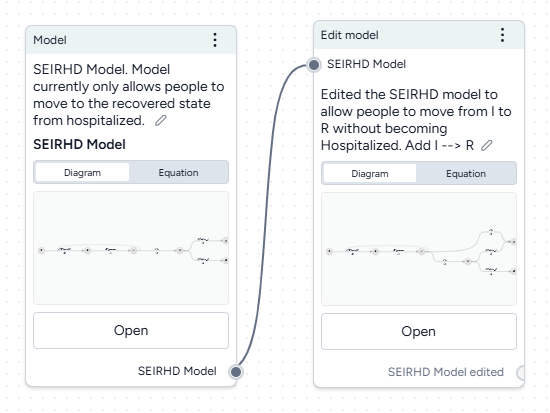
- 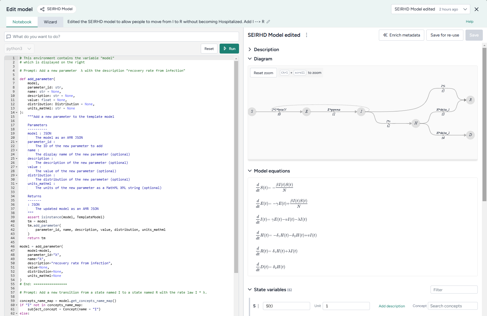

</div>

??? list "Add a new transition from infected to recovered"

      1. Pipe the model into an Edit model operator and then click **Open**.
      2. Add a new parameter for the transition rate law by asking the AI assistant to:
      
          ```{ .text .wrap }
          Add a new parameter λ with the description "recovery rate from infection"
          ```
      
      3.  Add the new transition by asking the assistant to:
      
          ```{ .text .wrap }
          Add a new transition from a state named I to a state named R with the rate law I * λ
          ```
      
      4. Click :material-play-outline:{ aria-hidden="true" } **Run** to apply the changes. Compare the edited model to the previous state by changing the output in the top right.
      5. Click **Save for re-use** and then enter *SEIRHD edited* as the name of the new model.

### Stratify models

> [Sample workflow](https://app.terarium.ai/projects/cc51dd40-f08a-4085-9eb1-ae22d7483839/workflow/cfdf914b-078e-4e67-ab6f-15bbf5c0ee1a)

Now we want to stratify our edited model to account for vaccinated and unvaccinated groups. Terarium's stratification process is an error-proof approach to stratifying along any dimension, such as age, sex, and location.

<div class="grid cards" markdown>

- 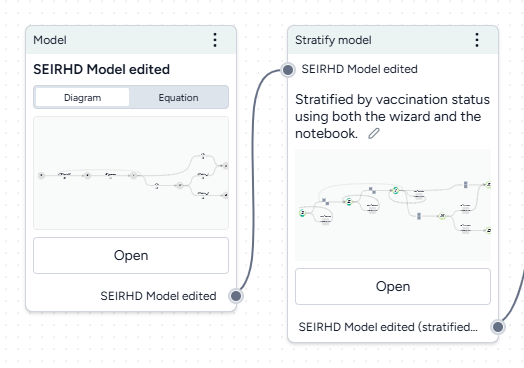
- 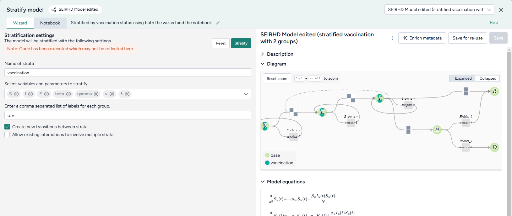

</div>

??? list "Stratify the SEIRHD model by age"

    1. Pipe the model into an Stratify model operator and then click **Open**.
    2. Name the strata "vaccination". 
    3. Select to stratify the *S*, *E*, and *I* state variables and the *beta* (infection rate), *gamma* (latent time), *v* (hospitalized rate), and *λ* (recovery rate) parameters.
    4. List the labels for each strata group:

        ``` text
        u, v
        ```

    5. Choose the allowed transitions and interactions between strata:

        - Select **Create new transitions between strata** to allow unvaccinated people to turn into vaccinated people.
        - Clear **Allow existing interactions between strata** to prevent vaccinated and unvaccinated people from interacting with and infecting each other.

        ???+ note

            In this case because vaccinated people cannot turn into unvaccinated people, additional settings must be configured in the Notebook view. For more information, see the code inside the Stratify model operator in the [Terarium help sample project](https://app.terarium.ai/projects/cc51dd40-f08a-4085-9eb1-ae22d7483839/workflow/cfdf914b-078e-4e67-ab6f-15bbf5c0ee1a) or see [Stratify a model](../modeling/stratify-model.md#add-or-edit-code).

    7. Click **Stratify**.
    8. Click **Save for re-use** and edit the name of the new model.

### Work with data

> [Sample workflow](https://app.terarium.ai/projects/cc51dd40-f08a-4085-9eb1-ae22d7483839/workflow/b5ce4c02-c96c-4cdb-bef7-691c163c237d)

The uploaded dataset covers all of the U.S. for 2021. However, we're only interested in LA county. We can use Terarium's data transformation tools to filter down to just what we need.

We'll also add a timestep column, which we'll need later to calibrate our model to the historical data.

<div class="grid cards" markdown>

- 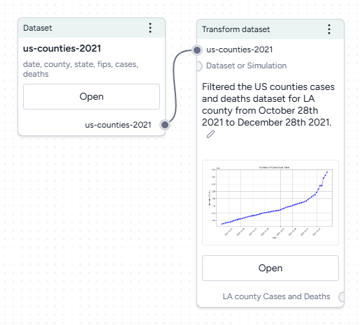
- 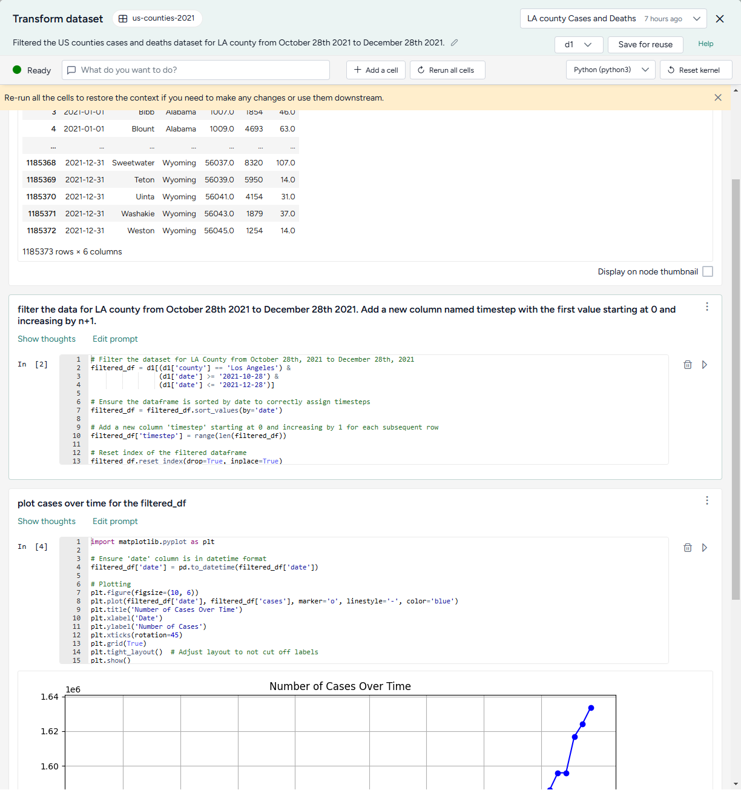

</div>

??? list "Filter the case data to focus on LA county"

      1. Drag the dataset from the Resources panel onto the canvas, hover over its output, click <span class="sr-only" id="link-icon-label">link</span> :octicons-plus-24:{ title="Link" aria-labelledBy="link-icon-label" } > **Transform dataset**, and then click **Open**.
      2. Preview the data by clicking <span class="sr-only" id="run-icon-label">Run</span> :material-play-outline:{ title="Run" aria-labelledBy="run-icon-label" }.
      3. Ask the assistant to filter the data: 
      
         ``` { .text .wrap }
         filter the data for LA county from October 28th 2021 to December 28th 2021. Add a new column named timestep with the first value starting at 0 and increasing by n+1.
         ```
      4. Ask the assistant to plot the data over time:
            
         ``` { .text .wrap }
         plot cases over time for the filtered_df
         ```
      
      5. Inspect the generated code, change the following line to include `COVID` in the title, and then click <span class="sr-only" id="run-icon-label">Run</span> :material-play-outline:{ title="Run" aria-labelledBy="run-icon-label" } to redraw the plot.
      
         ``` { .python .no-copy }
         plt.title('Number of Cases Over Time')
         ```
      
      6. Show the plot in the workflow by selecting **Display on node thumbnail**.
      7. At the top of the window, select *filter_d1*, click **Save for reuse**, and enter *LA county cases and deaths* as the name of the new dataset.

Doing your data transformations in Terarium helps make your modeling process more transparent and reproducible.

## Simulate models and explore intervention policies

### Configure and calibrate a model

> [Sample workflow](https://app.terarium.ai/projects/cc51dd40-f08a-4085-9eb1-ae22d7483839/workflow/02c85a57-1362-4112-9e04-bf5ff177aa1a)

Before you can simulate the modified SEIRHD model, we need to configure it to set the initial values for its states and parameters. To improve its performance, we can also adjust these by calibrating it against the context of the LA county data. 

In this example, we'll work with an already existing model configuration, but normally you can manually create configurations based on your expert knowledge or automatically extract them from documents or datasets in your project.

<div class="grid cards" markdown>

- 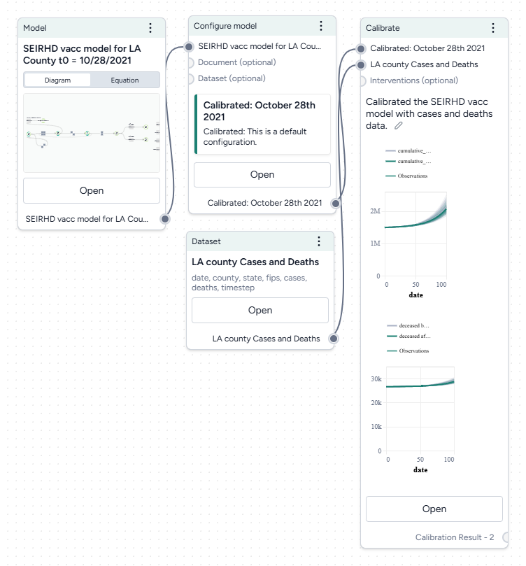
- 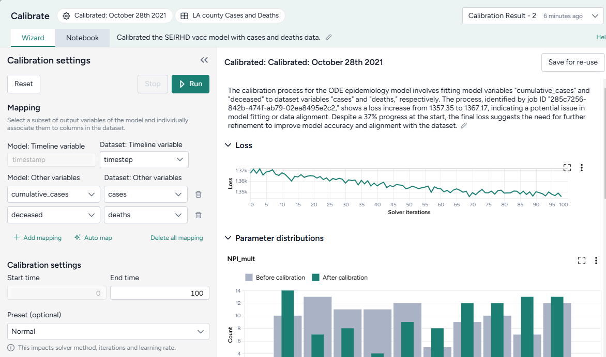

</div>

??? list "Calibrate the SEIRHD model to the LA county data"

      1. Pipe the Configure model operator and the transformed dataset into a Calibrate operator and then click **Open**.
      2. Map the model variables to the dataset variables:
      
         - Set the **Dataset: Timeline variable** to *timestep*.
         - Map model observables `cumulative cases` and `deceased` to dataset variables `cases` and `deaths` respectively.
      
      3. Change the **End time** to *150* and click :material-play-outline:{ aria-hidden="true" } **Run**.

When you calibrate a model, you can review the following immediate visual feedback to help you spot issues quickly:

- A loss chart showing error over time.
- Cases and deaths data over time, with observations from the dataset and the projected number of cases before and after the calibration.

### Run a sensitivity analysis

> [Sample workflow](https://app.terarium.ai/projects/cc51dd40-f08a-4085-9eb1-ae22d7483839/workflow/c559e84c-0114-4d2c-85fd-350021432631)

Next, we'll simulate our model configuration to perform a sensitivity analysis to explore the effects of infection rate (beta) and vaccination rate (r_Sv) on hospitalizations.

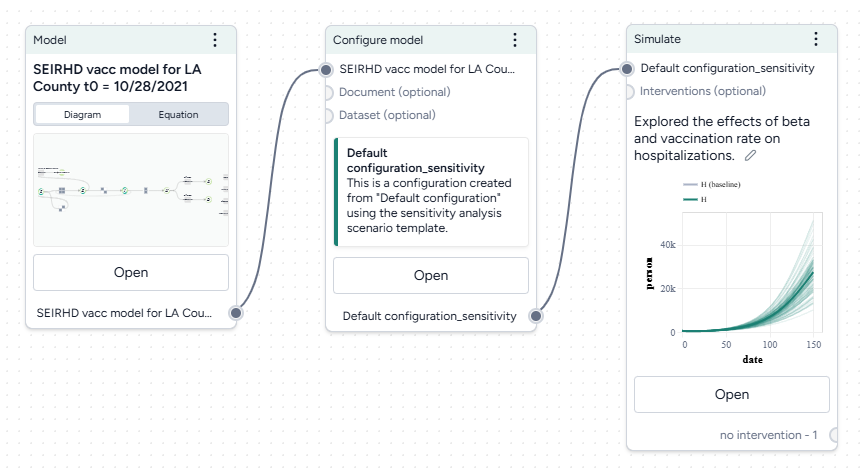

??? list "Run a sensitivity analysis with the Simulate operator"

      1. Pipe the Configure model operator a Simulate operator and then click **Open**.
      2. Change the End time to **150** days and click :material-play-outline:{ aria-hidden="true" } **Run**. 

The scatterplots below the sensitivity chart the parameters combine to affect hospitalizations shown in the chart above. Generally, high vaccination rates and low infection rates tend to reduce hospitalizations.

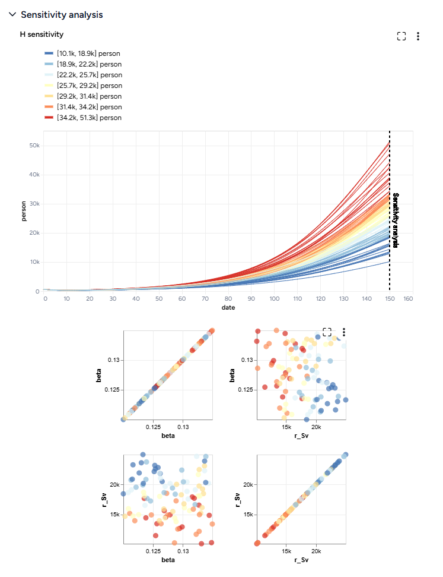

### Create and simulate intervention policies

> [Sample workflow](https://app.terarium.ai/projects/cc51dd40-f08a-4085-9eb1-ae22d7483839/workflow/55cba4d9-f16f-4fb3-a65f-ee8a20d1a2fa)

Our sensitivity analysis showed us the infection rates we should aim for to reduce hospitalizations. Now we can create different masking intervention policies to visualize the impact of different what-if masking scenarios that might get us there. For this, we'll use parameter NPI_mult, which is a multiplier for the transmission rate.

We'll create two policies:

- One that sets NPI_mult to 50% on day 63.
- One that sets to 50% only when hospitalizations cross 8,000.

<div class="grid cards" markdown>

- 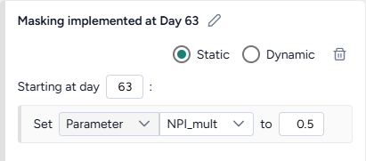
- 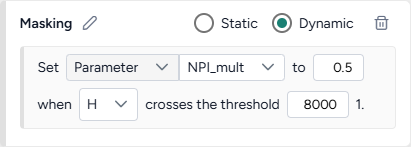

</div>

??? list "Create and simulate an intervention policy to increase masking"

      1. Pipe the Configure model operator into two different Create intervention policy operators and then click **Open**.
      2. Set the intervention policies: 
          1. On one policy, create a new **Static** intervention starting at day *63* that sets *Paramater* *NPI_mult* to *0.5*.
          2. On the other, create a new **Dynamic** intervention that sets *Paramater* *NPI_mult* to *0.5* when hospitalizations (H) cross the threshold of 8,000.
      3. Save each intervention policy and give them unique names.
      4. Create three new Simulate operators:
          1. One the first, pipe in only the model configuration to get a baseline without interventions.
          2. On the second, pipe in the model configuration and the static intervention.
          3. On the third, pipe in the model configuration and the dynamic intervention.
      5. Open each Simulate operator, change the **End time** to *150* days, and click :material-play-outline:{ aria-hidden="true" } **Run**.
      6. Click **Save for re-use** to save each simulation result as a new dataset.

Both interventions reduce hospitalizations compared to the baseline, but the static intervention of introducing masking at day 63 is more effective than the dynamic intervention that waits for hospitalizations to reach 8,000.

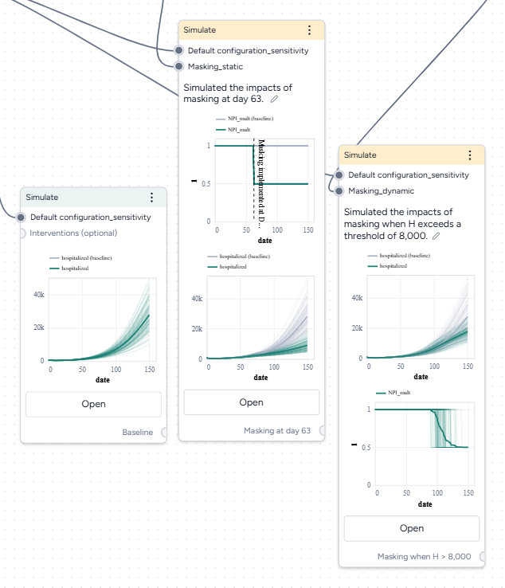

### Optimize intervention policies

> [Sample workflow](https://app.terarium.ai/projects/cc51dd40-f08a-4085-9eb1-ae22d7483839/workflow/65229c06-5517-4226-a7b4-62c0504ee53f)

In Terarium, you can optimize interventions to meet specified constraints, allowing you to get answers to key decision maker questions faster. We want to find how effective masking needs to be to prevent hospitalizations from exceeding capacity.

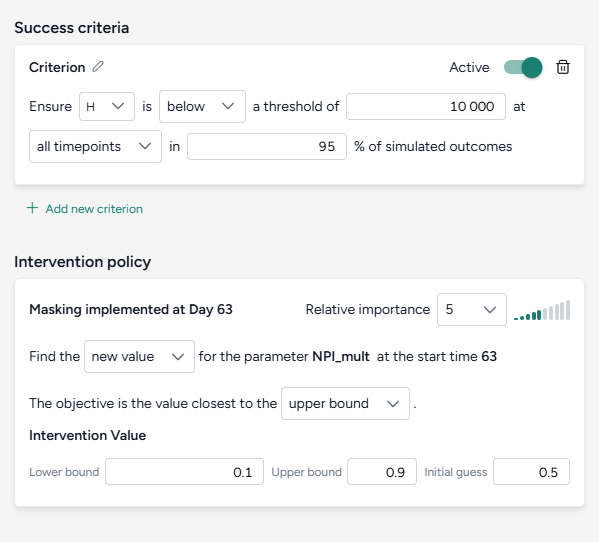

??? list "Optimize the intervention policy to find how effective masking needs to be to reduce hospitalizations"

      1. Pipe the static intervention and model configuration into an Optimize intervention policy operator and click **Open**.
      2. Set the success criteria:
      
         - Ensure hospitalizations (H) are below 10,000 at all timepoints in 95% of simulated outcomes.
      
      4. Specify a new intervention:
      
         - Find a new value for the parameter NPI_mult with the objective being closest to the upper bound of the range from 10&ndash;90%.
         - Set the initial guess to 50%.

      5. Simulate for 150 days and click **Run**.

By simulating the optimized intervention policy, you can see how the estimates of masking compliance affect peak hospitalizations:

- **Initial guess**: NPI_mult of 50%, which leads to peak hospitalizations of 9,602.
- **Optimization**: NPI_mult of 20.7%, which leads to peak hospitalizations of 4,071.

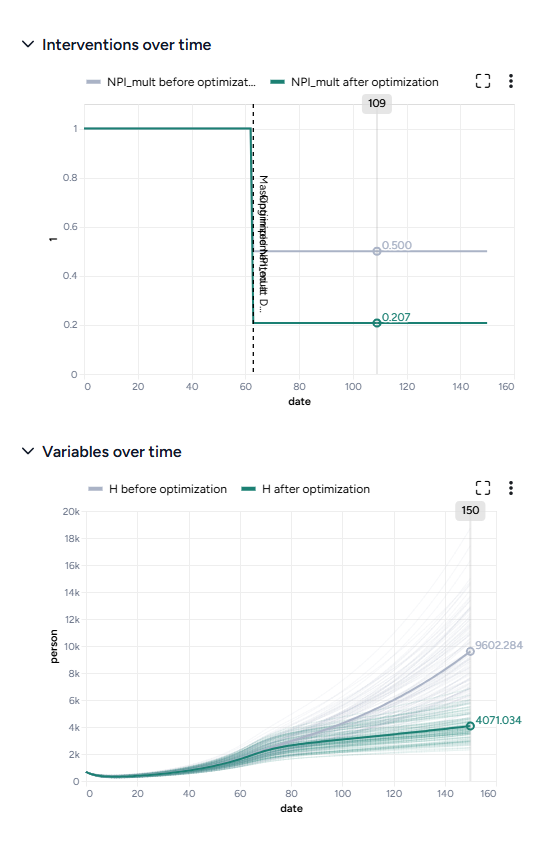

## Compare datasets

> [Sample workflow](https://app.terarium.ai/projects/cc51dd40-f08a-4085-9eb1-ae22d7483839/workflow/26f5a406-5df1-4ca2-b109-95b192f16ff0)

Finally, you can take the results of your simulations, interventions, and optimizations and compare them to see which works best at reducing hospitalizations. The Compare datasets operator lets you compare scenarios based on the various simulation results you've generated.

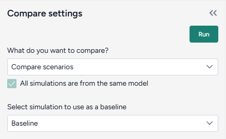

??? list "Optimize the intervention policy to find how effective masking needs to be to reduce hospitalizations"

    1. Pipe the datasets you created from simulating your different intervention policies into a Compare datasets operator and click **Open**.
    2. Select Compare scenarios, choose the baseline dataset, and click **Run**.
    3. In the Output settings, select H (hospitalizations) to plot the variable over time for each of the datasets. 

You can see the effectiveness of the different intervention policies on a single plot. Starting masking at day 63 is most effective at reducing hospitalizations.

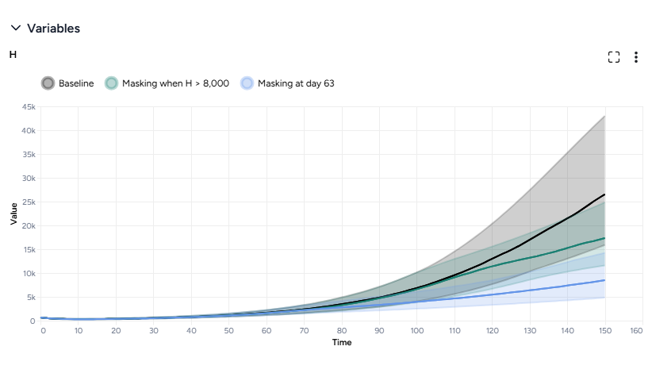

## What's next?

We've completed the sample SEIRHD model workflow! You now have the tools you need to start uploading, transforming, and simulating models and model resources in Terarium.