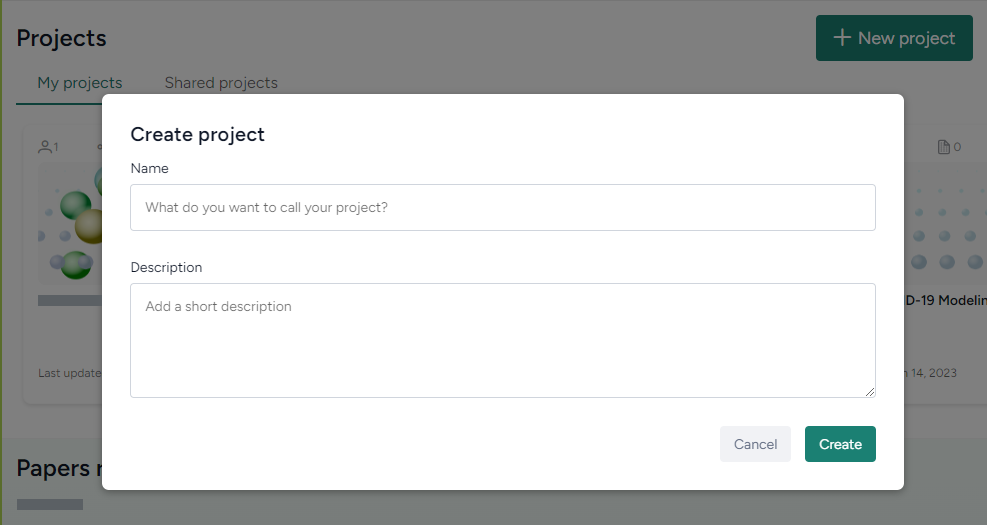
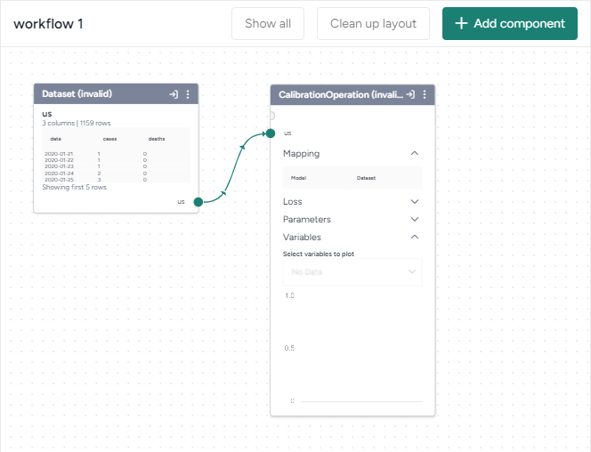

This sample workflow is designed to help you quickly understand the core capabilities of Terarium. The sample data needed to complete the workflow is accessible in the Explorer.

In this workflow, you will:

1. Create a new project.
2. Explore and add data to the project.
3. Explore and add models to the project.
4. Create a workflow to run complex operations using the discovered models and data.
5. Simulate a model.
6. Calibrate a model.
7. Compare model simulations.

## Create a project

To begin, create a new project in Terarium. A project is your workspace for:

- Gathering resources related to your modeling goals.
- Building and running complex operations to calibrate, simulate, and stratify models.

To create a new project

1. On the home page, click :octicons-plus-24:{ aria-hidden="true" } **New project**.
2. In the **Name** field, enter `COVID-19`.
3. Click **Create**.

## Explore and add data

Next, you can add resources to your project. The Terarium databases includes data resources of the following types:

- **Documents**, which are scientific papers. Some papers may be associated with equations or code repositories from which you can extract additional resources.
- **Datasets**, which you can use in modeling operations.  

All the modeling resources are accessible from the Explorer, which you can open at any time using the search bar. Because in this project you'll be modeling the latest COVID-19 data, begin by searching for `covid`.

To explore and add data

1. Enter `covid` in the search bar and press ++enter++.
2. In the **Publication year** facet, click the current year.
3. In the **GitHub repositories** facet, click *nytimes/covid-19-data*.
4. Click a paper to view more details and then click **Add to selected resources**.
5. On the Selected resources pane, click **Add to project > COVID-19**.
6. Open the newly added resource, scroll down to the extracted **GitHub URLs**, and click **Import** next to the `https://github.com/nytimes/covid-19-data` repository.
7. Select the :octicons-file-24:{ aria-hidden="true" } **us.csv** file and click **Import 1 file**.

## Explore and add models

Along with documents and datasets, the Terarium databases also store **models**. You can add models to your project resources and then calibrate, simulate, and stratify them.

In this step, you'll add some COVID-19 models to your project.

To explore and add models

1. Search for `covid` again, and this time click :octicons-share-android-24:{ aria-hidden="true" } **Models** to view the model results.
2. To look for models that have the same variables as the selected dataset, click *Dead* in the **Concepts** facet.
3. Click a model to view its description, including the list of variables it contains. 
4. When you find a model that matches the dataset concepts, click **Add to selected resources**. Choose the following models:
    - Bucky
    - CHIME-SIR
    - Giordano2020 - SIDARTHE model of COVID-19 spread in Italy
5. On the Selected resources pane, click **Add to project > COVID-19**.

## Create a workflow

Now that you have some resources relevant to your modeling goals, you can stitch them together to build and execute a set of complex modeling operations. 

To do this, you'll create a new workflow. A workflow graph is a visual workspace for managing the various inputs and outputs of modeling operations such as configuration, calibration, simulation, and stratification.

To create a workflow

1. On the project overview, click **New workflow**.
2. Drag the **us** dataset from the list of resources onto the workflow graph.
3. Right-click the workflow graph and click **Calibrate**.
4. Click the output port on the us dataset node and then click one of the input nodes on the CalibrationOperation node.

## Simulate a model

Before you can continue with the calibration operation you began in the previous step, you need to select a model. In this step, you'll simulate a few models to determine which is the best fit.

To simulate a model

1. Drag the **Giordano2020** model from the list of resources onto the workflow graph.
2. Right-click the workflow graph and click **Simulate**.
3. Click the output port on the Giordano2020 model node and then click the input node on the SimulateOperation node.
4. Click **Run**.
5. Repeat steps 1&ndash;3 with another model and then compare the behavior of the two simulations.

## Calibrate a model

Now that you know which model you want to use (Giordano2020), you can connect it to the calibration node and run the operation.

To calibrate a model

1. Click the output port on the Giordano2020 model node and then click the remaining input node on the CalibrationOperation node.
2. Click :octicons-sign-in-24:{ .flip title="Open calibrate details" } to open the Calibrate pane.
3. Scroll down to the Train / Test ratio section and, if necessary, drag the slider to adjust how much data should be reserved for training.
4. In the Mapping section, match the Giordano2020 model variables with the corresponding columns in the us dataset.
5. Click :material-play-outline:{ aria-hidden="true" } **Run**.

## Compare simulations

Pipe the output of calibration into the same simulate node to compare the model before and after calibration.

To compare simulations

More info coming soon.