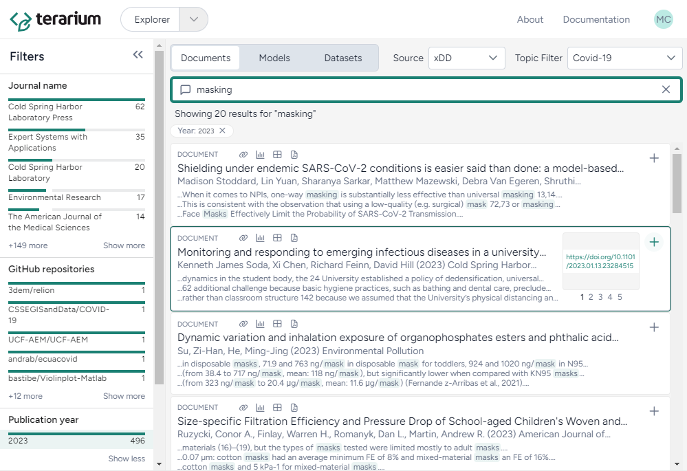

# Using Terarium

Terarium is a comprehensive platform that supports your scientific modeling processes from discovery to publication. With it, you can upload, search for, modify, and simulate scientific models and easily share and reproduce your results.

## Getting access to system

To access Terarium, you need a [GitHub account](https://github.com/signup){ target="_blank" rel="noopener noreferrer" } :octicons-link-external-24:{ aria-hidden="true" }. 

1. Send your GitHub username to [support@terarium.ai](mailto:support@terarium.ai?subject=Terarium Phase 1 evaluation - access request).
2. When you receive approval, go to [https://app.terarium.ai/](https://app.terarium.ai/) and click sign in with :fontawesome-brands-github:{ aria-hidden="true"} **GitHub**.
3. If redirected to github.com, enter your account details and click **Sign in**.

## Extracting knowledge

A project in Terarium acts as a repository for resources (models, datasets, documents, and code) related to your modeling goals. You can upload your own resources or search the Terarium databases for relevant papers.

To upload resources

1. Click :octicons-upload-16:{ aria-hidden="true" } **Upload resources** in the Resources panel.
   
2. Drag in your resources or click **open a file browser** to locate them.
3. Click **Upload**.

To search for resources

1. Expand the dropdown list in the nav bar and select :fontawesome-regular-compass:{ aria-hidden="true" } **Explorer**.
   
2. Enter keywords in the search bar and press ++enter++.
3. Choose the resources you want to review by clicking **Documents**, **Models**, or **Datasets**.
4. Use the Filters panel to understand and narrow down the results.
5. To add a resource to your project, click :octicons-plus-24:{ alt="Add to project" title="Add to project" } on the card in the results. 

## Constructing scientific modeling workflows

A workflow in Terarium is a graphical editor for building and executing complex modeling processes.

Graph nodes represent resources or operators that handle  transformation and simulation. Link them together to extract code from project resources, iteratively modify them, and run sophisticated calibration, optimization, and simulation tasks.

To create a workflow

1. Click :octicons-plus-24:{ aria-hidden="true" } **New** in the Workflow section of the Resource panel.
2. Drag Models, Datasets, Documents, or Code into the workflow graph from the Resources panel.
3. Right-click anywhere on the workflow graph and choose from the library of operators.
4. Link your resources and operators by connecting outputs ({ aria-hidden="true" style="display: inline; margin-top: 0; margin-bottom: 0;" }) on the right side of a node and then clicking a corresponding input ({ aria-hidden="true" style="display: inline; margin-top: 0; margin-bottom: 0;" }) on the left side of the destination node.

    ???+ note

        - Labels on inputs show you the types of resources and operators each operator requires.
        - Some operators don't display outputs until you edit their settings or run their associated task. Click **Open** or **Edit** on a node to edit settings and run tasks.

## Modifying models and data

Using Terarium's library of operators, you can recreate, reuse, and modify existing models and datasets to suit your modeling needs:

-   __Add resource__

    ---

    - [**Create model from code**](https://github.com/ml4ai/ASKEM-TA1-DockerVM?tab=readme-ov-file#code2amr){ target="_blank" rel="noopener noreferrer" } :octicons-link-external-24:{ alt="External link" title="External link" }  
        Build a model using selected lines within a code asset.

    - [**Create model from equations**](https://github.com/DARPA-ASKEM/model-service/blob/07ae21cae2d5465f9ac5b5bbbe6c7b28b7259f04/src/ModelService.jl#L54){ target="_blank" rel="noopener noreferrer" } :octicons-link-external-24:{ alt="External link" title="External link" }  
        Build a model using LaTeX expressions or equations extracted from a paper.

-   __Work with dataset__

    ---

    - [**Transform dataset**](https://pandas.pydata.org/docs/user_guide/index.html#user-guide){ target="_blank" rel="noopener noreferrer" } :octicons-link-external-24:{ alt="External link" title="External link" }  
        Modify a dataset by explaining your changes to an AI assistant.

-   __Work with model__

    ---

    - [**Edit model**](https://github.com/DARPA-ASKEM/beaker-kernel/blob/main/docs/contexts_mira_model_edit.md){ target="_blank" rel="noopener noreferrer" } :octicons-link-external-24:{ alt="External link" title="External link" }  
        Modify model states and transitions using a graphical template editor or an AI assistant.

-   __Work with multiple models__

    ---

    - [**Compare models**](https://github.com/gyorilab/mira/blob/7314765ab409ddc9647269ad2381055f1cd67706/notebooks/hackathon_2023.10/dkg_grounding_model_comparison.ipynb#L307){ target="_blank" rel="noopener noreferrer" } :octicons-link-external-24:{ alt="External link" title="External link" }  
        Generate side-by-side summaries of two or more models or prompt an AI assistant to visually compare them.

    - [**Couple models**](https://algebraicjulia.github.io/Decapodes.jl/dev/overview/#Merging-Multiple-Physics){ target="_blank" rel="noopener noreferrer" } :octicons-link-external-24:{ alt="External link" title="External link" }  
        Combine two or more models.

Some operators have a dual-view design, with a wizard for common settings and a notebook for direct coding. An AI assistant in the notebook helps you generate and refine code even without programming experience.

To access resource or operator settings

1. Click **Open** or **Edit** on the operator node.
2. Switch to the Wizard or Notebook view depending on your preference.

    ???+ note

        Any changes you make in the Wizard view are automatically translated into code in the Notebook view.

## Simulating models

Terarium's library of operators also allows you to rapidly create of scenarios and interventions by linking operators to configure, validate, calibrate, and optimize models:

-  __Work with model__

    ---

    - [**Configure model**](../models/configure-model.md)  
        Edit variables and parameters or extract them from a reference resource.
    - [**Validate configuration**](https://github.com/siftech/funman){ target="_blank" rel="noopener noreferrer" } :octicons-link-external-24:{ alt="External link" title="External link" }  
        Determine if a configuration generates valid outputs given a set of constraints.
    - [**Stratify model**](https://github.com/gyorilab/mira/blob/main/notebooks/viz_strat_petri.ipynb){ target="_blank" rel="noopener noreferrer" } :octicons-link-external-24:{ alt="External link" title="External link" }  
        Divide populations into subsets along characteristics such as age or location.

-   __Work with multiple models__

    ---

    - [**Simulate ensemble**](https://github.com/ciemss/pyciemss/blob/main/pyciemss/interfaces.py#L35){ target="_blank" rel="noopener noreferrer" } :octicons-link-external-24:{ alt="External link" title="External link" }  
        Run a deterministic simulation of multiple models or model configurations under specific conditions.
    - [**Calibrate ensemble**](https://github.com/ciemss/pyciemss/blob/main/pyciemss/interfaces.py#L156){ target="_blank" rel="noopener noreferrer" } :octicons-link-external-24:{ alt="External link" title="External link" }  
        Determine or update the value of model parameters given a reference dataset of observations.

-   __Run model (deterministic)__

    ---

    - [**Simulate with SciML**](https://github.com/DARPA-ASKEM/sciml-service/blob/main/src/operations.jl#L222){ target="_blank" rel="noopener noreferrer" } :octicons-link-external-24:{ alt="External link" title="External link" }  
        Run a deterministic simulation of a model under specific conditions.
    - [**Calibrate with SciML**](https://github.com/DARPA-ASKEM/sciml-service/blob/main/src/operations.jl#L245){ target="_blank" rel="noopener noreferrer" } :octicons-link-external-24:{ alt="External link" title="External link" }  
        Determine or update the value of model parameters given a reference dataset of observations.

-   __Run model (probabilistic)__

    ---

    - [**Simulate with PyCIEMSS**](https://github.com/ciemss/pyciemss/blob/main/pyciemss/interfaces.py#L323){ target="_blank" rel="noopener noreferrer" } :octicons-link-external-24:{ alt="External link" title="External link" }  
        Run a probabilistic simulation of a model under specific conditions.
    - [**Calibrate with PyCIEMSS**](https://github.com/ciemss/pyciemss/blob/main/pyciemss/interfaces.py#L529){ target="_blank" rel="noopener noreferrer" } :octicons-link-external-24:{ alt="External link" title="External link" }  
        Determine or update the value of model parameters given a reference dataset of observations.
    - [**Optimize with PyCIEMSS**](https://github.com/ciemss/pyciemss/blob/main/pyciemss/interfaces.py#L747){ target="_blank" rel="noopener noreferrer" } :octicons-link-external-24:{ alt="External link" title="External link" }  
        Determine the optimal values for variables that minimize or maximize an intervention given some constraints.  

Just as with operators that modify and transform resources, simulation operators support wizard and notebook views with AI-assisted configuration. 