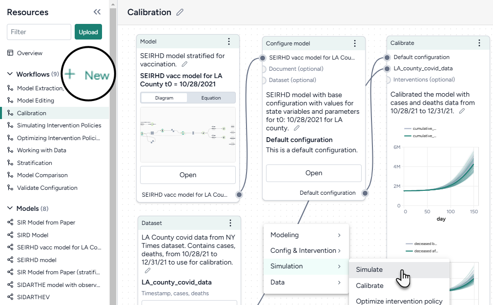

# Using Terarium

Terarium supports your scientific decision making by helping you organize, refine, and communicate the results of your modeling processes. You can:

- Gather existing knowledge.
- Break down complex scientific operations into separate, easy-to-configure tasks.
- Create reproducible visual representations of how your resources, processes, and results chain together.

## How Terarium represents your modeling work

The following concepts describe how Terarium organizes your modeling work to help you manage, visualize, and run scientific processes.

-   __Project__

    ---

    A workspace for storing modeling resources, organizing workflows, and recording and sharing results.

    [:fontawesome-solid-angle-right:{ aria-hidden="true"} Creating a project](#creating-a-project)

-   __Resource__

    ---

    Scientific knowledge&mdash;models, datasets, or documents (PDF)&mdash;used to build workflows and extract insights.
    
    [:fontawesome-solid-angle-right:{ aria-hidden="true"} Gathering resources](#gathering-resources)

-   __Workflow__

    ---

    A visual canvas for building and capturing your modeling processes. Workflows show how resources move between different operators to produce results.

    [:fontawesome-solid-angle-right:{ aria-hidden="true"} Building scientific modeling workflows](#building-scientific-modeling-workflows)

-   __Operator__

    ---

    A part of a workflow that performs tasks like data transformation or simulation.
    
    [:fontawesome-solid-angle-right:{ aria-hidden="true"} Using the library of operators](#using-the-library-of-operators)

## Creating a project

Create a project for a problem you want to model and then:

- Upload existing models, datasets, and documents to build a library of relevant knowledge. 
- Visually construct different modeling workflows to transform the resources and test different models.

<figure markdown>

<figcaption>
The overview of a COVID-19 project. The Resources panel (left) provides access to your library of models, datasets, and documents. Build new visual workflows to extract knowledge from and build on your resources.
</figcaption> 
</figure>

??? list "Create a project"

    1. On the Home page, do one of the following actions:
        - To start from scratch, click :octicons-plus-24:{ aria-hidden="true" } **New project**.
        - To find a project to copy, search My projects or Public projects and then click Menu :fontawesome-solid-ellipsis-vertical:{ title="Menu" aria-labelledby="menu-icon-label" } > :octicons-copy-24:{ aria-hidden="true" style="transform: rotate(-90deg);"} **Copy**.
        - To upload a project, click :octicons-upload-16:{ aria-hidden="true" } **Upload project** and drag in or browse to the location of your *.project* file.
    2. In the new project, edit the overview to capture your goals and save results over time.

## Gathering resources

Use the Resources panel to upload and access your models, datasets, and documents.

???+ note

    You can also add resources by: 

    - Copying them from other projects.
    - Creating them using Terarium's library of operators.

??? list "Upload resources"

    1. Do one of the following actions:
        - Drag your files into the Resources panel.
        - Click **Upload** and then click **open a file browser** to navigate to the location of the files you want to add.
    2. Click **Upload**.
    
        !!! note
    
            To view a resource, click its title in the Resources panel. 

## Building scientific modeling workflows

Create a workflow to visually build your modeling processes. Each box is a resource or an operator that handles a task like transformation and simulation. Chain their outputs and inputs to:

- Recreate, reuse, and modify existing models and datasets to suit your modeling needs.
- Rapidly create scenarios and interventions by configuring, validating, calibrating, and optimizing models.

??? list "Create a workflow"

    1. In the Workflows section of the Resource panel, click :octicons-plus-24:{ aria-hidden="true" } **New**.
    2. Select a template, fill out the required fields, and then click **Create**.
    3. Use the canvas to customize your workflow:

        - Drag in models, datasets, or documents from the Resources panel.
        - Right-click on the canvas to add operators.
        - Connect resources and operators by clicking the source input { aria-hidden="true" class="node-icon" } and followed by the output { aria-hidden="true" class="node-icon" } destination. Labels show you the types of resources and operators you can connect.

## Using the library of operators

Terarium's operators support various ways for you to configure complex scientific tasks. For example, you can drill down to access: 

- A guided wizard for quickly configuring common settings.
- A notebook for direct coding.
- An integrated AI assistant for creating and refining code even if you don't have any programming experience.

??? list "Use a Terarium operator"

    1. Make sure you've connected all the required inputs.
    1. Click **Open** or **Edit** on the operator node.
    2. Switch to the Wizard or Notebook view depending on your preference.
    
        ???+ note
    
            Any changes you make in the Wizard view are automatically translated into code in the Notebook view.

-   __Modeling__

    ---

    - [**Create model from equations**](../modeling/create-model-from-equations.md)  
        Build a model using LaTeX expressions or equations extracted from a paper.  
        :material-github:{ title="GitHub" aria-label="GitHub" class="md-annotation__index"} [*Source code*](https://github.com/DARPA-ASKEM/model-service/blob/07ae21cae2d5465f9ac5b5bbbe6c7b28b7259f04/src/ModelService.jl#L54){ target="_blank" rel="noopener noreferrer" }  

    - [**Edit model**](../modeling/edit-model.md)  
        Modify model states and transitions using an AI assistant.  
        :material-github:{ title="GitHub" aria-label="GitHub" class="md-annotation__index" } [*Source code overview*](https://github.com/DARPA-ASKEM/beaker-kernel/blob/main/docs/contexts_mira_model_edit.md){ target="_blank" rel="noopener noreferrer" }  

    - [**Stratify model**](../modeling/stratify-model.md)  
        Divide populations into subsets along characteristics such as age or location.  
        :material-github:{ title="GitHub" aria-label="GitHub" class="md-annotation__index" } [*Source code overview*](https://github.com/gyorilab/mira/blob/main/notebooks/viz_strat_petri.ipynb){ target="_blank" rel="noopener noreferrer" }  

    - [**Compare models**](../modeling/compare-models.md)  
        Generate side-by-side summaries of two or more models or prompt an AI assistant to visually compare them.  
        :material-github:{ title="GitHub" aria-label="GitHub" class="md-annotation__index" } [*Source code overview*](https://github.com/gyorilab/mira/blob/7314765ab409ddc9647269ad2381055f1cd67706/notebooks/hackathon_2023.10/dkg_grounding_model_comparison.ipynb#L307){ target="_blank" rel="noopener noreferrer" }  

-   __Simulation__

    ---

    - [**Simulate**](../simulation/simulate-model.md)  
        Run a simulation of a model under specific conditions.  
        :material-github:{ title="GitHub" aria-label="GitHub" class="md-annotation__index" } [*Source code*](https://github.com/ciemss/pyciemss/blob/main/pyciemss/interfaces.py#L323){ target="_blank" rel="noopener noreferrer" }  
    - [**Calibrate**](../simulation/calibrate-model.md)  
        Determine or update the value of model parameters given a reference dataset of observations.  
        :material-github:{ title="GitHub" aria-label="GitHub" class="md-annotation__index" } [*Source code*](https://github.com/ciemss/pyciemss/blob/main/pyciemss/interfaces.py#L529){ target="_blank" rel="noopener noreferrer" }  
    - [**Optimize intervention policy**](../config-and-intervention/optimize-intervention-policy.md)  
        Determine the optimal values for variables that minimize or maximize an intervention given some constraints.  
        :material-github:{ title="GitHub" aria-label="GitHub" class="md-annotation__index" } [*Source code*](https://github.com/ciemss/pyciemss/blob/main/pyciemss/interfaces.py#L747){ target="_blank" rel="noopener noreferrer" }  
    - [**Simulate ensemble**](../simulation/simulate-ensemble.md)  
        Run a simulation of multiple models or model configurations under specific conditions.  
        :material-github:{ title="GitHub" aria-label="GitHub" class="md-annotation__index" } [*Source code*](https://github.com/ciemss/pyciemss/blob/main/pyciemss/interfaces.py#L35){ target="_blank" rel="noopener noreferrer" }  
    - [**Calibrate ensemble**](../simulation/calibrate-ensemble.md)    
        Extend the calibration process by working across multiple models simultaneously.  
        :material-github:{ title="GitHub" aria-label="GitHub" class="md-annotation__index" } [*Source code*](https://github.com/ciemss/pyciemss/blob/main/pyciemss/interfaces.py#L156){ target="_blank" rel="noopener noreferrer" }  

-   __Data__

    ---

    - [**Transform dataset**](../datasets/transform-dataset.md)  
        Modify a dataset by explaining your changes to an AI assistant.  
        :octicons-book-24:{ title="User Guide" aria-label="User Guide" class="md-annotation__index" } [*Source code user guide*](https://pandas.pydata.org/docs/user_guide/index.html#user-guide){ target="_blank" rel="noopener noreferrer" }  

    - [**Compare dataset**](../datasets/transform-dataset.md)  
        Compare the impacts of two or more interventions or rank interventions.  
        :octicons-book-24:{ title="User Guide" aria-label="User Guide" class="md-annotation__index" } 

-   __Config and intervention__

    ---

    - [**Configure model**](../config-and-intervention/configure-model.md)  
        Edit variables and parameters or extract them from a reference resource.
    - [**Validate configuration**](../config-and-intervention/validate-model-configuration.md)  
        Determine if a configuration generates valid outputs given a set of constraints.  
        :material-github:{ title="GitHub" aria-label="GitHub" class="md-annotation__index" } [*Source code repository*](https://github.com/siftech/funman){ target="_blank" rel="noopener noreferrer" }  
    - [**Create intervention policy**](../config-and-intervention/create-intervention-policy.md)  
         Define intervention policies to specify changes in state variables or parameters at specific points in time.

