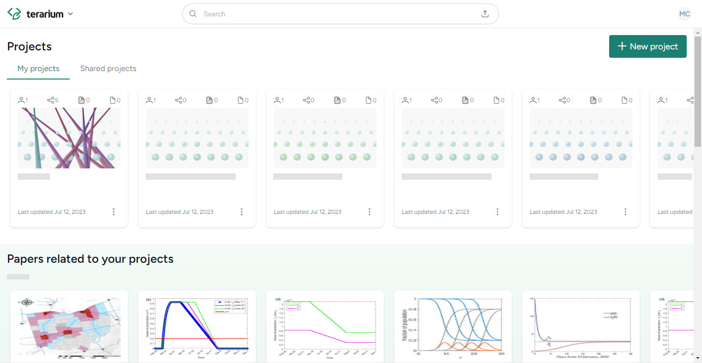

Terarium is a comprehensive modeling and simulation ecosystem designed to support decision making in diverse missions and scientific domains. With Terarium, you can:

- Find models in academic literature,
- Parameterize and calibrate them,
- Run simulations to test a variety of scenarios, and
- Analyze the results.

Need help? Check out these topics:

[Get started](get-started/){ .md-button }
[Gather modeling resources](modeling-resources/){ .md-button }

[Manage workflows](workflows/){ .md-button }
[Work with data](datasets/){ .md-button }

[Work with models](models/){ .md-button }
[Integrated subsystems](subsystems/){ .md-button }