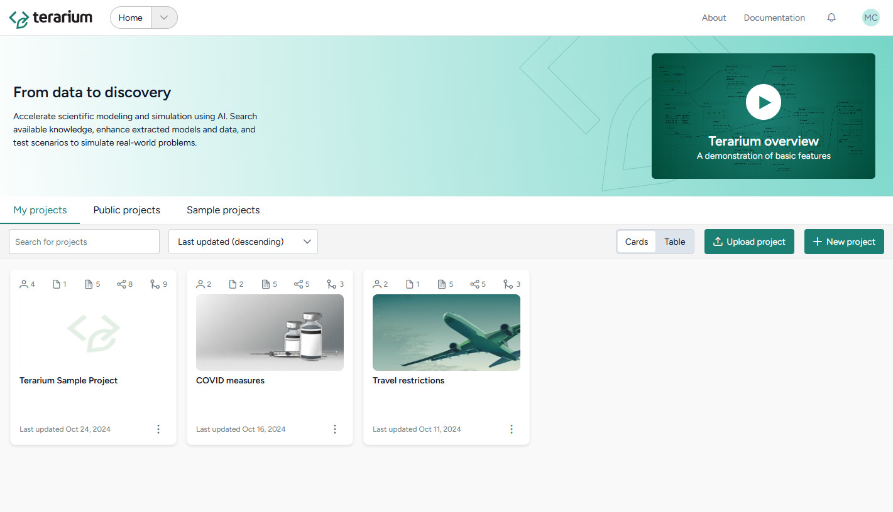

# About Terarium

Terarium is a modeling and simulation workbench designed to help you assess and contribute to the scientific landscape. Regardless of your level of programming experience, Terarium allows you to:

- :fontawesome-solid-magnifying-glass:{ .lg .middle } **Extract models from academic literature**
- :fontawesome-solid-sliders:{ .lg .middle } **Parameterize and calibrate them**
- :fontawesome-solid-gear:{ .lg .middle } **Simulate a variety of scenarios**
- :fontawesome-solid-chart-line:{ .lg .middle } **Analyze the results**

Need help? Check out these topics:

[Get started](get-started/using-terarium.md){ .md-button }
[Upload modeling resources](upload-resources/index.md){ .md-button }

[Build a workflow graph](workflows/index.md){ .md-button }
[Review and transform data](datasets/index.md){ .md-button }

[Modeling](modeling/index.md){ .md-button }
[Configuration and intervention](config-and-intervention/index.md){ .md-button }

[Simulation](simulation/index.md){ .md-button }
[Integrated subsystems](subsystems/index.md){ .md-button }

