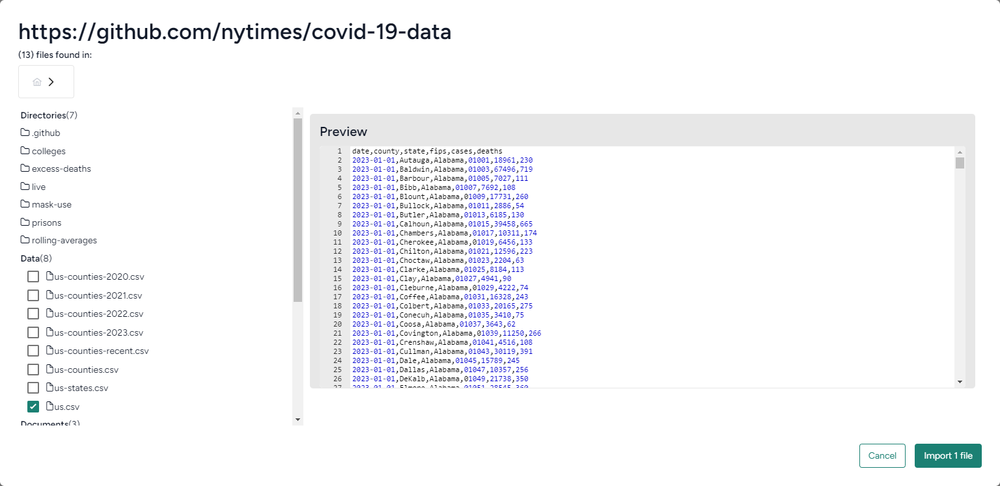
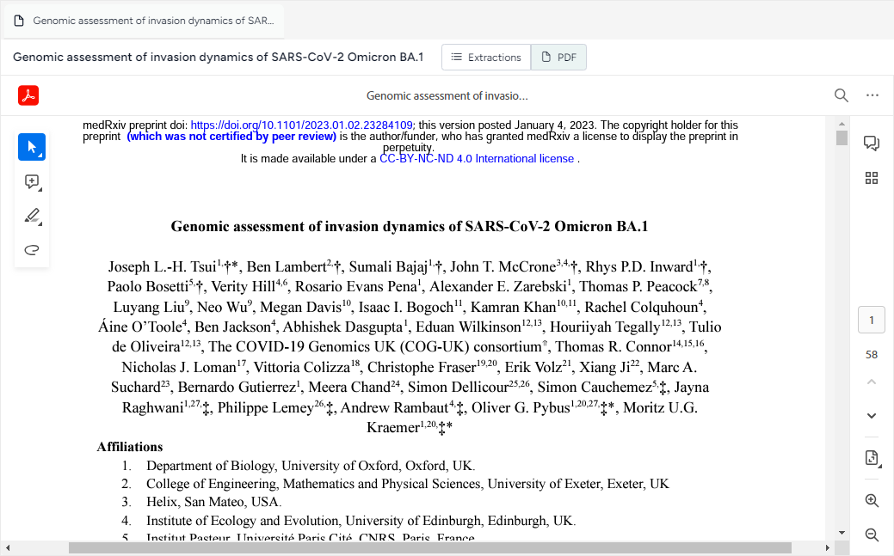

# Gather modeling resources

With Terarium, you can upload, store and manage resources needed for your modeling and simulation workflows. You can upload resources from your computer or retrieve resources from online code repositories. Many resources are also available for search within the Terarium databases.

??? info "Resource extractions"

    Terarium summarizes the following types of metadata and data extracted from the supported resources.

    === ":octicons-file-24:{ aria-hidden="true" } Documents"

        Each document has an associated PDF (from Unpaywall) and a set of extracted metadata and contents, which may include:

        * Metadata
            - Journal
            - Title
            - Authors
            - Publication year
            - DOI
            - Publisher
        * Extractions
            - Abstract
            - Section summaries
            - Figures
            - Tables
            - Equations
            - References
            - GitHub URLs

    === ":octicons-share-android-24:{ aria-hidden="true" } Models"

        - Description
        - Diagram
        - Equations
        - Observables
        - State variables
        - Parameters
        - Observables
        - Transitions
        - Other concepts
        - Time
        - Diagram

    === ":material-file-table-outline:{ aria-hidden="true" } Datasets"

        * Description
        * Column information

## Upload resources

You can upload papers, models, and datasets in a variety of formats from your computer or from a GitHub repository.

### Upload your own resources

:octicons-upload-16:{ aria-hidden="true" } **Upload resources** in the Resources panel lets you add resources from your computer.

??? list "To upload resources"

    1. In the Resource panel, click :octicons-upload-16:{ aria-hidden="true" } **Upload resources**.
    2. Drag your resource files into the Upload resources dialog or click **open a file browser** to navigate to the location of the files you want to add.
    3. Click **Upload**.

### Import resources from a GitHub repository

You can import the following resources directly from a GitHub repository:

- Code files (PY, M, JS).
- Data files (CSV, JSON, TSV, XML, YAML / YML).
- Document files (PDF, TXT, MD)
- Unknown files (if you specify which resource type to import it as)

??? list "To import resources from a GitHub URL"

    1. In the Resource panel, click :octicons-upload-16:{ aria-hidden="true" } **Upload resources**.
    2. Enter the URL of the repository in the format *https://github.com/nytimes/covid-19-data*.
    3. Click **Upload**.
    4. Select the code, data, and documents you want to import. 
    5. To import an unknown file type, select it and choose whether you want to import it as code, data, or a document.
    6. Click **Import files to project**.

??? list "To import resources from a GitHub URL referenced in a paper"

    1. In the Resources panel, click the title of the paper to open it in a new tab.
    2. In the GitHub URLs section of the document extractions, click :material-cloud-download-outline:{ aria-hidden="true" } **Import**.
    3. Select the code, data, and documents you want to import. 
    4. To import an unknown file type, select it and choose whether you want to import it as code, data, or a document.
    5. Click **Import files to project**.

<!-- ## Annotate document resources

You can open the source PDF for a document and add comments, highlights, underlines, strike-throughs, and freehand drawings.

??? list "To annotate document resources"

    1. On Resources pane, click the title of the paper to open it in a new tab.
    2. Click :octicons-file-24:{ aria-hidden="true" } **PDF** to view the source document.
    3. Use the annotation toolbar on the left side to add:
        - Comments.
        - Highlighting, underlines, or strike-throughs.
        - Freehand drawings. -->

## Find papers, models, and datasets

Using the Explorer view, you can search for the following types of resources to use in your modeling and simulation workflows:

- :octicons-file-24:{ aria-hidden="true" } **Documents** from a continuously updated collection of published scientific papers related to the COVID-19 pandemic.
- :octicons-share-android-24:{ aria-hidden="true" } **Models** from the Terarium databases.
- :material-file-table-outline:{ aria-hidden="true" } **Datasets** from the Terarium databases.

??? list "To open the Explorer"

    - Expand the dropdown list in the nav bar and select :fontawesome-regular-compass:{ aria-hidden="true" } **Explorer**.

??? list "To search for resources"

    1. Enter a keyword in the search bar and press ++enter++.

        ??? tip "DOI search"

            If you have a specific paper you want to add to your project, try searching for its DOI in the format *prefix/suffix* (for example, *10.3390/ijerph18179027*).

    3. To choose the type of resources you want to review, click the **Documents**, **Models**, or **Datasets** button.
    4. Click :material-chevron-double-right:{ alt="Expand filters" title="Expand filters" } to review the filters, which break down the resources that match your search. Different filters are available for each type of resource.
        <figure>
          
          <figcaption>Top five publication years. The bar and number shows how many of the matches were published in each year.<figcaption>
        </figure>
    5. To view more details about a resource, click anywhere on its card in the search results.

??? list "To find resources similar to an example"

    1. In the search results, click and drag the card that represents the example resource into the Search by example dialog. 
    2. Select any of the following options to choose how Terarium should determine similarity:
        - **Similar content**: Use a similarity vector to find resources with similar contents.
        - **Forward citations** coming soon 
        - **Backward citation** coming soon
        - **Related resources**: Find resources based on shared references to assets such as papers, models, and datasets.
    3. Click **Search**.

??? list "To browse all resources"

    1. Click in the search bar, clear any search terms and press ++enter++.
    2. To choose the type of resources you want to review, click the **Documents**, **Models**, or **Datasets** button.
    3. Click :material-chevron-double-right:{ alt="Expand filters" title="Expand filters" } to review the filters, which break down all the resources in the Terarium databases. Different filters are available for each type of resource.
    4. To view more details about a resource, click anywhere on its card in the search results.

??? list "To filter a search"

    - Click a value in the Filters. For example, if you only want to see the latest research, click the current year in the Publication year filter.
        <figure>
          
          <figcaption>Added filters appear below the summary of the results. Click **x** any time to clear them.<figcaption>
        </figure>

??? list "To clear a filter"

    Perform one of the following actions:
    
    * Click the selected value in the Filters, or
    * Click :octicons-x-24:{ title="Clear" } on the filter badge below the summary of the results.

??? list "To add resources to your project"

    - Click :octicons-plus-24:{ title="Add to project" } on the upper right of the resource card and select a project.