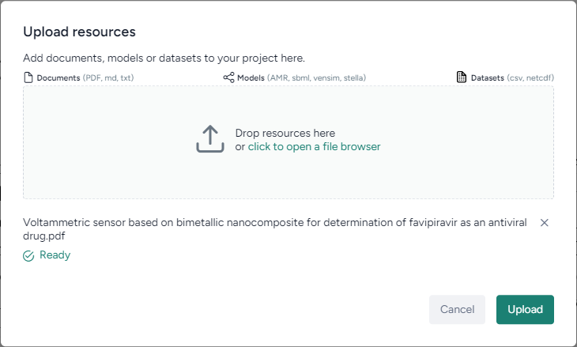

With Terarium, you can search for, upload, store, and manage resources needed for your modeling and simulation workflows. Many resources are available for search within the Terarium databases. You can also upload your own resources or resources found in relevant code repositories.

??? info "Resource extractions"

    Terarium summarizes the following types of metadata and data extracted from the supported resources.

    === ":octicons-file-24:{ aria-hidden="true" } Documents"

        Each document has an associated PDF (from Unpaywall) and a set of extracted metadata and contents, including:

        * Metadata
            - Publisher
            - Title
            - Authors
            - DOI
            - Journal
        * Abstract
        * Section summaries
        * Figures
        * Tables
        * Equations
        * References
        * GitHub URLs

    === ":octicons-share-android-24:{ aria-hidden="true" } Models"

        * Description:
            - Description
            - Parameters
            - State variables
            - Transitions
            - Variable statements
        * Model:
            - Diagram
            - Configurations
            - Simulation space

    === ":octicons-database-24:{ aria-hidden="true" } Datasets"

        * Descriptions
        * Annotations
        * Features

## Find papers, models, and datasets

You can search for the following types of resources to use in your modeling and simulation workflows:

- :octicons-file-24:{ aria-hidden="true" } **Documents** from a continuously updated collection of published scientific papers related to the COVID-19 pandemic.
- :octicons-share-android-24:{ aria-hidden="true" } **Models** from the Terarium databases.
- :octicons-database-24:{ aria-hidden="true" } **Datasets** from the Terarium databases.

??? list "To search for resources"

    1. Enter a keyword in the search bar and press ++enter++.
    2. Review the **Suggested terms** and click any that you think will improve your search.
    3. To choose the type of resources you want to review, click one of the following buttons:
        * :octicons-file-24:{ aria-hidden="true" } **Documents**
        * :octicons-share-android-24:{ aria-hidden="true" } **Models**
        * :octicons-database-24:{ aria-hidden="true" } **Datasets**
    4. Review the facets to see a breakdown of the resources that match your search. Different facets are available depending on the type of resources you are searching for.
        <figure>
          
          <figcaption>Top five publication years. The bar and fraction shows how many of the resources were published in each year out of all the matches (*130,343*).<figcaption>
        </figure>
    5. To view more details about a resource, click anywhere on its card in the search results.

??? list "To find resources similar to an example"

    1. In the search results, click and drag the card that represents the example resource into the Search by example dialog. 
    2. Select any of the following options to choose how Terarium should determine similarity:
        - **Similar content** for a document using similarity vector.
        - **Forward citations** to be supported in a future release 
        - **Backward citation** to be supported in a future release
        - **Related resources** to be supported in a future release
    3. Click **Search**.

??? list "To browse all resources"

    1. Click in the search bar, clear any search terms, and press ++enter++.
    2. To choose the type of resources you want to review, click one of the following buttons:
        * :octicons-file-24:{ aria-hidden="true" } **Documents**
        * :octicons-share-android-24:{ aria-hidden="true" } **Models**
        * :octicons-database-24:{ aria-hidden="true" } **Datasets**
    3. Review the facets to see a breakdown of all the resources in the Terarium databases. Different facets are available depending on the type of resources you are searching for.
    4. To view more details about a resource, click anywhere on its card in the search results.

??? list "To filter a search"

    - Click a value in the Facets. For example, if you only want to see the latest research, click the current year in the Publication year facet.
        <figure>
          
          <figcaption>Added filters appear below the summary of the results. Click **x** any time to clear them.<figcaption>
        </figure>

??? list "To clear a filter"

    - Perform one of the following actions:
        * Click the value in the Facets, or
        * Click :octicons-x-24:{ title="Clear" } on the filter badge below the summary of the results.

??? list "To add resources to your project"

    1. To select resources, perform one of the following actions:
        * Click :octicons-plus-24:{ title="Add to selected resources" } on the upper right of the resource card.
        * With the resource details expanded, click **Add to selected resources**.
    2. Repeat the previous step for all the resources you want to add.
    3. In the Selected resources panel, click **Add to project** and select your project name from the list.

## Upload resources

In addition to the papers, models, and datasets you can find using the Explorer, you can also upload:

- Your own resources such as PDFs and CSVs.
- Resources from a GitHub repository referenced in one of your project's documents.

### Upload your own resources

The project overview tab has a quick link that lets you **Upload resources** (PDF and CSV) from your computer.

??? list "To upload resources"

    1. On the project overview, click **Upload resources**.
    2. Drag your resource files into the Upload resource dialog or click **upload a file** to browse to the location of the files you want to add.
    3. Configure any file-specific settings:
    
        ??? info "For PDFs"

            1. Choose the extractor you want to use to 

                - [pypdf2](https://pypi.org/project/PyPDF2/)
                - [pdfminer](https://pypi.org/project/pdfminer/)
                - [pymupdf](https://pypi.org/project/PyMuPDF/)
        
                ??? note
        
                    If you find one extractor doesn't capture your resources properly, try reuploading them and using a different extractor.
            2. To extract images from the PDF, select **Import Data**.

        ??? info "For CSVs"

            1. Enter a description of the dataset contents in the **Description** field.

    4. Click **Import Data**.
    5. Review the extractions that appear at the bottom of the dialog.
    6. Once you are satisfied with the extractions, click **Upload**.

### Import resources from a GitHub repository

If your project has a document that references a GitHub repository, you can import resources directly from the repository. You can import:

- Code files (PY, M, JS).
- Data files (CSV, JSON, TSV, XML, YAML / YML).
- Document files (PDF, TXT, MD)
- Unknown files (provided you specify which resource type to import it as)

??? list "To import resources from GitHub"

    1. On Resources pane, click the title of the paper to open it in a new tab.
    2. In the GitHub URLs section of the document extractions, click **Import**.
    3. Select the code, data, and documents you want to import. 
    4. To import an unknown file type, select it and choose whether you want to import it as code, data, or a document.
    5. Click **Import X files**.

## Annotate document resources

You can open the source PDF for a document and add comments, highlights, underlines, strike-throughs, and freehand drawings.

??? list "To annotate document resources"

    1. On Resources pane, click the title of the paper to open it in a new tab.
    2. Click :octicons-file-24:{ aria-hidden="true" } **PDF** to view the source document.
    3. Use the annotation toolbar on the left side to add:
        - Comments.
        - Highlighting, underlines, or strike-throughs.
        - Freehand drawings.