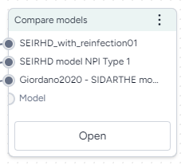

# Compare models

You can compare two or more models in Terarium to see:

- A brief overview of their structural and metadata similarities and differences.
- Side-by-side comparisons of key model details.
- An AI-assisted visualization of common and unique state variables and transitions across each model.

The Compare models operator is powered by an interactive AI assistant. The assistant automatically compares the models based on any enriched metadata and can generate summaries tailored to your modeling goals.

## Compare models operator

In a workflow, the Compare models operator takes two or more models as inputs and shows side-by-side comparisons of them. It does not output any data for use in other operators.

<figure markdown><figcaption markdown>How it works: [MIRA](https://github.com/gyorilab/mira/blob/7314765ab409ddc9647269ad2381055f1cd67706/notebooks/hackathon_2023.10/dkg_grounding_model_comparison.ipynb#L307) :octicons-link-external-24:{ alt="External link" title="External link" }</figcaption></figure>

-   :material-arrow-collapse-right:{ .lg .middle aria-hidden="true" } __Inputs__

    ---

    Two or more models

-   :material-arrow-expand-right:{ .lg .middle aria-hidden="true" } __Outputs__

    ---

    N/A

???+ list "Add the Compare models operator to a workflow"

    - Perform one of the following actions:
    
        - On a resource or operator that outputs a model, click Link :octicons-plus-24:{ title="Link" aria-labelledby="link-icon-label" } > **Compare models**.
        - Right-click anywhere on the workflow graph, select **Modeling** > **Compare models**, and then connect the output of two or more models to the Compare models inputs.

## Get model comparisons

The Compare model operator has a wizard view and a code notebook:

- The wizard view provides AI-generated text summaries of model similarities and differences.
- The code notebook allows you to create a visual comparison that shows the similarities and differences between the models.

## Use the wizard to compare models

The wizard view compares the selected models along the following lines. For the best results, make sure you've [enriched](review-and-enrich-model.md#enrich-model-metadata) each model before running the comparison.

- [Goal-driven comparison overview](#create-a-goal-driven-comparison-overview)
- [Side-by-side model cards](#get-side-by-side-model-card-comparisons)
- [Concept comparisons](#review-model-concept-comparisons)

### Create a goal-driven comparison overview

The goal-driven model comparison overview highlights the similarities and differences between the selected models. An AI assistant generates the overview by reviewing and summarizing the following structural and metadata components of the models.

???+ note

    - Before generating the overview, you can specify your goal for comparing the models. The assistant then produces the overview summary with your goal as context.
    - Metadata comparison is only available if you've first [enriched](review-and-enrich-model.md#enrich-model-metadata) the selected models.

- __Summary__

    ---

    A high-level comparison of the models, highlighting their strengths, weaknesses, and intended use cases. If you provide a goal, the summary incorporates it to ensure the analysis aligns with your specific focus.

-

- __Structural Comparison__

    ---

    This section compares the structures of each model.
    
    - **States**: Compares the state variables across models, focusing on similarities and differences in names, descriptions, and initial conditions.
    - **Transitions**: Highlights similarities and differences in transitions, including input/output states and mathematical expressions.
    - **Parameters**: Examines shared and unique parameters, detailing names, values, and usage in rate laws.
    - **Observables**: Summarizes observables, comparing names, IDs, and expressions across models.

- __Metadata Comparison__

    ---

    This section is only available if you've [enriched](review-and-enrich-model.md#enrich-model-metadata) the selected models. 

    - **Details**: Summarizes common and unique metadata, such as source, authorship, funding, and model type.
    - **Uses**: Discusses shared and unique contexts for using each model, including direct, indirect, and potential misuse scenarios.
    - **Biases, Risks, and Limitations**: Identifies common and unique biases, risks, and limitations, with a focus on assumptions, potential harms, and mitigations.
    - **Testing and Validation**: Compares evaluation protocols, testing data, and metrics, highlighting fairness, privacy, and other social considerations.

???+ list "Get an AI-generated analysis of the models related to your goals"

    - Enter your goal for comparing the models and click **Compare**.

### Get side-by-side model card comparisons

The side-by-side model cards let you visually compare the following key aspects of the selected models. The model cards are based on an AI summary of their underlying metadata.

???+ note

    Model cards are only available if you've first [enriched](review-and-enrich-model.md#enrich-model-metadata) the selected models. Otherwise, the model cards only show the model name and diagram.

- __Model name__

- __Model diagram__

- __Summary__

    --- 

    A description of the model, how it is intended to be used, and whether it can be represented in Petri Net format.

- __Specs__

    ---

    - **Domain**: Areas where the model is relevant or can be effectively utilized.
    - **Type**: How the model is represented, *Mathematical Model*, *Graphical Model*, or *Other*.
    - **Specification**: Detail about the model's structure and complexity, including the number of places, transitions, parameters, and arcs.
    - **States**: A list summarizing the model states, including what they represent, their initial values, their units, and how they can transition to other states.
    - **Parameters**: A list summarizing the model parameters, including what they represent, their units, and how they influence transition rates.

- __Uses__

    ---

    - **Direct use**: How the model can be used to analyze or simulate real-world scenarios.
    - **Out of scope use**: Instances where using the model would be inappropriate or misleading.

- __Bias risks limitations__

    ---

    - **Biases**: Factors that may skew the model's outputs or affect its accuracy.
    - **Risks**: Potential issues that could compromise the model's reliability or safety.
    - **Limitations**: Constraints that define the model's scope or performance boundaries.

- __Testing__

    ---

    - **Validation**: How the model was validated, such as through simulation or comparison with real-world data.
    - **Metrics**: Criteria used to assess the model's performance.

- __Getting started__

    ---

    Instructions or examples on how to use the model.

- __Glossary__

    ---

    A list of terms and definitions.

- __Authors__

    ---

    A list of authors of the model.

- __Citation__

    ---

    A list of citations relevant to the model.

- __More information__

    ---

    - **Funded by**: Funding sources.
    - **Links**: Links to additional information about the model.

???+ list "Get aside-by-side model card comparisons"

    - Make sure you've [enriched](review-and-enrich-model.md#enrich-model-metadata) each model before opening the Compare models operator.

### Review model concept comparisons

The concept comparisons highlight the relationships and differences between the concepts and states in the models. The comparison is presented in following formats to visualize the refinements and equivalences between concepts and identify how the models approach similar ideas.

???+ note

    - Concept comparison is available only if you've [enriched](review-and-enrich-model.md#enrich-model-metadata) the selected models.

- __Concept context comparison__

    ---

    A list of concepts in the models and how often they appear in each one.

-

- __Tabular concept comparison__

    ---

    A table that compares the concept relationships between states in two models:

    - `=`: The concepts behind the states are equivalent.
    - `<`: The concepts in the state on the left are a subset or a more specific instance of the concepts in the state on the top.
    - `>`: The concepts in the state on the left is a superset or a more general instance of the concepts in the state on the top. 
    - Blank: The concepts are not equal.

- __Concept graph comparison__

    A graph showing how the model states and concepts are related, highlighting refinements and equivalences.
    
    Each node is a state or concept. The color shows the model it belongs to:
    
    - Blue: From the first model.
    - Green: From the second model.
    - Orange: Shared by both models.
    
    Edges between nodes represent refinement relationships or equality between concepts. For refinement relationships, the direction of the arrow shows that the source is a refinement of the target.

## Use the notebook to visually compare models

The AI assistant in the Compare models operator can visualize the similarities and differences of the attached models. It creates a comparison diagram for every pair of input models. The diagram is color-coded to show the state variables and transitions that are unique to each model and common to both.

???+ list "Visualize model similarities and differences"

    1. Click **Notebook**.
    2. Click in the prompt field, select **Compare the models and visualize and display them**, and then click Submit :octicons-paper-airplane-24:{ style="transform: rotate(-45deg);" title="Submit" aira-labelledby="Submit" }.
    3. Review the generated code and then click :material-play-outline:{ aria-hidden="true" } **Run**.
    4. Review the model diagrams in the Preview.
    5. To make changes, modify the selected prompt or the generated code and click :material-play-outline:{ aria-hidden="true" } **Run** again.