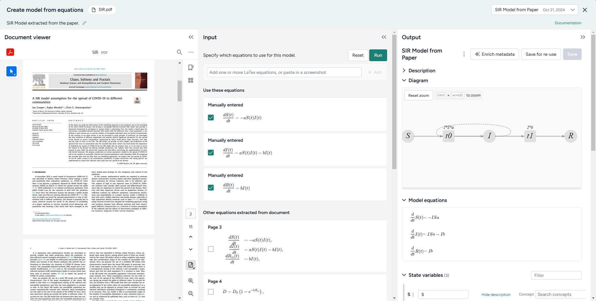
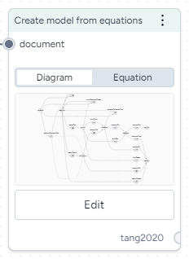

# Create a model from equations

The Create model from equations operator helps you to recreate a model from literature or build a new model from [LaTeX equations](https://www.latex-project.org/help/documentation/) :octicons-link-external-24:{ aria-hidden="true" alt="External link" title="External link" }. In this process, you: 

1. [Choose or enter the equations](#choose-the-equations) you want to include in the model.
2. [Create the model](#create-the-model) as an output or resource for use in other modeling and configuration processes. 

!!! note

    When you upload a document to your project, Terarium automatically extracts any ordinary differential equations it contains and converts them to LaTeX. However, the extraction doesn't handle all the ways that equations can represent models. Before using any equations, check and edit them if needed.

## Create model from equations operator

In a workflow, the Create model from equations operator takes an optional document as an input and outputs a new model. You can use the operator without any inputs by entering or uploading LaTeX equations that represent the model you want to create. 

Once you have created a model, the operator in the workflow shows its underlying diagram or equations.

<figure markdown>

<figcaption markdown>How it works: [Model Service](https://github.com/DARPA-ASKEM/model-service/blob/07ae21cae2d5465f9ac5b5bbbe6c7b28b7259f04/src/ModelService.jl#L54) :octicons-link-external-24:{ alt="External link" title="External link" }</figcaption>
</figure>

-   :material-arrow-collapse-right:{ .lg .middle aria-hidden="true" } __Inputs__

    ---

    Document (optional)

-   :material-arrow-expand-right:{ .lg .middle aria-hidden="true" } __Outputs__

    ---

    [Model](index.md)

???+ list "Add the Create model from equations operator to a workflow"

    - Perform one of the following actions:
    
        - Hover over the output of a Document and click Link :octicons-plus-24:{ title="Link" aria-labelledby="link-icon-label" } > **Create model from equations**.
        - Right-click the workflow graph and select **Modeling** > **Create models from equations**.  

            If needed, connect the output of a Document to the Create model from equations input.

## Choose the equations

You can create a model from a set of ordinary differential equations by: 

- [Selecting equations from a document in your project](#select-equations-from-a-document).
- [Uploading and extracting equations from an image](#extract-equations-from-an-image). 
- [Manually entering equations as LaTeX code](#enter-your-own-equations).

To ensure the best results, Terarium uses a set of [LaTeX formatting guidelines](#recommended-latex-format) when converting extracted equations. It is recommended that you follow these guidelines for any LaTeX you add or edit as well.  

### Select equations from a document

To recreate a model from literature, you can select any ordinary differential equations extracted from an input document. Terarium represents each equation as LaTeX.

In some cases you may want to change the LaTeX either to correct or and new details. As you edit the LaTeX, the equation is automatically updated.

??? list "Select equations from a document"

    1. In the workflow, make sure the document is connected to the operator input and then click **Edit**.
    2. In the Input panel, review and select the equations you want to include in the model.

??? list "Edit equations extracted from a document" 

    ???+ note

    When you modify equations extracted from a document, your changes are only saved to the current Create model from equations operator. If you reuse the document in another Create model from equations operator, you need to make the edits again.

    1. Click an equation to jump to where it's found in the document and reveal the converted LaTeX code.
    2. Edit the code as necessary and verify that the updated equation matches your edits.
    3. Select the check box next to the equation to include it in the model.

### Extract equations from an image

In some cases, Terarium may not extract all the equations you want from a document. Or you may have equations from other sources that you want to bring into your project. In these cases, you can capture a screenshot of the equations and load them into Terarium for automatic extraction.

??? list "Extract equations from an image"

    1. Take a screenshot of the equations you want to use or copy a saved image of the equations.
    2. Click inside the text box and paste your image. For example, right click and select **Paste** or press ++ctrl+v++.
    3. Click :octicons-plus-24:{ aria-hidden="true" } **Add**.
    4. Review the new equations. Click to reveal the LaTeX code and edit it if necessary.

### Enter your own equations

In addition to selecting extracted equations, you can also paste or enter LaTeX code from elsewhere.

??? list "Manually enter equations"

    1. Use the text box to add LaTeX equations to enter a new equation and click :octicons-plus-24:{ aria-hidden="true" } **Add**.
    2. Repeat step 1 for each equation you want to add.

??? list  "Manually copy an equation from a document"

    If the automatic extraction missed an equation from your document, you can still copy it and add it separately.

    1. Select the text in the document viewer and then click :octicons-copy-24:{ aria-hidden="true"} **Copy text**.
    2. Paste the equation into the Input text box and edit as necessary.
    3. Click :octicons-plus-24:{ aria-hidden="true" } **Add**.

### Recommended LaTeX format

The Create model from equations operator works with LaTeX equations. Before it creates a model, Terarium uses an AI assistant to "clean" your edited equations according to the following guidelines. You can follow these same guidelines yourself or enter equations as you normally would and then check the AI-cleaned equations for errors such as missing terms or duplicated parameters.

-   #### Derivatives

    ---

    - Write derivatives in **Leibniz notation**, not Newton or Lagrange notation.
    
        *Recommended*: `\frac{d X}{d t}`  
        *Not recommended*: `\dot{X}`  
        *Not recommended*: `X^\prime` or `X'`

    - Represent partial derivatives of one-variable functions as **ordinary derivatives**.
    
        *Recommended*: `\frac{d X}{d t}`  
        *Not recommended*: `\partial_t X`  
        *Not recommended*: `\frac{\partial X}{\partial t}`

    - Place **first-order derivatives** to the left of the equal sign.

-   #### Mathematical notations

    ---

    - Avoid the use of:
        - Capital sigma (`Σ`) and pi (`Π`) notations for summation and product.
        - Non-ASCII characters.
        - Homoglyphs (characters that look similar but have different meanings).
    - To indicate multiplication, use ` * `.

        *Recommended*: `"b * S(t) * I(t)`
        *Not recommended*: `b S(t) I(t)`

    - Rewrite expressions with negative exponents as explicit fractions.

        *Recommended*: `"\\frac{{1}}{{N}}`
        *Not recommended*: `N^{{-1}}`

-   #### Parentheses

    ---

    - When grouping algebraic expressions, don't use square brackets `[ ]`, curly braces `{ }`, or angle brackets `< >`. Use parentheses `( )` if needed.
    - Expand time-dependent algebraic expressions grouped by parentheses according to the distributivity property of multiplication. 
    
        *Recommended*: `a * S(t) * I(t) + b * S(t) * D(t) + c * A(t) * S(t)`
        *Not recommended*: `S(t) * (a * I(t) + b * D(t) + c * A(t))`

    - Don't expand constant algebraic expressions grouped by parentheses. 

        *Recommended*: `a * b * (1 - c)`
        *Not recommended*: `a ∗ b ∗ 1 − a ∗ b ∗c`

-   #### Variable and symbol usage

    ---

    - For variables that have time `t` dependence, write the dependence explicitly as `(t)`,
    
        *Recommended*: `X(t)`  
        *Not recommended*: `X`

    - For **variables and names**, avoid the use of words or multiple character.
    - If needed, use camel case (`susceptiblePopulationSize`) to **combine multi-word or multi-character names**.
    - **Replace any variant form of Greek letters** (`\varepsilon`) with their main form (`\epsilon`) when representing a parameter or variable. 
    - Don't separate equations by punctuation (commas, periods, or semicolons).

-   #### Superscripts and subscripts

    ---

    - To denote **indices**, use LaTeX subscripts `_` instead of superscripts and LaTeX superscripts `^`.
    - Use **LaTeX subscripts** `_` instead of Unicode subscripts. Wrap all characters in the subscript in curly brackets `{...}`.

## Create the model

Once you have selected the equations you want to use, you can create a new model as:

- An output you can connect to other operators in the same workflow.
- A project resource that you can use in any of your workflows.
- A downloadable JSON file you can use in external tools. 

???+ note

    Before it creates a model, Terarium uses an AI assistant to "clean" the selected equations according to the [LaTeX formatting guidelines](#recommended-latex-format). When the model is ready, the Input panel shows the equations "Edited by AI" that appear in the model.

??? list "Create a new model from the selected equations"

    When you run the Create model from equations operator, the newly created model becomes an output you can connect to other operations in the same workflow. 

    1. Click **Run**.

        ??? note "Run options for creating models"

            Terarium supports two methods for creating models from equations:

            - **MIRA** uses LLM assistance to [standardize LaTeX equations](https://github.com/DARPA-ASKEM/terarium/blob/c0f054f1983a7d8b07441c8d8fc5da1a989fb884/packages/gollm/gollm_openai/prompts/latex_style_guide.py) :octicons-link-external-24:{ aria-hidden="true" alt="External link" title="External link" }, [translate them to SymPy equations](https://github.com/DARPA-ASKEM/terarium/blob/c0f054f1983a7d8b07441c8d8fc5da1a989fb884/packages/gollm/gollm_openai/prompts/latex_to_sympy.py) :octicons-link-external-24:{ aria-hidden="true" alt="External link" title="External link" }, and then create a Petri Net model.
            - **[SKEMA](https://github.com/DARPA-ASKEM/skema/tree/a68068ad4e05423499760469f253d2972c7f82de/skema/skema-rs/mathml)** :octicons-link-external-24:{ aria-hidden="true" alt="External link" title="External link" } uses regular expressions to rigidly parse LaTeX equations and create a Petri Net model.

            MIRA is the default and recommended model. SKEMA can be used as a workaround when MIRA generates errors or inaccurate results. SKEMA is most reliable for equations with no parentheses, no production/degradation, and no complex rate law expressions.

    2. Review the new equations. If you need to make changes, edit the equations in the Input panel and click **Run** again.
    3. If needed, use the Output panel to [enrich the model metadata](review-and-enrich-model.md) and then click **Save**.

??? list "Save the new model as a resource for use in other workflows"

    By default, the new model only appears as an output of the Create new model. You can make it available for use in other workflows by saving it as a project resource.

    - In the Output panel, click **Save for re-use** and choose a name for the new model.

??? list "Download the new model"

    - Next to the model name, click Menu :fontawesome-solid-ellipsis-vertical:{ title="Menu" aria-labelledBy="Menu" } > :octicons-download-24:{ aria-hidden="true"} **Download**. 