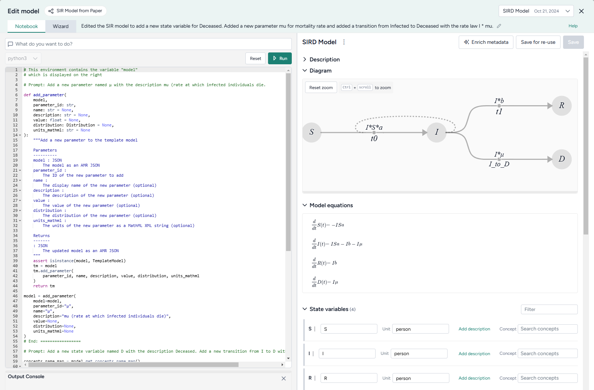

# Edit a model

Model editing lets you build on existing models. Supported edits include:

- Answering questions about, adding, removing, or changing state variables, transitions, parameters, rate laws, and observables.
- Renaming model elements.
- Setting variable or parameter units.
- Replacing parameters with more complex formulas.
- Resetting the model to its original state.

The Edit model operator is a code notebook with an interactive AI assistant. You describe in plain language the changes you want to make, and the large language model (LLM)-powered assistant automatically generates the code for you.

<video controls>
  <source src="https://videos.terarium.ai/editing-a-model.mp4" type="video/mp4">
  Your browser does not support HTML5 video. <a href="https://videos.terarium.ai/editing-a-model.mp4" download>Download the video</a>.
</video>

???+ note

    The Edit model operator adapts to your coding experience. You can: 

    - Use plain language to prompt an AI assistant for a no-code experience.
    - Edit and rerun AI-generated code. 
    - Write own executable code to make custom edits.

???+ note

    For more examples and information about model editing, see the [MIRA training material](https://github.com/gyorilab/mira/blob/main/docs/training_material.md).

## Edit model operator

In a workflow, the Edit model operator takes a model or model configuration as an input and outputs an edited model.

???+ tip

    For complex edits with multiple steps, it can be helpful to chain multiple Edit model operators together. This allows you to:

    - Keep each notebook short and readable.
    - Access intermediate results for testing or comparison.

Once you've completed your edits, the thumbnail preview shows the diagram or equations of the edited model.

<figure markdown>

<figcaption markdown>How it works: [MIRA Model Edit](https://darpa-askem.github.io/askem-beaker/contexts_mira_model_edit.html) :octicons-link-external-24:{ alt="External link" title="External link" }</figcaption> 
</figure>

<div class="grid cards" markdown>

-   :material-arrow-collapse-right:{ .lg .middle aria-hidden="true" } __Inputs__

    ---

    Model or model configuration

-   :material-arrow-expand-right:{ .lg .middle aria-hidden="true" } __Outputs__

    ---

    Edited model

</div>

???+ list "Add the Edit model operator to a workflow"

    - Perform one of the following actions:
    
        - On a resource or operator that outputs a model or model configuration, click <span class="sr-only" id="link-icon-label">Link</span> :octicons-plus-24:{ title="Link" aria-labelledby="link-icon-label" } > **Edit model**.
        - Right-click anywhere on the workflow graph, select **Modeling** > **Edit model**, and then connect the output of a model or model configuration to the Edit model input.

## Edit a model in the Edit model code notebook

Inside the Edit mode operator is a code notebook. In the notebook, you can prompt an AI assistant to answer questions about or modify your model. If you're comfortable writing code, you can edit anything the assistant creates or add your own custom code.



Generated code appears below your prompts, where you can preview, edit, and run it. Each prompt and response builds on the previous ones, letting you gradually make complex changes and save the history of your work.

???+ note

    Each new prompt and response adds new code below any existing code. When you run the Edit model operator, all the code is executed, not just your latest changes.

??? list "Open the Edit model code notebook"

    - Make sure you've connected a model or model configuration to the Edit model operator and then click **Open**.

### Use the AI assistant to edit a model

The Edit model AI assistant interprets plain language to answer questions about or transform your model.

???+ tip

    The AI assistant can perform more than one command at a time.

??? list "Ask the AI assistant a question about your model or the process of editing"

    1. Click in the text box at the top of the page, enter your question, and then click <span class="sr-only" id="submit-icon-label">Submit</span> :octicons-paper-airplane-24:{ style="transform: rotate(-45deg);" title="Submit" aira-labelledby="Submit" }.
    2. Click **Show thoughts** to view the answer.

??? list "Edit a model using the AI assistant"

    1. Click in the text box at the top of the page and then perform one of the following actions:
        - Select a suggested prompt and modify it to fit your model and required edits.
        - Enter a plain-language description of the changes you want to make.
    2. Click <span class="sr-only" id="submit-icon-label">Submit</span> :octicons-paper-airplane-24:{ style="transform: rotate(-45deg);" title="Submit" aira-labelledby="Submit" } to generate and preview the model edit code.
    3. Review and edit (if necessary) the generated model edit code.
    4. Click :material-play-outline:{ aria-hidden="true" } **Run**.

### Add or edit code

At any time, you can edit the code generated by the AI assistant or enter your own custom code.

??? list "Add or make changes to model edit code"

    1. Directly edit the python code. 
    2. Click :material-play-outline:{ aria-hidden="true"} **Run**.
    3. If needed, review any errors in the Output Console below the code.

<!-- Add support for adding observables via pattern https://github.com/DARPA-ASKEM/askem-beaker/pull/161/ -->

#### Write initials, observables, and rate laws as expressions

In addition to setting initials, observables, and rate laws as numeric values, you can define them as expressions involving other states or parameters. Expressions should follow [SymPy](https://docs.sympy.org/latest/tutorials/intro-tutorial/basic_operations.html) :octicons-link-external-24:{ alt="External link" title="External link" } syntax. They can include: 

- Elementary operators (`*`. `/`, `+`, `-`, and `**`).

    ??? example

        ```python
        (S + I + R) ** (1/2)
        ```

- [Mathematical and logical operations](https://github.com/patrick-kidger/sympytorch/blob/0670a3bbdfc0b77fa1ecc1367f51887eb6c6e3e9/sympytorch/sympy_module.py#L45) :octicons-link-external-24:{ alt="External link" title="External link" } for symbolic-to-numeric computation.

    ??? example

        ```python
        log(Pi + 1e-9, 10) * exp(-t) + Max(-10, Pi * t)
        ```
???+ example 

    ```{ .python .wrap }
    t = sympy.Symbol('t')
    EV_i_t_raw, EV_min, EV_max = sympy.Symbol('EV_i_t_raw EV_min EV_max')
    
    model.observables['NewObs'] = Observable(
        name = 'NewObs',
        expression = SympyExprStr((sympy.log(EV_i_t_raw * 1e9, 10) - sympy.log(EV_min * 1e9, 10) / (sympy.log(EV_i_t_raw * 1e9, 10) - sympy.log(EV_max * 1e9, 10))))
    ```

### Edit model examples

The following sections show examples of how to prompt the Edit model AI assistant to perform commonly used edits.

??? list "Add observables by pattern"

    For a stratified model, you can add observables by pattern. For example, with a model stratified by age (*children*, *adults*, *elderly*) and vaccination status (*vaccinated*, *unvaccinated*]:
    
    ```{ .text .wrap }
    Add an observable called susceptible_vaccinated_children for the susceptible identifier and for vaccinated children
    ```

??? list "Expand an equation"

    You can use the Edit model operator to take a high-level equation and progressively expand it by substituting definitions of variables into the equation. By doing this in multiple iterative steps over several connected Edit model operators, you can create a fully detailed model with clear relationships and dependencies.

    ```{ .text .wrap }
    Replace rate law t1 with the equation i * s * omega * (1 - (1/e)**(theta * IR**2 * Cv * Ci * IR * Vdrop * tContact / ((AER + lambda + S) * Vair)))
    ```

## Save an edited model

Each time you click :material-play-outline:{ aria-hidden="true" } **Run**, Terarium creates a new edited model as the output for the Edit model operator. This lets you return to previous versions of your model or choose the best one to save and use in your workflow.

When you're done making changes, you can connect the chosen output to any operators in the same workflow that take models as an input. 

To use an edited model in other workflows, save it as a project resource.

??? list "Choose a different output for the Edit model operator"

    - Use the **Select an output** dropdown.

??? list "Save an edited model to your project resources"

    You can save an edited model at any time.

    1. (Optional) If you created multiple outputs during your edits, **Select an output** to save.
    2. Click **Save for re-use**, enter a unique name in the text box, and then click **Save**.

??? list "Download an edited model"
    
    - Click <span class="sr-only" id="menu-icon-label">Menu</span> :fontawesome-solid-ellipsis-vertical:{ title="Menu" aria-labelledby="menu-icon-label" } > :octicons-download-24:{ aria-hidden="true" } **Download**.