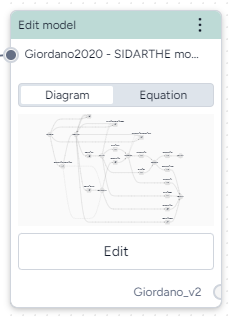

# Edit a model

Model editing lets you build on existing models. You can add, remove, or change state variables, transitions, parameters, rate laws, and observables.

How you implement your edits is up to you. You can write your own code or prompt the integrated AI assistant to generate and execute code for you.

<figure markdown>

<figcaption markdown>How it works: [MIRA Model Edit](https://darpa-askem.github.io/askem-beaker/contexts_mira_model_edit.html) :octicons-link-external-24:{ alt="External link" title="External link" }</figcaption> 
</figure>

-   :material-arrow-collapse-right:{ .lg .middle aria-hidden="true" } __Inputs__

    ---

    Model

-   :material-arrow-expand-right:{ .lg .middle aria-hidden="true" } __Outputs__

    ---

    Edited model

???+ list "Add the Edit operator to a workflow"

    - Perform one of the following actions:
    
         On a resource or operator that outputs a model or model configuration, click Link :octicons-plus-24:{ title="Link" aria-labelledby="link-icon-label" } > **Edit model**.
        - Right-click anywhere on the workflow graph, select **Modeling** > **Edit model**, and then connect the output of a model or model configuration to the Edit model input.

## Edit a model with the AI assistant

Using the Notebook view of the Edit model operator, you can steer an AI assistant to quickly create, modify, and refine a model from code. All generated code is directly editable, allowing you to make modifications at any time.

???+ note

    Each time you submit a new prompt or command, the generated code is added below any existing code. Each time you run the code, the whole notebook is executed.

???+ list "Edit a model using the AI assistant"

    2. Click in the prompt field to see suggested actions. Select a suggestion or enter your own command using plain language.
    3. Click :material-play-outline:{ aria-hidden="true" } **Run**.

        ???+ tip

            To generate and preview model code but not run it, click :fontawesome-regular-paper-plane:{ alt="Generate code" title="Generate code"}.

    4. Review the resulting model diagram in the preview on the right. 
    5. To make changes, submit a new prompt that clarifies or builds on what you asked for or directly edit the generated code.
    6. Click :material-play-outline:{ aria-hidden="true" } **Run** again to update the model.
    7. To save an iteration of the model at any point, click **Save for re-use**, enter a unique name and click **Save**.

## Edit a model with your own code

More info coming soon.

## Use the edit model operator output

More info coming soon.

- [Edit model](#)
- [Stratify model](stratify-model.md)
- [Compare models](compare-models.md)
- [Configure model](../config-and-intervention/configure-model.md)
- [Create intervention policy](../config-and-intervention/create-intervention-policy.md)
