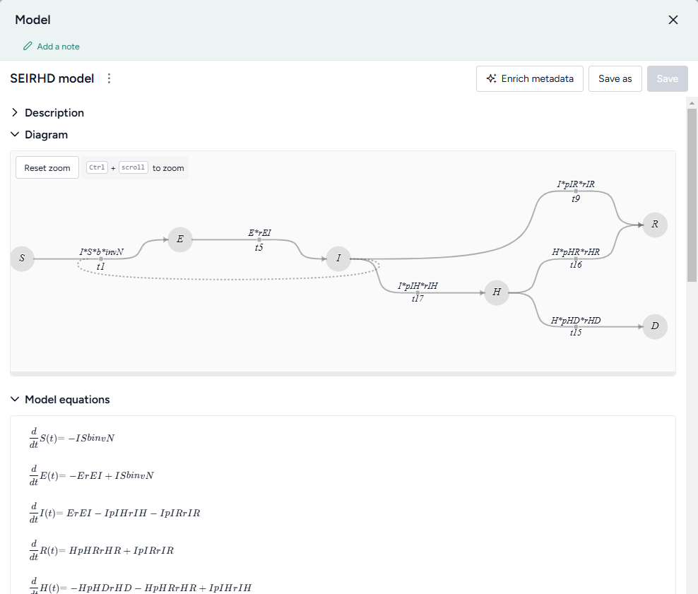

# Working with a model

A model is an abstract representation that approximates the behavior of a system. In Terarium, you can build a chain of complex operations to recreate, edit, configure, stratify, calibrate, and simulate models.

!!! note

    For information about: 

    - Uploading models, see [Upload modeling resources](../upload-resources/index.md).
    - Creating models, see [Edit model](edit-model.md).

## Model resource

A model resource represents a model you've uploaded to or created in Terarium.

In a workflow graph, a model resource shows its underlying diagram or equations. You can use the resource to:

- Open, review, and enrich the model variables, parameters, observables, and transitions.
- Edit or stratify the model.
- Compare it to other models.
- Create model configurations or intervention policies.

-   :material-arrow-collapse-right:{ .lg .middle aria-hidden="true" } __Inputs__

    ---

    - None

-   :material-arrow-expand-right:{ .lg .middle aria-hidden="true" } __Outputs__

    ---

    - Model

??? list "Add a model resource to a workflow"

    - Drag the resource from the Models section of the Resources panel.

??? list "Copy a model"

    1. Add the Model operator to a workflow graph and connect it to an Edit model operator.
    2. Click **Edit** on the Edit model operator.
    3. Click **Save for re-use**, enter a name for the copy, and click **Save**.

### What can I do with a model resource?

Hover over the output of the model resource and click link :octicons-plus-24:{ title="Link" aria-labelledBy="link-icon-label" } to use the model as an input to one of the following operators.

-   __Modeling__

    ---

    - [Edit model](edit-model.md): Add, remove, or change state variables, transitions, parameters, rate laws, and observables.
    - [Stratify model](stratify-model.md): Divide populations into subsets along demographic characteristics such as age and location.
    - [Compare models](compare-models.md): Compare side-by-side with other models to understand their similarities and differences.

-   __Configuration and intervention__

    ---

    - [Configure model](../config-and-intervention/configure-model.md): Set the initial values and parameters for the condition you want to test
    - [Create intervention policy](../config-and-intervention/create-intervention-policy.md): Create static and dynamic interventions for "what-if" scenarios.

