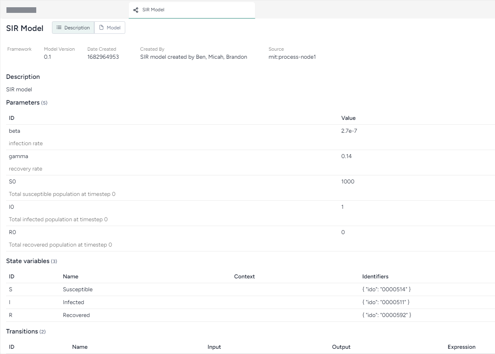

# Review and enrich a model

Once you have uploaded or created a model in your project, you can open it to:

- Explore its diagram, equations, state variables, parameters, observables, and transitions.
- Manually add metadata that explains the model components.
- Automatically enrich metadata using documents in your dataset or without additional context.

## Review a model

To get an understanding of a model, you can open a detailed view that summarizes the following extracted details:

- Description
- Diagram
- Model equations
- State variables
- Parameters
- Observables
- Transitions
- Time

??? list "Open a model"

    - Click the model name in the Resources panel.

??? list "Download a model"

    - Next to the model name, click Menu :fontawesome-solid-ellipsis-vertical:{ title="Menu" aria-labelledBy="Menu" } > :octicons-download-24:{ aria-hidden="true"} **Download**.

??? list "Rename a model"

    * Click Menu :fontawesome-solid-ellipsis-vertical:{ title="Menu" aria-labelledBy="Menu" } > :octicons-pencil-24:{ aria-hidden="true"} **Rename**, type a unique name for the model, and press ++enter++.

## Enrich model metadata

If your model lacks descriptive details about its variables and parameters, you can use Terarium's model enrichment capability to complete the:

- **Names**: A meaningful label that describes what the variable or parameter stands for. 
- **Units**: What the variable or parameter measures (people, cases).
    
    ???+ note

        Transitions don't have units.

- **Descriptions**: A short plain language explanation of the variable or parameter's contents.
- **Concepts**: Epidemiological concepts related to the variable or parameter. Useful for comparing models and mapping variables and parameters to data columns.

Terarium's enrichment service uses an AI language model to automatically populate model metadata based on either:

- Contextual clues in the contents of a document in your project.
- The variable or parameter names in the model. In this case, the language model attempts to define the metadata as if they relate to a general epidemiological context.

??? list "Enrich model metadata"

    1. Click **Enrich metadata**.
    2. Perform one of the following actions:

        - To enrich metadata without selecting a document, click **Generate information without context**.
        - To use a document, select the document title.

    3. Click **Enrich**.
    4. Review the updated metadata.
    5. Click **Save**.

??? list "Add or edit model metadata"

    1. Edit the **Name**, **Unit**, **Description**, or **Concept**.
    2. Click **Save**.