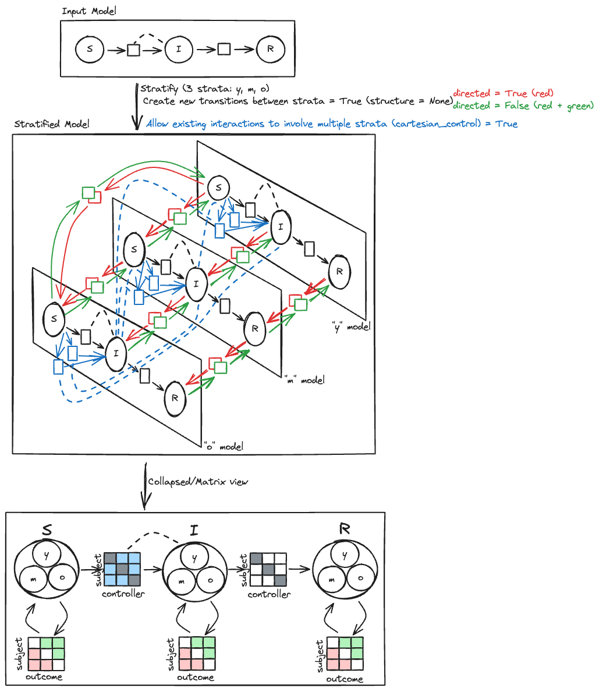
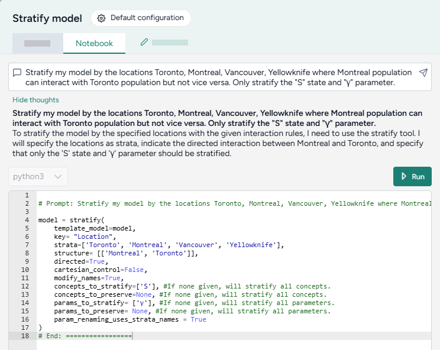
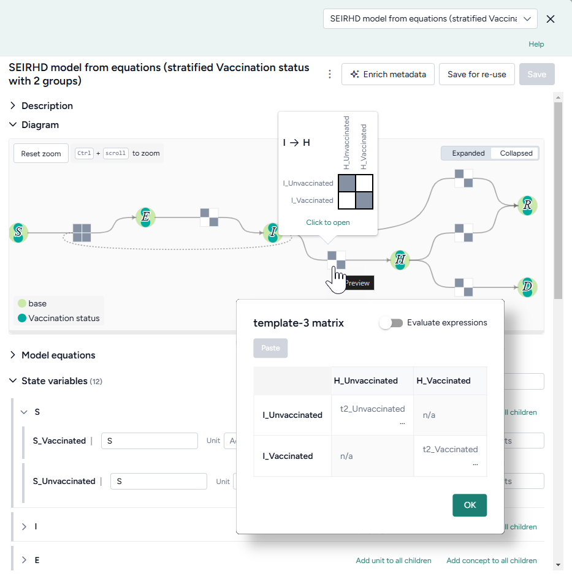

# Stratify a model

You can make a simple model more complex by stratifying its state variables and parameters. Stratification builds many different versions of a model and its parameters&mdash;by location, demographics, or other contextual data&mdash;into one large model. You can then configure, calibrate, or simulate the combined models all at once.

<video controls>
  <source src="https://videos.terarium.ai/stratification.mp4" type="video/mp4">
  Your browser does not support HTML5 video. <a href="https://videos.terarium.ai/stratification.mp4" download>Download the video</a>.
</video>

???+ note

    For more examples and information about model stratification, see the [MIRA training material](https://github.com/gyorilab/mira/blob/main/docs/training_material.md).

## Stratify model operator

In a workflow, the Stratify model operator takes a model as an input and outputs a stratified version of the model.

???+ tip

    For complex stratification schemes, it can be helpful to chain several Stratify model operators together. To make the generated matrices easier to understand, use as many parameters as the number of stratification levels. 

Once you've completed the stratification, the thumbnail preview shows the updated model diagram.

<figure markdown><figcaption markdown>How it works: [MIRA](https://github.com/gyorilab/mira/blob/main/notebooks/viz_strat_petri.ipynb) :octicons-link-external-24:{ alt="External link" title="External link" }</figcaption></figure>

<div class="grid cards" markdown>

-   :material-arrow-collapse-right:{ .lg .middle aria-hidden="true" } __Inputs__

    ---

    - [Model](index.md) or model configuration

-   :material-arrow-expand-right:{ .lg .middle aria-hidden="true" } __Outputs__

    ---

    - [Model](index.md) (stratified)

</div>

??? list "Add the Stratify model operator to a workflow"

    - Perform one of the following actions:
        - On a resource or operator that outputs a model or a model configuration, hover over the output and click <span class="sr-only" id="link-icon-label">Link</span> :octicons-plus-24:{ title="Link" aria-labelledby="link-icon-label" } > **Stratify model**.
        - Right-click anywhere on the workflow graph, select **Modeling** > **Stratify model**, and then connect a model or model configuration to the input.

## Stratify a model

The Stratify model operator adapts to your level of coding experience. You can stratify a model using:

- A [wizard view](#use-the-wizard-to-stratify-a-model) with the most common settings. 
- A [code notebook](#use-the-notebook-to-stratify-a-model) with an interactive AI assistant.

??? list "Open the Stratify model operator"

    - Make sure you've connected a model or model configuration to the Stratify model operator and then click **Open**.

### Use the wizard to stratify a model

Use the wizard view of the Stratify model operator to quickly apply commonly used stratification settings. Simply choose:

- The name of your strata.
- The variables and parameters you want to stratify.
- A list of labels for each group.
- Whether to [allow interactions and transitions between strata](#allow-transitions-and-interactions-between-strata). 


??? list "Choose what and how to stratify"

    1. Enter a name for the strata you want to add.

        ???+ note

            If you choose to save the stratified model for re-use, the text you enter here becomes part of the suggested model name.

    2. Select the model variables and parameters you want to stratify.
    
        ???+ tip
    
            Only stratify the parameters that differ for each stratum.
    
    3. Enter a comma-separated list of labels for each of the strata groups.

        ```
        Young, Old, MiddleAged
        ```

        Labels are added to the selected variables and parameters for stratification, with an underscore `_` separating them (`S_Young`).

    4. Choose whether to [allow interactions and transitions between strata](#allow-transitions-and-interactions-between-strata).

??? list "Stratify the model"

    -  Once you have completed all the settings, click **Stratify**.

???+ tip

    Strata group labels should only contain letters (`a`&ndash;`Z`) and numbers (`0`&ndash;`9`). Don't use special characters like `+`, `-`, `\`, `/`, or `*`. 

    - Recommended: `0to17, 18to65, 66plus`
    - Not recommended: `0-17, 18-65, 66+`

    Because strata labels become part of mathematical symbols, they must adhere to [SymPy naming conventions](https://docs.sympy.org/latest/tutorials/intro-tutorial/gotchas.html).


#### Allow transitions and interactions between strata

You can configure transitions and interactions in stratified models to customize dynamics between groups, such as age or location categories.

??? example "Example: interactions and transitions between strata in an SIR model"

    The following image shows how the transition and interaction settings apply to a simple SIR model stratified by *y*, *m*, and *o*:

    - **Black** lines are the base model. Stratification essentially creates a copy of it for each of the three strata.
    - **Blue**{.strata-interaction} lines show interactions between strata (*Allow existing interactions to involve multiple strata*). The susceptible group in each stratum can interact with the infected groups from all strata.

        For example were this an age model, a susceptible young person could become infected after interacting with an infected older adult.
    
    - **Red**{.strata-transition-directed} and **green**{.strata-transition-undirected} lines show transitions between strata (*Create transitions between strata*). 

        For example were this a location model, a susceptible person could travel between location **o** and **m**. 

    

??? list "Create transitions between strata"

    Select **Create transitions between strata** when you want the strata to be able to transition between each other. For example, when stratifying by:

    - **Age**, this option is usually off because people don't change age groups. (A susceptible young person can't become a susceptible older adult).
    - **Location**, this option can be:
        - On if people can travel between locations. (A susceptible person in one county can move to another).
        - Off if people are quarantined or social distancing. (A susceptible person in Canada can't travel to the U.S. due to border restrictions).

    For more control over which strata can transition and which cannot, see the code notebook. 

??? list "Allow existing interactions to involve multiple strata"

    Select **Allow existing interactions to involve multiple strata** when you want the strata to be able to interact with each other across existing interactions. For example:

    - When stratifying an SIR model by age, turn this option on to allow the age groups in each state to interact with age groups in other states.

### Use the notebook to stratify a model

In the notebook, you can prompt the AI assistant to: 

- Answer questions about the model or stratification options.
- Make more complicated stratifications than possible with the wizard. 

You can edit anything the assistant creates or add your own custom code.



??? list "Open the Stratify model notebook"

    - Click **Notebook**.

#### Prompt the AI assistant to stratify a model

The Stratify model AI assistant interprets plain language to answer questions about or stratify your model.

???+ tip

    The AI assistant can perform more than one command at a time.

??? list "Ask the AI assistant a question about your model or the process of stratification"

    1. Click in the text box at the top of the page, enter your question, and then click <span class="sr-only" id="submit-icon-label">Submit</span> :octicons-paper-airplane-24:{ style="transform: rotate(-45deg);" title="Submit" aira-labelledby="Submit" }.
    2. Click **Show thoughts** to view the answer.

??? list "Prompt the AI assistant to stratify your model"

    1. Click in the text box at the top of the page and then perform one of the following actions:
        - Select a suggested prompt and edit it to fit your model and the stratification you want to make.
        - Describe the stratification you want to make. 
    2. Click <span class="sr-only" id="submit-icon-label">Submit</span> :octicons-paper-airplane-24:{ style="transform: rotate(-45deg);" title="Submit" aira-labelledby="Submit" }.
    3. Review and edit (if necessary) the generated stratification code.
    4. Click :material-play-outline:{ aria-hidden="true" } **Run**.

#### Add or edit code

At any time, you can edit the code generated by the AI assistant or enter your own custom code. 

The notebook environment uses a structured data format to represent stratification operations. You can edit the code to have greater control over the transitions, interactions, and naming conventions for the stratified model.

```python
model = stratify(
    template_model=model,
    key= "Age",
    strata=['Young', 'Old'],
    structure= [],
    directed=False,
    cartesian_control=True,
    modify_names=True,
    concepts_to_stratify=['S', 'I', 'E', 'H', 'R', 'D'], #If none given, will stratify all concepts.
    concepts_to_preserve=None, #If none given, will stratify all concepts.
    params_to_stratify= None, #If none given, will stratify all parameters.
    params_to_preserve= None, #If none given, will stratify all parameters.
    param_renaming_uses_strata_names = True
)
```

??? info "Stratification code settings"

    <table>
        <thead>
            <tr>
                <th>Setting</th>
                <th>Description</th>
            </tr>
        </thead>
        <tbody>
            <tr>
                <td>
                    <p><b>key</b></p>
                    <p>(<i>Name of strata</i> setting in Wizard)</p>
                </td>
                <td>The characteristic along which the model should be divided, such as age, location, vaccination status.</td>
            </tr>
            <tr>
                <td><b>strata</b></td>
                <td>Groups into which the model should be divided. If the <b>key</b> is "Age", strata might be ['young', 'middle-aged', 'old'].</td>
            </tr>
            <tr>
                <td>
                    <p><b>structure</b></p>
                    <p>(<i>Create new transitions between strata</i> setting in Wizard)</p>
                </td>
                <td>
                    <p>Pairs of strata within the same state that can interact with each other. For example, ['young', 'old'] allows the 'young' stratum to interact with the 'old' stratum.</p>
                    <p>If no structure is specified, all strata can interact with each other.</p>
                </td>
            </tr>
            <tr>
                <td><b>directed</b></td>
                <td>
                    <p>Controls the flow of effects or interactions within the model. Useful in scenarios where the direction of interaction matters, such as disease transmission or information flow.</p>
                    <ul>
                        <li><b>True</b>: Interactions between strata are one-way or asymmetric. For example, if you have a <b>structure</b> ['young', 'old'], 'young' can affect or interact with 'old', but not the other way around.</li> 
                        <li><b>False</b>: Interactions between strata are two-way or symmetric.  For example, if you have a <b>structure</b> ['young', 'old'], 'young' can interact with 'old' and 'old' can also interact with 'young'.</li>
                    </ul>
                </td>
            </tr>
            <tr>
                <td>
                    <p><b>cartesian_control</b></p>
                    <p>(<i>Allow existing interactions to involve multiple strata</i> setting in Wizard)</p>
                </td>
                <td>
                    <p>Determines whether strata from different state variables can interact with each other.</p> 
                    <ul>
                        <li><b>True</b>: Allow interactions across different strata. For example, infected in one location can interact with susceptible in another location).</li>
                        <li><b>False</b>: Restrict interactions between different strata. Isolates the dynamics within each stratum.</li>
                    </ul>
                </td>
            </tr>
            <tr>
                <td><b>modify_names</b></td>
                <td>
                    <p>Determines whether the names of states in the model should be altered to include the strata names.</p>
                    <ul>
                    <li><b>True</b>: Modify the names of states to reflect the strata they belong to. For example, a state variable 'S' stratified by age into 'young' and 'old' results in state variables named 'S_young' and 'S_old'.</li> 
                    <li><b>False</b>: Keep the original names of the states unchanged.</li>
                </ul>
            </td>
            </tr>
            <tr>
                <td>
                    <p><b>concepts_to_stratify</b></p>
                    <p>(Controlled by <i>Variables and parameters to stratify</i> setting in Wizard)</p>
                </td>
                <td>List of the state variables to stratify.</td>
            </tr>
            <tr>
                <td><b>concepts_to_preserve</b></td>
                <td>List of the state variables that shouldn't be stratified.</td>
            </tr>
            <tr>
                <td>
                    <p><b>parameters_to_stratify</b></p>
                    <p>(Controlled by <i>Variables and parameters to stratify</i> setting in Wizard)</p>
                </td>
                <td>List of the parameters to stratify.</td>
            </tr>
            <tr>
                <td><b>parameters_to_preserve</b></td>
                <td>List of the parameters that shouldn't be stratified.</td>
            </tr>
            <tr>
                <td><b>param_renaming_uses_strata_names</b></td>
                <td>
                    <p>Determines whether the names of parameters in the model should be altered to include the strata names.</p>
                    <ul>
                    <li><b>True</b>: Modify the names of parameters to reflect the strata they belong to. For example, a parameter 'β' stratified by age into 'young' and 'old' results in parameters named 'β_young' and 'β_old'.</li> 
                    <li><b>False</b>: Modify the names of parameters numerically. For example, a parameter 'β' stratified by age into 'young' and 'old' results in parameters named 'β_young' and 'β_old'.</li>
                </td>
            </tr>
        </tbody>
    </table>


??? list "Add or make changes to stratification code"

    1. Directly edit the python code. 
    2. Click :material-play-outline:{ aria-hidden="true"} **Run**.

#### Examples of AI-assisted stratifications

The following examples show how to prompt the Stratify model AI assistant to perform commonly used stratifications.

??? list "Stratify all state variables and parameters"

    To stratify all the state variables and parameters in the SIR model by age, simply list the strata you want to divide them into.
    
    === "Prompt"
    
        ```{ .text .wrap }
        Stratify my model by the ages young, middle, and old
        ```
    
    === "Code"
    
        ```python
        model = stratify(
            template_model=model,
            key= "Age",
            strata=['young', 'middle', 'old'],
            structure= [],
            directed=False,
            cartesian_control=False,
            modify_names=True,
            concepts_to_stratify=None, # Stratify all concepts.
            concepts_to_preserve=None, # Stratify all concepts.
            params_to_stratify= None, # Stratify all parameters.
            params_to_preserve= None, # Stratify all parameters.
            param_renaming_uses_strata_names = True
        )
        ```

??? list "Stratify with full interaction"

    Stratify the model by city, and then enable susceptible individuals from each stratum (city) to interact with infected individuals from every other city.  
    
    === "Prompt"
    
        ```{ .text .wrap }
        Stratify my model by the locations Toronto, Montreal, Vancouver, Yellowknife where all populations can interact with each other
        ```
    
    === "Code"
    
        ```python
        model = stratify(
            template_model=model,
            key= "Location",
            strata=['Toronto', 'Montreal', 'Vancouver', 'Yellowknife'],
            structure= [],
            directed=False,
            cartesian_control=True, # Allow interactions across different strata
            modify_names=True,
            concepts_to_stratify=None,
            concepts_to_preserve=None,
            params_to_stratify= None,
            params_to_preserve= None,
            param_renaming_uses_strata_names = True
        )
        ```

??? list "Stratify without interaction"

    Stratify the model by age, but don't allow susceptible individuals in a stratum (age group) to interact with infected individuals from other age groups.  
    
    === "Prompt"
    
        ```{ .text .wrap }
        Stratify my model by the ages young, middle, and old. Assume that the age groups cannot interact.
        ```
    
    === "Code"
    
        ```python
        model = stratify(
            template_model=model,
            key= "Age",
            strata=['young', 'middle', 'old'],
            structure= [],
            directed=False,
            cartesian_control=False, # Restrict interactions across different strata
            modify_names=True,
            concepts_to_stratify=None,
            concepts_to_preserve=None,
            params_to_stratify= None,
            params_to_preserve= None,
            param_renaming_uses_strata_names = True
        )
        ```

??? list "Stratify with asymmetric interaction"

    Stratify the model by city, but only allow individuals from Montreal to interact with individuals from Toronto.

    === "Prompt"

        ```{ .text .wrap }
        Stratify my model by the locations Toronto, Montreal, Vancouver, Yellowknife where Montreal population can interact with Toronto population but not vice versa
        ```

    === "Code"

        ```python
        model = stratify(
            template_model=model,
            key= "Location",
            strata=['Toronto', 'Montreal', 'Vancouver', 'Yellowknife'],
            structure= [['Montreal', 'Toronto']], # Allow Montreal and Toronto to interact
            directed=True, # Allow interactions from Montreal to Toronto but not Toronto to Montreal
            cartesian_control=False,
            modify_names=True,
            concepts_to_stratify=None,
            concepts_to_preserve=None,
            params_to_stratify= None,
            params_to_preserve= None,
            param_renaming_uses_strata_names = True
        )
        ```

??? list "Choose which states and parameters to stratify"

    Stratify only the susceptible state and γ parameter by city.

    === "Prompt"

        ```{ .text .wrap }
        Stratify my model by the locations Toronto, Montreal, Vancouver. Only stratify the "S" state and "γ" parameter.
        ```

    === "Code"

        ```python
        model = stratify(
            template_model=model,
            key= "Location",
            strata=['Toronto', 'Montreal', 'Vancouver'],
            structure= [],
            directed=False,
            cartesian_control=False,
            modify_names=True,
            concepts_to_stratify=['S'], # Only stratify the susceptible state
            concepts_to_preserve=None,
            params_to_stratify= ['γ'], # Only stratify the y parameter.
            params_to_preserve= None,
            param_renaming_uses_strata_names = True
        )
        ```

??? list "Exclude states and parameters from stratification"

    Stratify every state and parameter by city except infected and the β parameter.

    === "Prompt"

        ```{ .text .wrap }
        Stratify my model by the locations Toronto, Montreal, Vancouver, Yellowknife. Do not stratify the "I" state and "β" parameter.
        ```

    === "Code"

        ```python
        model = stratify(
            template_model=model,
            key= "Location",
            strata=['Toronto', 'Montreal', 'Vancouver', 'Yellowknife'],
            structure= [],
            directed=False,
            cartesian_control=False,
            modify_names=True,
            concepts_to_stratify=None,
            concepts_to_preserve=['I'], # Stratify all states except infected.
            params_to_stratify= None,
            params_to_preserve= ['β'], # Stratify all parameters except β.
            param_renaming_uses_strata_names = True
        )
        ```

??? list "Answer a question about parameter settings"

    Ask the AI assistant to explain your model structure and give more details about stratification settings. 

    === "Prompt"

        ```{ .text .wrap }
        What is cartesian_control in stratify?
        ```

    === "Answer"

        ```{ .text .wrap .no-copy }
        Cartesian control in the context of stratifying a model determines whether strata from different state variables can interact with each other. If set to true, it allows for interactions across different strata, meaning that entities from one stratum (e.g., infected individuals in one location) can interact with entities in another stratum (e.g., susceptible individuals in another location). If set to false, it restricts interactions such that entities from different strata cannot interact, isolating the dynamics within each stratum.
        ```

## Interpret the stratified model

Terarium previews the stratified model as:

- A color-coded diagram that shows the base model and the newly added strata.
- A list of stratified state variables, parameters, observables, and transitions.

When reviewing the stratified model, you can get a sense of the state variables and parameters in the list below the diagram, but the results are easiest to understand in matrix form.



??? list "Review stratified state variables or parameters"

    In the model diagram:

    1. Hover over a transition matrix to see how the different strata interact. Grey cells show that the corresponding strata can interact.
    2. Click the matrix to see the equations that describe the interactions.

    In the list of state variables, parameters, observables, and transitions, perform one of the following actions:

    - Click <span class="sr-only" id="preview-icon-label">Preview</span> :fontawesome-solid-angle-right:{ title="Preview" aria-labelledby="preview-icon-label" } next to a symbol name.
    - Click **Open matrix**.

        ???+ note

            For parameter matrices, use the dropdown to select the type of interactions you want to view:

            - **subjectOutcome**: Parameters for the relationship between the subject (the entity undergoing change) and the outcome (the result of that change).
            - **subjectControllers**:  Parameters for how controllers (external entities involved in the process) influence the subject (the entity undergoing change).
            - **outcomeControllers**: Parameters for how controllers (external entities involved in the process) influence the outcome (the result of that change). The controller does not experience the outcome but facilitates the transition.
            - **other**: Factors or intermediary states other than subjects, controllers, or outcomes that affect the process.

The block matrices in the model diagram should hint at the collapsed transitions.

## Save a stratified model

Saved models appear in your Resources panel and as the output of the Stratify model operator.

??? list "Save a stratified model as a new model in Terarium"

    You can save your stratified model as a new model at any time.

    - Click **Save for re-use**, edit the name of the stratified model, and then click **Save**.

??? list "Download a stratified model"
    
    1. In the Output panel, click <span class="sr-only" id="menu-icon-label">Menu</span> :fontawesome-solid-ellipsis-vertical:{ title="Menu" aria-labelledby="menu-icon-label" } > :octicons-download-24:{ aria-hidden="true" } **Download**.
