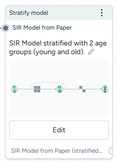

# Stratify a model

Stratifying a model divides its populations into subsets along demographic characteristics such as age and location.


Terarium automatically updates both the graphical representation of the model and its equations to reflect your changes.

<figure markdown><figcaption markdown>How it works: [MIRA](https://github.com/gyorilab/mira/blob/main/notebooks/viz_strat_petri.ipynb) :octicons-link-external-24:{ alt="External link" title="External link" }</figcaption></figure>

<div class="grid cards" markdown>

-   :material-arrow-collapse-right:{ .lg .middle aria-hidden="true" } __Inputs__

    ---

    Model

-   :material-arrow-expand-right:{ .lg .middle aria-hidden="true" } __Outputs__

    ---

    Stratified model

</div>

## Stratify a model

???+ tip

    To create complex stratification schemes, chain several Stratify model operators together. To facilitate the interpretation of the generated matrices, use as many parameters as the number of stratification levels. 

???+ list "To stratify a model"

    1. Add the model to a workflow, hover over its output, and click :octicons-plus-24:{ title="Link" aria-label="Link" } > **Stratify model**.
    2. On the Stratify model operator, click **Edit**.
    3. Enter a **Name** for the strata you want to add.
    4. Use the **Select variables and parameters to stratify** dropdown.
    
        ??? tip
    
            Only stratify the parameters that differ for each strata.
    
    5. Enter a comma-separated list of labels for each of the strata groups:
        ```
        A1, A2
        ```
    6. Choose whether you want to:

        - Create new transitions between strata
        
            ??? tip
    
                
                
                - When stratifying by age, this option is usually off, as people do not change age groups.
                - When stratifying by location, this option can be turned on if people are allowed to travel between locations.
    
        - Allow existing interactions to involve multiple strata
    
    7. Click **Stratify**.
    8. Review the preview of the stratified model.
    9. Click **Save for re-use**.

## Interpret a stratified model

Terarium previews the a stratified model as:

- A color-coded diagram that highlights the base model and the newly added strata.
- A list of stratified initial variables, parameters, observables, and transitions.

When reviewing the stratified model, you can get a sense of the initial variable and parameter values as a hierarchical list, but the results are easiest to understand in matrix form.

??? list "Review stratified model initials or parameters"

    Perform one of the following actions:

    - To view values as a hierarchical list, click :fontawesome-solid-angle-right:{ alt="Show strata" title="Show strata"} next to a symbol name.
    - To view values as a matrix, click :fontawesome-solid-table-cells-large:{ aria-hidden="true"} **Open matrix**.

The block matrices in the model diagram should hint at the collapsed transitions.