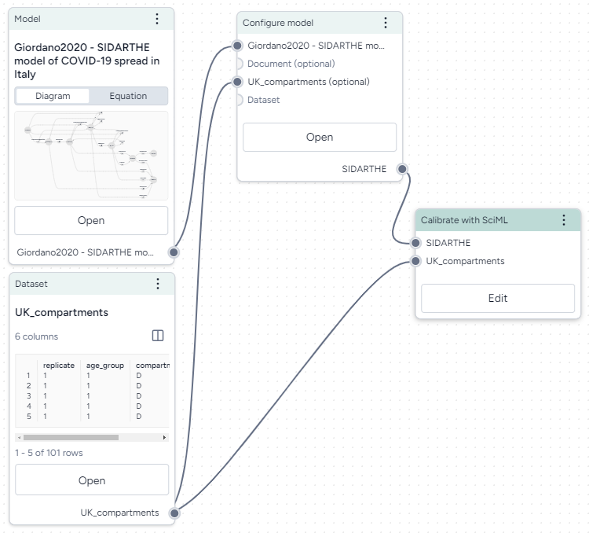

# Calibrate a model

Calibrating a model lets you determine or update the value of model parameters given a reference dataset of observations.

Terarium supports two types of calibrations: deterministic (with SciML) and probabilistic (with PyCIEMSS).

## Deterministic calibration

Deterministic calibrations (SciML) take a model configuration and a dataset as an input.

<figure markdown><figcaption markdown>How it works: [sciml-service](https://github.com/DARPA-ASKEM/sciml-service/blob/main/src/operations.jl#L245) :octicons-link-external-24:{ alt="External link" title="External link" }</figcaption></figure>

-   :material-arrow-collapse-right:{ .lg .middle aria-hidden="true" } __Inputs__

    ---

    - Model configuration
    - Dataset

-   :material-arrow-expand-right:{ .lg .middle aria-hidden="true" } __Outputs__

    ---

    Calibrated model configuration

To calibrate a model

1. Add the model and reference dataset to a workflow graph.
2. Connect the Model operator output to a Configure model operator. See [Configure a model](configure-model.md) for information on selecting a model configuration. 
2. Right-click anywhere on the workflow graph and select **Run model** > **Calibrate with SciML**.
3. Connect the outputs of the Configure model operator and Dataset resource to the inputs on the Calibrate with SciML operator.
4. Click **Edit** on the Calibrate with SciML operator.
6. In the Mapping section, map the model variables to the columns in the dataset.
7. Configure the calibration options as needed:
    - **Chains**: Number of parallel chains to run during the calibration.
    - **Iterations**: Number of steps each chain should take.
    - **ODE method**: Method to solve ordinary differential equations.
    - **Calibrate method**: Approach to calibration (*bayesian*, *local*, or *global*).
8. Click :material-play-outline:{ aria-hidden="true" } **Run**.

## Probabilistic calibration

Probabilistic calibrations (PyCIEMSS) take a model configuration and a dataset as an input.

<figure markdown><figcaption markdown>How it works: [PyCIEMSS](https://github.com/ciemss/pyciemss/blob/main/pyciemss/interfaces.py#L529) :octicons-link-external-24:{ alt="External link" title="External link" }</figcaption></figure>

-   :material-arrow-collapse-right:{ .lg .middle aria-hidden="true" } __Inputs__

    ---

    - Model configuration
    - Dataset

-   :material-arrow-expand-right:{ .lg .middle aria-hidden="true" } __Outputs__

    ---

    Calibrated model configuration

## Intermediate results

To view calibration results

- Use the **Select variables to plot** dropdown to choose the variables you want to see, or click **Add Chart** to add another chart.