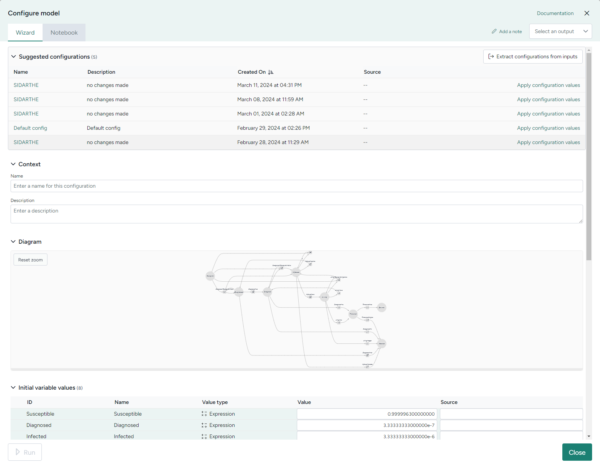
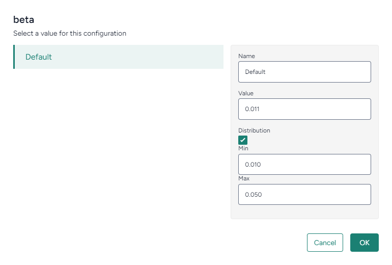

Before you can simulate a model, you need to configure it to set the initial values and parameters for the condition you want to test.

??? list "To access the model configurations"

    1. Open the model in a new tab.
    2. Click :octicons-file-24:{ aria-hidden="true" } **Model**.
    3. Scroll down to the Model configurations section.

??? list "To copy a model configuration"

    - On the :octicons-plus-24:{ aria-hidden="true"} **Add configuration** button, click :octicons-chevron-down-24:{ title="Menu"} and select a configuration from the list.

??? list "To edit a model configuration"

    1. Click :octicons-plus-24:{ aria-hidden="true"} **Add configuration**.
    2. Click in the first cell of the new row and type a unique name to rename the configuration.
    3. Click an initial condition or parameter to edit its value.
    4. To add more detail to the value, click :fontawesome-solid-ellipsis-vertical:{ title="Menu" }.
    
        
    
        + To rename the value, type a unique name in the **Name** field.
        + To provide a distribution range for a parameter:
            1. Click **Distribution**.
            2. Enter the **Min** and **Max** values for the distribution.
    
    5. Click **OK**.
    6. Repeat steps 3&ndash;5 for each initial condition or parameter you want to change.