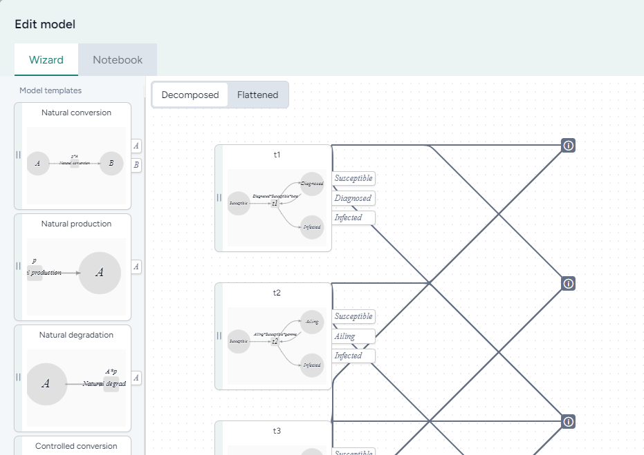

# Edit a model

You can use Terarium to edit model resources in your project or even create new ones. The Edit model operator allows you to compose or modify a diagram of the model states and transitions or prompt an AI assistant to generate code that makes your requested changes.

<figure markdown>

<figcaption markdown>How it works: [MIRA Model Edit](https://darpa-askem.github.io/askem-beaker/contexts_mira_model_edit.html) :octicons-link-external-24:{ alt="External link" title="External link" }</figcaption> 
</figure>

-   :material-arrow-collapse-right:{ .lg .middle aria-hidden="true" } __Inputs__

    ---

    Model

-   :material-arrow-expand-right:{ .lg .middle aria-hidden="true" } __Outputs__

    ---

    Edited model

## Edit a model diagram

The Wizard view of the Edit model operator represents each model as a diagram where:

- State variables are nodes.
- Dependencies are directed edges. 

For each model framework, the editor has a set of model templates that you can use to quickly edit or create different parts of the model. Available templates vary depending on the selected framework. Options include:

- **Natural conversion**: subject converts into outcome at a constant rate.
- **Natural production**: outcome is generated at a constant rate.
- **Natural degradation**: subject is destroyed at a constant rate
- **Controlled conversion**: subject converts into outcome at a rate that depends on some controller variable
- **Controlled production**: outcome is produced at a rate that depends on some controller variable
- **Controlled degradation**: subject is destroyed at a rate that depends on some controller variable

- **Grouped controlled conversion**: subject converts into outcome at a rate that depends on several controller variables
- **Grouped controlled production**: subject is produced at a rate  that depends on several controller variables
- **Grouped controlled degradation**: subject converts into outcome at a rate that depends on several controller variables
- **Natural replication**: subject is generated at a rate that depends on itself
- **Controlled replication**: subject generates at a rate that depends on itself and some controller variable

The model diagram is linked to the model equations. Changes you make to the diagram are automatically reflected in the equations.

??? list "To begin editing a model diagram"

    1. Add the Model to a workflow graph.
    2. Right-click anywhere on the workflow graph and select **Work with model** > **Edit model**.
    3. Connect the output port of the Model operator to the input port of the Edit model operator.
    4. Click **Edit** on the Edit model operator.
    5. Edit the model diagram:
        - To add new states and transitions, drag model templates from the panel on the left into the diagram.
        - To rename a state or transition, click the label of the node.
        - To link states across templates, click an output port on a template and connect it to another and output port on another template.
    6. To view the edited model, click **Flattened**.

## Edit a model with the AI assistant

Using the Notebook view of the Edit model operator, you can steer an AI assistant to quickly create, modify, and refine a model from code. All generated code is directly editable, allowing you to make modifications at any time.

???+ note

    Each time you submit a new prompt or command, the generated code is added below any existing code. Each time you run the code, the whole notebook is executed.

??? list "To edit a model using the AI assistant"

    1. In the Edit model operator details, click **Notebook**.
    2. Click :fontawesome-solid-angle-down:{ title="Suggested prompts" alt="Suggested prompts"" } in the prompt field to see suggested actions. Select a suggestion or enter your own command using plain language.
    3. Click :material-play-outline:{ aria-hidden="true" } **Run**.

        ???+ tip

            To generate model code but not run and preview it, click :fontawesome-regular-paper-plane:{ alt="Generate code" title="Generate code"}.

    4. Review the resulting model diagram in the Preview. 
    5. To make changes, submit a new prompt that clarifies or builds on what you asked for or directly edit the generated code.
    6. Click :material-play-outline:{ aria-hidden="true" } **Run** again to update the model.
    7. To save an iteration of the model at any point, enter a unique **name** and click **Save as new model**.
