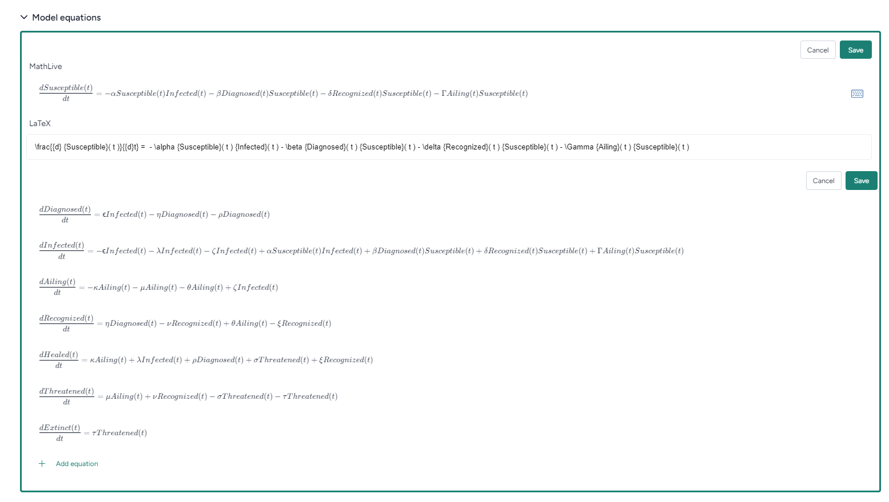
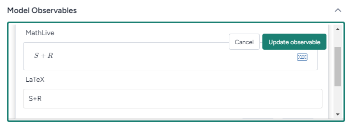

You can use Terarium to edit model resources in your project or even create new ones. You can define different aspects of a model using:

- Equations
- Diagrams
- Observables
- Configurations

## Add or edit an equation

Terarium represents model equations as both [MathLive](https://cortexjs.io/mathlive/virtual-keyboard/) :octicons-link-external-24: and [LaTeX](https://www.latex-project.org/) :octicons-link-external-24: expressions. You can create or edit either expression, and your changes are automatically applied to the other.

Equations are also linked to the model diagram. Changes you make to the expressions are automatically reflected in the diagram. 

??? list "To create or edit an equation"

    1. Click :octicons-file-24:{ aria-hidden="true" } **Model**.
    2. Scroll down to the Model equations section and click **Edit equation**.
    3. Select or create an equation to edit: 
    
        * To add a new equation, click :octicons-plus-24:{ aria-hidden="true" } **Add Equation**.
        * To edit an existing equation, click anywhere on the equation.
        * To delete an equation, hover over it and click **Delete** > **Confirm Delete**.
    
    4. Edit the equation in either the **MathLive** or **LaTeX** field. Changes you make in either field are automatically reflected in the other.
    
        ??? tip "Virtual keyboard"
    
            The MathLive field has a [virtual keyboard](https://cortexjs.io/mathlive/virtual-keyboard/) :octicons-link-external-24: that helps you enter mathematical symbols and functions. Click :material-keyboard-outline:{ title="Virtual keyboard" } to enable it.
    
    5. Click **Save**.
    6. Repeat steps 3&ndash;5 to add or edit more equations.
    7. Click **Update model**.

??? list "To extract a model equation from a publication"

    1. Click :octicons-list-unordered-24:{ aria-hidden="true" } **Description**.
    2. In the Related publications section, click :octicons-plus-24:{ aria-hidden="true" } **Add resources**.
    3. Select the publication that contains the equation you want to extract.
    4. Click **Use these resources to enrich descriptions**.

## Create or edit a diagram

The model diagram represents the model as a set of states and transitions connected by directed edges.

The model diagram is linked to the model equations. Changes you make to the diagram are automatically reflected in the equations. 

??? list "To begin editing the model diagram"

    - Click **Edit model**.

??? list "To add a state"

    1. Right-click the diagram and select :octicons-circle-24:{ aria-hidden="true" } **Add state**.
    2. Enter an **ID** (appears on the state in the diagram) and optional **Name** for the state and click **Submit**. 
    3. Drag the new node to the desired spot in the diagram.
    4. Click and drag one of the green endpoints onto the transition you want to connect the state to.
    5. Repeat step 4 for each transition you want to connect.

??? list "To add a transition"

    1. Right-click the diagram and select :material-crop-square:{ aria-hidden="true" } **Add transition**.
    2. Enter an **ID** (appears on the state in the diagram) and optional **Name** for the state and click **Submit**. 
    3. Drag the new node to the desired spot in the diagram.
    4. Click and drag one of the green endpoints onto the state you want to connect the transition to.
    5. Repeat step 4 for each state you want to connect.

??? list "To edit a state or transition"

    - To edit the **ID** or optional **Name**, double click the node, enter your changes, and click **Submit**.
    - To connect it to another state or transition, click the node to expose the green endpoints and then drag one onto the desired node.
    - To move the state or transition, drag it to the desired spot.

??? list "To delete a state or transition"

    - Click the node and press ++delete++.

??? list "To save your changes"

    - Click **Save model**.

## Add or edit an observable

An observable is quantity of a model that can be measured as an "observation" data point. Terarium represents observables as both [MathLive](https://cortexjs.io/mathlive/virtual-keyboard/) :octicons-link-external-24: and [LaTeX](https://www.latex-project.org/) :octicons-link-external-24: expressions. You can create or edit either expression, and your changes are automatically applied to the other.

??? list "To create or edit an observable"

    1. Click :octicons-file-24:{ aria-hidden="true" } **Model**.
    2. Scroll down to the Model configurations section and click **Edit observables**.
    3. Select or create an observable to edit: 
    
        * To add a new observable, click :octicons-plus-24:{ aria-hidden="true" } **Add Observable**.
        * To edit an existing observable, click anywhere on the observable.
        * To delete an observable, hover over it and click **Delete** > **Confirm Delete**.
    
    4. Edit the observable in either the [MathLive](https://cortexjs.io/mathlive/virtual-keyboard/) :octicons-link-external-24: or [LaTeX](https://www.latex-project.org/) :octicons-link-external-24: field. Changes you make in either field are automatically reflected in the other.
    
        ??? tip "Virtual keyboard"
    
            The MathLive field has a [virtual keyboard](https://cortexjs.io/mathlive/virtual-keyboard/) :octicons-link-external-24: that helps you enter mathematical symbols and functions. Click :material-keyboard-outline:{ title="Virtual keyboard" } to enable it.
    
    5. Click **Save**.
    6. Repeat steps 3&ndash;5 to add or edit more observables.
    7. Click **Update observable**.

## Add or edit a configuration

With model configurations, you can set the initial values and parameters for conditions you want to test.

For information on adding or editing a model configuration, see [Configure a model](../configure-model/).