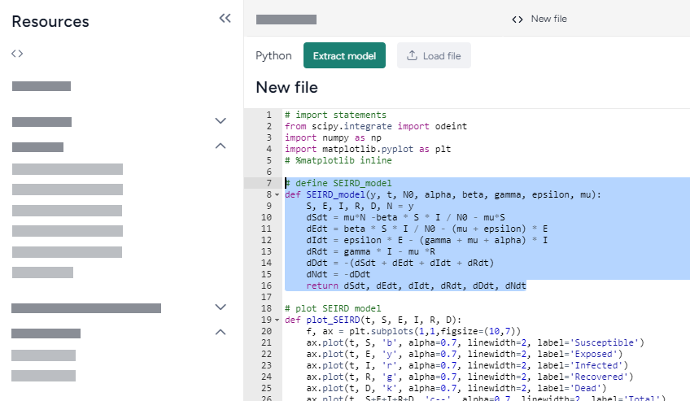
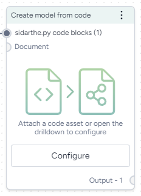

# Create a model from code

In addition to the models you can find by using the Explorer, you can create models from code ([python](https://www.python.org/doc/) :octicons-link-external-24:{ aria-hidden="true" }, [r](https://www.r-project.org/) :octicons-link-external-24:{ aria-hidden="true" }, or [julia](https://julialang.org/) :octicons-link-external-24:{ aria-hidden="true" }) that you extract from a document or manually enter.

Terarium considers all the provided code, including comments, to extract and define the underlying model. You can mark a code block as containing the core model dynamics by highlighting it before you begin the extraction.

??? list "To create a code asset"

    1. In the Resources panel, click :octicons-plus-24:{ aria-hidden="true" } **New** in the Code section.
    2. Use the dropdown to specify the type of code (julia, python, or r).
    3. Paste your code in the code editor.
    4. Highlight a part of the code that represents the core model dynamics and click :octicons-plus-24:{ aria-hidden="true" } **Add a code block**.
    5. Enter a name for the code block and click **Save**.
    6. Click **Apply changes**.

## Extract a model from code

To extract a model from a code asset or document, use the Create model from code operator. 

<figure markdown>

<figcaption markdown>How it works: [Code2AMR](https://github.com/ml4ai/ASKEM-TA1-DockerVM?tab=readme-ov-file#code2amr) :octicons-link-external-24:{ alt="External link" title="External link" }</figcaption> 
</figure>

-   :material-arrow-collapse-right:{ .lg .middle aria-hidden="true" } __Inputs__

    ---

    - Code asset (optional)
    - Document (optional)

-   :material-arrow-expand-right:{ .lg .middle aria-hidden="true" } __Outputs__

    ---

    Model

??? list "To extract a model from a code asset"

    1. From the Resources panel, drag the Code asset into a workflow graph.
    2. Right-click anywhere on the workflow graph and select **Add resource** > **Create model from code**.
    3. Connect the output of the Code asset to the input of the Create model from code operator.
    4. On the Create model from code operator, click **Configure**.
    5. Scroll through the available code blocks and clear **Include in process** to deselect any you don't want to include in the model.
    6. Click **Run**.

??? list "To extract a model from a document"

    1. From the Resources panel, drag the Document into a workflow graph.
    2. Right-click anywhere on the workflow graph and select **Add resource** > **Create model from code**.
    3. Connect the output of the Document resource to the input of the Create model from code operator.
    4. On the Create model from code operator, click **Configure**.
    5. Scroll through the available code blocks and clear **Include in process** to deselect any you don't want to include in the model.
    6. Click **Run**.

??? list "To enter code and create a model from it"

    1. Right-click anywhere on the workflow graph and select **Add resource** > **Create model from code**.
    2. On the Create model from code operator, click **Configure**.
    3. Use the dropdown to specify the type of code (julia, python, or r).
    4. Paste your code in the code editor.
    5. Select **Include in process**
    6. Click **Run**.
