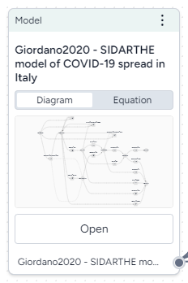

# Work with a model

In Terarium, a model is an abstract representation that approximates the behavior of a system. In the workflow graph, you can build a chain of complex operations to configure, stratify, calibrate, and simulate models.

## Add a model to your project

For information about uploading or finding models, see [Gather modeling resources](../modeling-resources/index.md).

Once you add model to your project, you can open it to view more details or add it to a workflow for use in various scientific modeling processes.

-   :material-arrow-collapse-right:{ .lg .middle aria-hidden="true" } __Inputs__

    ---

    None

-   :material-arrow-expand-right:{ .lg .middle aria-hidden="true" } __Outputs__

    ---

    Model

To add a model to a workflow

- From the Resources panel, drag the model into a workflow graph.

## Create a model from an equation

You can create models from equations that have been extracted from a paper or manually enter your own equations.

<figure markdown>

<figcaption markdown>How it works: [Model Service](https://github.com/DARPA-ASKEM/model-service/blob/07ae21cae2d5465f9ac5b5bbbe6c7b28b7259f04/src/ModelService.jl#L54) :octicons-link-external-24:{ alt="External link" title="External link" }</figcaption>
</figure>

-   :material-arrow-collapse-right:{ .lg .middle aria-hidden="true" } __Inputs__

    ---

    Document (optional)

-   :material-arrow-expand-right:{ .lg .middle aria-hidden="true" } __Outputs__

    ---

    Model

??? list "To extract model equations from a publication"

    1. Add the Document to a workflow graph and click **Open**.
    2. Scroll through the extracted Equation images and select **Include in process** for each one you want to add to the model. 
    3. Right-click anywhere on the workflow graph and select **Work with model** > **Create model from equations**.
    4. Connect the output of the Document resource to the input of the Create model from equations operator.
    5. Click **Edit** on the Create model from equations operator.
    6. To customize the selected equations, edit the LaTeX expressions or clear **Include in process** to deselect them.
    7. Enter a name for the new model and click **Run**.

??? list "To create a model from manually entered equations"

    1. Right-click anywhere on the workflow graph and select **Work with model** > **Create model from equations**.
    2. Click **Edit** on the Create model from equations operator.
    3. Click :octicons-plus-24:{ aria-hidden="true" } **Add an equation**.
    4. Enter an equation as a LaTeX expression.
    5. Repeat steps 3&ndash;4 for each equation you want to add.
    6. Enter a name for the new model and click **Run**.

## Understand model representations

Each model has a detailed view that summarizes the following extracted details:

- Description
- Diagram
- Provenance
- Model equations
- Observables
- State variables
- Parameters
- Transitions
- Other concepts
- Time

To support systematic curation of model structure and extracted metadata, you can view and [edit](edit-model.md) different representations of a model:

- A diagram that summarizes the different states and transitions in the model.
- Equations that show the same.

To view model details

- Click the model name in the Resources panel to open it in a new tab.

## Manage models

You can create, copy, and edit models for use in your workflows.

??? list "To create a new model"

    1. In the Resources panel, click :octicons-plus-24:{ aria-hidden="true" } **New** in the Model section.
    2. Enter a unique name for the model and click **Create model**.
    3. From the Resources panel, drag the new model into a workflow.
    4. Right-click anywhere on the workflow graph and select **Work with model** > **Edit model**.
    5. Click the output of the Model operator and then click the input of the Edit model operator to connect them.
    6. Click **Edit** on the Edit model operator.
    7. Use the Edit model Wizard or Notebook view to construct a set of equations that describe the model.

??? list "To rename a model"

    * Click :fontawesome-solid-ellipsis-vertical:{ title="Menu" } > :octicons-pencil-24:{ aria-hidden="true"} **Rename**, type a unique name for the model, and press ++enter++.

??? list "To make a copy of a model"

    1. Add the Model operator to a workflow graph and connect it to an Edit model operator.
    2. Click **Edit** on the Edit model operator and then select the Notebook tab.
    3. Enter a name for the copy and click **Save as new model**.
