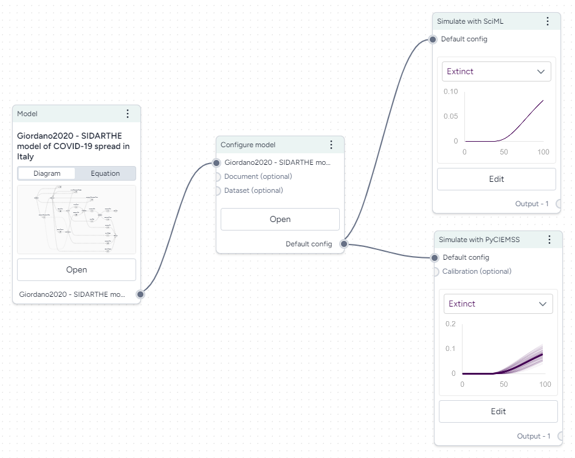

Simulating a model lets you understand how the underlying system might behave under specific conditions.

## Simulate a model

To simulate a model, you need to pass in the specific [configuration](../configure-model/) you want to simulate.

To simulate a model

1. In the workflow graph, drag in the model you want to simulate.
2. Right click the workflow graph and select **Simulate**.
3. On the model node, click the output port for the config you want to use and then click the input node on the simulate node.
4. To edit the simulation time range: 
    1. Click :octicons-sign-in-24:{ .flip title="Open simulate details" } to open the Simulate details pane. 
    2. Scroll down to the Simulation Time Range section and set the **Units**, **Start date** and **End date**.
5. On the simulate node, click **Run**.
6. Use the **Select variables to plot** dropdown to choose the variables you want to see for the simulated model.
7. To add an additional chart, click :octicons-plus-24:{ aria-hidden="true"} **Add Chart** and repeat the previous step.

## Compare model configurations

You can use the same simulate node to compare multiple configurations of a model.

To simulate multiple model configurations

1. In the workflow graph, drag in the model you want to simulate.
2. Right click the workflow graph and select **Simulate**.
3. For each configuration you want to use, click its output port and then click the input node on the simulate node.
4. On the simulate node, click **Run**.