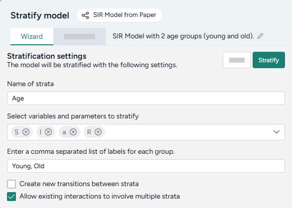

# Stratify a model

By stratifying a model, you divide its populations into subsets along demographic characteristics such as age and location.



Terarium automatically updates both the graphical representation of the model and its equations to reflect your changes.

<figure markdown><figcaption markdown>How it works: [MIRA](https://github.com/gyorilab/mira/blob/main/notebooks/viz_strat_petri.ipynb) :octicons-link-external-24:{ alt="External link" title="External link" }</figcaption></figure>

<div class="grid cards" markdown>

-   :material-arrow-collapse-right:{ .lg .middle aria-hidden="true" } __Inputs__

    ---

    Model

-   :material-arrow-expand-right:{ .lg .middle aria-hidden="true" } __Outputs__

    ---

    Stratified model

</div>

<p class="procedure">To stratify a model</p>

1. Add the model to a workflow graph.
2. Right-click anywhere on the workflow graph and select **Work with model** > **Stratify model**.
3. Connect the output of the Model resource to the input of the Stratify model operator.
4. On the Stratify model operator, click **Edit**.
4. Enter a **Name** for the strata you want to add.
5. Use the **Select variables and parameters to stratify** dropdown.
5. Enter a comma-separated list of labels for each of the strata groups:
    ```
    A1, A2
    ```
6. Choose whether you want to:
    - Create new transitions between strata
    - Allow existing interactions to involve multiple strata
7. Click :material-play-outline:{ aria-hidden="true" } **Stratify**.
8. Click **Save as new model**.