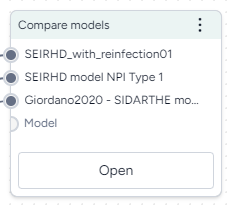

# Compare models

More info coming soon.

<figure markdown><figcaption markdown>How it works: [MIRA](https://github.com/gyorilab/mira/blob/7314765ab409ddc9647269ad2381055f1cd67706/notebooks/hackathon_2023.10/dkg_grounding_model_comparison.ipynb#L307) :octicons-link-external-24:{ alt="External link" title="External link" }</figcaption></figure>

-   :material-arrow-collapse-right:{ .lg .middle aria-hidden="true" } __Inputs__

    ---

    Models

-   :material-arrow-expand-right:{ .lg .middle aria-hidden="true" } __Outputs__

    ---

    N/A

