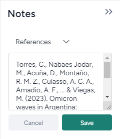

The Notes pane on the right side of the page lets you capture and save insights you've gained during your modeling processes. 

To assist with publishing a paper, the Notes pane lets you organize insights into sections such as *Abstract*, *Intro*, *Methods*, *Results*, *Discussion*, or *References*.

## Save an insight as a note

Any notes you save are associated with the current tab only. This means you can create unique notes for each resource (publications, documents, datasets, models, workflows) in your project.

To save an insight as a note

1. Click **<<** to expand the Notes pane.
2. Click **+ Add Note**.
3. Use the dropdown list to select which section you want to insert the note into. To add a general note, leave the section as *Unassigned*.
4. Type the contents of your insight in the text field and click **Save**.