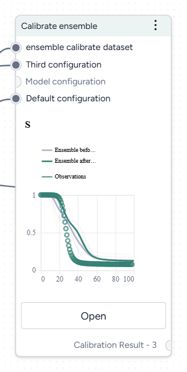
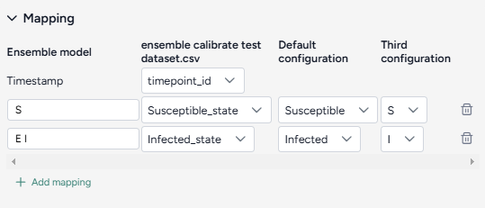
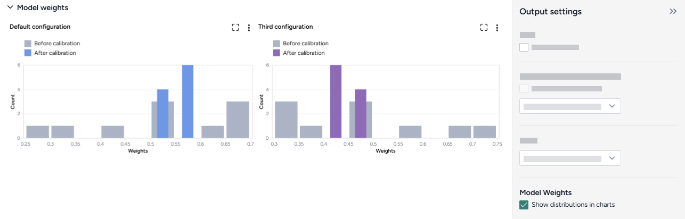
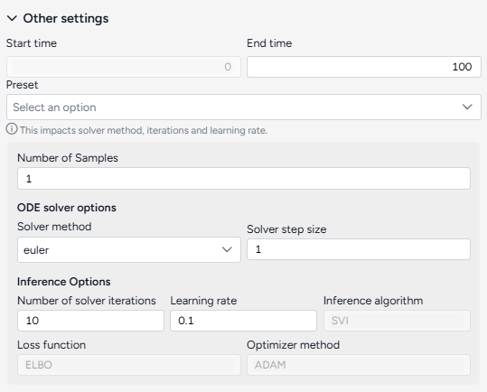
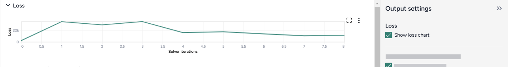
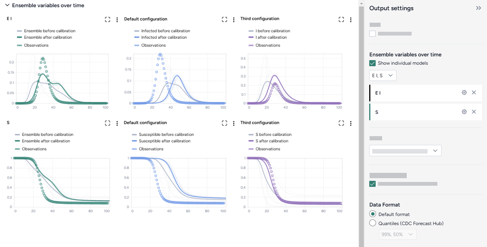
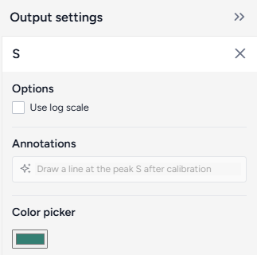
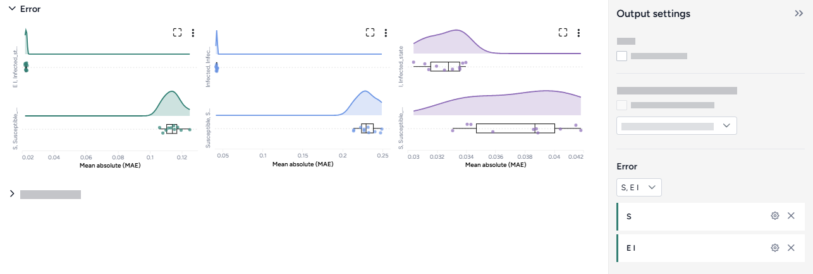

# Calibrate ensemble

Terarium supports the joint calibration of multiple models as an ensemble. Each member model is first calibrated on its own against the same time-series dataset representing historical observations and then calibrated again as a single ensemble, wherein the loss or prediction error is calculated between a linearly weighted sum of the corresponding model outputs and the dataset features. The result is a joint set of calibrated model configurations that may generate predictions with less error than what the individual models and their singly calibrated configurations could.

Ensemble calibration essentially allows a search for configuration solutions wherein the member models can specialize to different features or time periods of the given dataset. This is analoguous to a high-performing [random forest regressor](https://scikit-learn.org/1.6/modules/ensemble.html#forest) can be constructed from multiple weak-learning [decision trees](https://scikit-learn.org/1.6/modules/tree.html#tree).

This Terarium feature is powered by the `ensemble_calibrate` function of the [PyCIEMSS package](https://github.com/ciemss/pyciemss/blob/6a41b1a8247dd76f929488a479f4d27671120b36/pyciemss/interfaces.py#L184). An example of how it can be used programmatically can be found in [this Jupyter notebook](https://github.com/ciemss/pyciemss/blob/main/docs/source/interfaces.ipynb).  

???+ tip

    You can quickly create an ensemble calibration using the [Calibrate an ensemble model workflow template](../workflows/index.md#create-new-workflows-based-on-templates).

## Calibrate ensemble operator

In a workflow, the Calibrate ensemble operator takes two or more model configurations and a dataset as inputs. It outputs a calibrated dataset.

Once you've completed the calibration, the thumbnail preview shows the calibrated ensemble variables over time.

<figure markdown><figcaption markdown>How it works: [PyCIEMSS](https://github.com/ciemss/pyciemss/blob/main/pyciemss/interfaces.py#L156) :octicons-link-external-24:{ alt="External link" title="External link" }</figcaption></figure>

<div class="grid cards" markdown>

-   :material-arrow-collapse-right:{ .lg .middle aria-hidden="true" } __Inputs__

    ---

    - Two or more model configurations
    - Dataset (with timepoints)

-   :material-arrow-expand-right:{ .lg .middle aria-hidden="true" } __Outputs__

    ---

    Calibrated dataset

</div>

??? list "Add a Calibrate ensemble operator to a workflow"

    - Do one of the following actions:
    
        - On an operator that outputs a model configuration, click <span class="sr-only" id="link-icon-label">Link</span> :octicons-plus-24:{ title="Link" aria-labelledby="link-icon-label" } > **Calibrate ensemble**.
        - Right-click anywhere on the workflow graph, select **Simulation** > **Calibrate ensemble**, and then connect two or more model configurations and a dataset to the Calibrate ensemble input.

## Calibrate ensemble

The Calibrate ensemble operator allows you to define how to:

- [Map your model configurations and dataset](#map-dataset-columns-and-model-variables).
- [Assign your level of confidence in each model](#assign-model-weights).
- [Choose how to run the calibration](#configure-the-run-settings).

??? list "Open a Calibrate ensemble operator"

    1. Make sure you've connected two or more model configurations and a dataset to the Calibrate ensemble operator. 
    2. Click **Open**.

### Map dataset columns and model variables

To begin, create a mapping between the calibration data and the model configurations by selecting features (e.g. current number of hospitalized cases and cumulative number of deaths) and corresponding outcomes that are represented by every model (e.g. threatened (`T`) and extinct (`E`) populations in the [SIDARTHE model](https://www.nature.com/articles/s41591-020-0883-7) or hospitalizations (`H`) and deaths (`D`) in a (SEIQHRD-type model)[https://www.sciencedirect.com/science/article/pii/S2211379721006732]).



Note that it is not necessarily to map every dataset feature to a set of model outcomes nor vice versa. For example, susceptible or exposed populations in SEIR-type models do not correspond to readily observed or reported values.

???+ tip

    High-quality case, death, and hospitalization data for COVID-19 is available on the [COVID-19 Forecast Hub GitHub repository](https://github.com/reichlab/covid19-forecast-hub/blob/3a6997b6abdcfabe321dd059ebe32334095d49b5/data-truth/README.md). If a model selected for ensemble calibration does not have a state variable that corresponds well to these observations, then you can easily add an observable using the notebook interface of the [Edit model operator](../modeling/edit-model.md#edit-a-model-in-the-edit-model-code-notebook). 

???+ tip

    State variables in compartmental models usually represents [_prevalence_](https://www.nimh.nih.gov/health/statistics/what-is-prevalence) of disease conditions. Literature and data repositories often provide only daily [_incident_](https://www.nimh.nih.gov/health/statistics/what-is-prevalence#part_2624) or _cumulative_ estimates. You may use the [Transform dataset operator](../datasets/transform-dataset.md#transformation-examples) to convert from incidence to prevalence values. 
    
    You can also use the [Edit model operator](../modeling/edit-model.md#edit-a-model-in-the-edit-model-code-notebook) to add new "controlled production" transitions and create new state variables that are cumulative equivalents. For example, the cumulative equivalent (`Icum`) of the number of infected individuals (`I`) can be defined by adding to a SIR-type model a controlled production where the outcome is `Icum`, the controller is `I`, and the rate law is `I` such that there is the equation `d Icum(t) / dt = I(t)` or `Icum(t) = int I(t) dt`.


??? list "Create a mapping between the calibration data and the model configurations"

    1. Select the Timestamp column from the dataset.
    2. For each variable of interest:
    
        1. Click :octicons-plus-24:{ aria-hidden="true" } **Add mapping**.
        2. Enter a unique name for the variable in the ensemble model.
        3. Select the corresponding state from each of the model configurations. 

### Assign model weights

Model weights are the parameters used to linearly sum the model outcomes into the ensemble. They represent how much each model contribute to the ensemble. 

Since "Calibrate ensemble" is Bayesian inference process, the model weights are not single values but are represented by a [Dirichlet distribution](https://en.wikipedia.org/wiki/Dirichlet_distribution) of order `K`, where `K` is the number of models in the ensemble. This distribution has parameters `a_1, a_2, ..., a_K` that control where and how much mass is concentrated at different possible combinations of noramlized model weights `(w_1, w_2, ..., w_k)`.

In the interface, the Dirichlet alpha parameters `a_k` are exposed as "Relative uncertainty" dropdowns. Selecting from `0` to `10` allows you to express your confidence in each of the models and find an ensemble solution that potentially produce better predictions.

??? list "Assign model weights"

    - For each model, select a value from `1` (low) to `10` (high) using the "Relative certainty" dropdown.

- If you do not know a priori which models are better and probably should be given more weight, assign **equal medium weights** (e.g. `5`). This is equivalent to initially assuming a flat Dirichlet distribution where all model weight combinations are equally probable. This is the default and recommended option.
- Assign a **high weight** (e.g. `10`) to one or more models that produces the best predictions in your belief. "Calibrate ensemble" will start searching for solutions that prioritize the contribution of these models.
- Conversely, assign a **low weight** (e.g. `1`) to models that you believe are less reliable. Their contributions will be reduced in the ensemble calculation.




### Configure the run settings

The "Other settings" section contains the options for the "Calibrate ensemble" operator. They control the time period of interest and behaviour of the underlying ODE solver and optimizer. You can select a preset ("Fast" or "Normal") or adjust these settings individually to balance between run time and precision.



??? list "Configure quickly the run settings"

    1. Choose the **Start time** and **End time** to specify the timepoints to be simulated.
    2. Select a **Preset**, "Fast" or "Normal".

??? list "Advanced settings"

    Using the following advanced settings, you can further control how fast or precise the calibration can be:
    
    - **Number of samples**: Number of point estimates to be made on the posterior distribution (model parameters and weights) for the pre- and post-calibration simulations.
    - ODE solver options determine the approach for solving the equations of the model during calibration:
        - **Solver method**: *dopri5* returns the best results while *euler* is faster but less accurate (see [here](https://docs.scipy.org/doc/scipy/reference/generated/scipy.integrate.ode.html) for more details).
        - **Solver step size**: Size of the time interval used to integrate the solution, larger is faster but less accurate (only needed by the *euler* method).
    - Inference options control the behaviour of the inference algorithm that minimizes the calibration error:
        - **Number of solver iterations**: The number of calibration steps.
        - **Learning rate**: Step size for updating parameter values during calibration.
        - **Inference algorithm**: [Stochastic Variational Inference (SVI)](https://pyro.ai/examples/svi_part_i.html), which estimates the parameters probabilistically.
        - **Loss function**: [Evidence Lower Bound (ELBO)](https://pyro.ai/examples/svi_part_iii.html), which guides parameter updates by balancing data fit and model complexity.
        - **Optimizer method**: algorithm for updating parameter values, [ADAM](https://pytorch.org/docs/stable/generated/torch.optim.Adam.html) by default.

## Create and save the calibrated dataset

Once you've configured the settings, you can run the operator to generate a new calibrated dataset. The new dataset becomes a temporary output for the Calibrate ensemble operator. You can connect it to other operators in the same workflow.

??? list "Create a new calibrated dataset"

    - Click :material-play-outline:{ aria-hidden="true" } **Run**.

??? list "Choose a different output for the Calibrate ensemble operator"

    - Use the **Select an output** dropdown.

## Understand the results

Ensemble calibration results are presented as a series of charts that show:

- [Loss](#loss)
- [Ensemble variables over time](#ensemble-variables-over-time)
- [Error](#error)
- [Model weights](#model-weights)

??? list "Access the Output settings"

    Additional settings for the various chart types are available in the Output settings panel.

    - Click <span class="sr-only" id="expand-icon-label">Expand</span> :fontawesome-solid-angles-left:{ title="Expand" aria-labelledby="expand-icon-label" } to expand the Output settings.

??? list "Save a chart for use outside Terarium"

    You can save Calibrate ensemble charts for use outside of Terarium. Download charts as images that you can share or include in reports, or access structured JSON that you can edit with [Vega](https://vega.github.io/) :octicons-link-external-24:{ alt="External link" title="External link" }.

    - Click <span class="sr-only" id="menu-icon-label">Menu</span> :fontawesome-solid-ellipsis-vertical:{ title="Menu" aria-labelledby="menu-icon-label" } and then choose one of the following options:
        - Save as SVG
        - Save as PNG
        - View source (Vega-Lite JSON)
        - View compiled Vega (JSON)
        - Open in [Vega Editor](https://vega.github.io/editor/#/) :octicons-link-external-24:{ alt="External link" title="External link" }

??? list "Add annotations that call out key values and timesteps"

    To highlight notable findings, you can manually add annotations that label plotted values at key timesteps on loss and ensemble variable charts.

    1. Click anywhere on the chart to add a callout.
    2. To add more callouts without clearing the first one, hold down ++shift++ and click a new area of the chart.

    ???+ note

        Ensemble variable charts also support [AI-generated annotations](#ensemble-variables-over-time).

### Loss

The loss chart shows the error between the ensemble model outputs and the calibration data. An monotonically and exponetially decrease in loss values indicates convergence and a successful calibration.



??? list "Show or hide the loss chart"

    - Select or clear **Show loss chart**.

???+ tip

    If the loss is not decreasing to a plateau, the calibration algorithm may be struggling to converge to a solution. Failure to convergence could indicate that the model outputs are not good matches to the calibration data. Consider reducing the complexity of the problem by (1) adjusting the values of the input model configurations to approximate a solution and (2) removing the larger or least truthworthy model configurations.


### Ensemble variables over time

To aid visual validation, the Ensemble variables over time charts compare the effects of calibration for each state variable and the historical data. 

- The grey line represents the model before calibration.
- The colored line represents the model after calibration.
- Circles represent observations from the historical data.

The Output settings panel has several options that let you customize the scale and display of the charts. You can also use an AI assistant to generate chart annotations that highlight key data points.



??? list "Choose which model states to plot"

    - Select the model states from the dropdown list.

??? list "Show charts for each model configuration"

    You can view individual charts for all the models that contribute to the ensemble model as small multiples.

    - Click **Show individual models**.

??? list "Change the data format"

    The data format controls how the ensemble variable charts are drawn.

    - Choose the **Data format**:
        - Default: Include the historical observations in the plot.
        - Quantiles (CDC Forecast Hub): Omit the historical observations and draw filled shapes to represent quantiles ranging from 50$ndash;90%.

Additional chart settings are available for each of the state variables.



??? list "Access additional chart settings"

    - Click <span class="sr-only" id="options-icon-label">Options</span> :octicons-gear-24:{ title="Options" aria-labelledby="options-icon-label" }.

??? list "Change the chart scale"

    By default, ensemble variable charts are shown in linear scale. You can switch to log scale to view large ranges, exponential trends, and improve visibility of small variations.

    - Select or clear **Use log scale**.

??? list "Change variable colors"

    You can change the color of any model state to make your charts easier to read.

    - Click the color picker and choose a new color from the palette or use the eye dropper to select a color shown on your screen. 

??? list "Prompt an AI assistant to add chart annotations"

    You can prompt an AI assistant to automatically create annotations on the ensemble variable charts. Annotations are labelled or unlabelled lines that mark specific timestamps or peak values. Examples of AI-assisted annotations are listed below.

    - Describe the annotations you want to add and press ++enter++.

        ```{ .text .wrap }
        Draw a vertical line at day 100
        ```
        ```{ .text .wrap }
        Draw a line at the peak S after calibration
        ```
        ```{ .text .wrap }
        Draw a horizontal line at the peak of default configuration Susceptible after calibration. Label it as "important"
        ```
        ```{ .text .wrap }
        Draw a vertical line at x is 10. Don't add the label
        ```
        ```{ .text .wrap }
        Draw a line at x = 40 only for ensemble after calibration
        ```

### Error

The error plots show the mean absolute error (MAE) for each model and variable of interest.



??? list "Change the chart scale"

    By default, error charts are shown in linear scale. You can switch to log scale to view large ranges, exponential trends, and improve visibility of small variations.

    1. Click <span class="sr-only" id="options-icon-label">Options</span> :octicons-gear-24:{ title="Options" aria-labelledby="options-icon-label" }.
    2. Select or clear **Use log scale**.

### Model weights

The model weights charts show the one-dimensional projections of the Dirichlet distribution of the weights to each model, before and after the calibration.

Generally, a good calibration will take broad distribution (a low-certainty prior) and return a narrow distribution (a high-certainty posterior, conditioned on the calibration data).


??? list "To show or hide the model weights charts"

    - Select or clear **Show distributions in charts**.