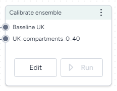

# Calibrate ensemble

More info coming soon.

<figure markdown><figcaption markdown>How it works: [PyCIEMSS](https://github.com/ciemss/pyciemss/blob/main/pyciemss/interfaces.py#L156) :octicons-link-external-24:{ alt="External link" title="External link" }</figcaption></figure>

-   :material-arrow-collapse-right:{ .lg .middle aria-hidden="true" } __Inputs__

    ---

    - Model configuration
    - Dataset

-   :material-arrow-expand-right:{ .lg .middle aria-hidden="true" } __Outputs__

    ---

    Calibrated model configuration

