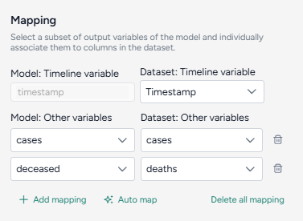
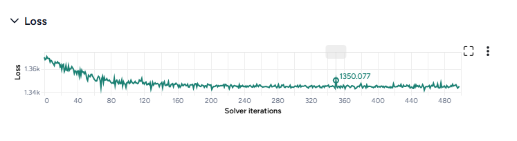

# Calibrate a model

Calibration lets you improve the performance of a model by updating the value of configuration parameters. You can calibrate a model with a reference dataset of observations and an optional intervention policy representing historical events that occur during the time period of the reference dataset. This operation is essentially takes prior distribution over the parameters (user's knowledge of the world at the first timepoint) and infer posterior distributions over the same, representing the best estimate of the state of the world again but conditioned on data.

<iframe class="video" src="https://drive.google.com/file/d/1by_OGfVBbx2ExmdAMR8lKYFym000-B1x/preview" width="640" height="360"></iframe>

## Calibrate operator

In a workflow, the Calibrate operator takes a model configuration, a dataset, and optional interventions as inputs. It outputs a calibrated model configuration. 

???+ tip

    At least one parameter in the configuration must be defined as a [uniform distribution](../config-and-intervention/configure-model.md#edit-or-create-a-model-configuration) and the dataset must have a column named "Timestamp" with values `0, 1, 2, ...` indexing all the timepoints.

Once you've completed the calibration, the thumbnail preview shows the results charts.

<figure markdown><figcaption markdown>How it works: [PyCIEMSS](https://github.com/ciemss/pyciemss/blob/main/pyciemss/interfaces.py#L529) :octicons-link-external-24:{ alt="External link" title="External link" }</figcaption></figure>

<div class="grid cards" markdown>

-   :material-arrow-collapse-right:{ .lg .middle aria-hidden="true" } __Inputs__

    ---

    - Model configuration
    - Dataset
    - Interventions (optional)

-   :material-arrow-expand-right:{ .lg .middle aria-hidden="true" } __Outputs__

    ---

    Calibrated model configuration

</div>

??? list "Add a Calibrate operator to a workflow"

    - Do one of the following actions:
    
        - On an operator that outputs a model configuration, click <span class="sr-only" id="link-icon-label">Link</span> :octicons-plus-24:{ title="Link" aria-labelledby="link-icon-label" } > **Calibrate**.
        - Right-click anywhere on the workflow graph, select **Simulation** > **Calibrate**, and then connect a model configuration and a dataset to the Calibrate input.

## Calibrate a model

The Calibrate operator allows you to define how to:

- [Map your model configurations and dataset](#map-dataset-columns-and-model-variables).
- [Choose how to run the calibration](#configure-the-run-settings).

??? list "Open a Calibrate operator"

    1. Make sure you've connected a model configuration and a dataset to the Calibrate operator. 
    2. Click **Open**.

### Map dataset columns and model variables

To begin, map the observed data (such as number of cases) to the corresponding model states (such as detected cases). 



Only relevant variables need to be mapped. For example, if the model includes susceptible and recovered states, but the data only includes infected, you only need to map the infected state. States like susceptible populations that are typically not observed may not be mappable.

??? list "Automatically map the dataset and model configuration"

    If you enriched the model and dataset with concepts, click **Auto map** to speed the alignment process.

    1. Click **Auto map**.
    2. Review and edit the mappings as needed.

??? list "Manually map between the data and model configurations"

    1. Select the Timestamp column from the dataset.
    2. For each variable of interest:
    
        1. Click :octicons-plus-24:{ aria-hidden="true" } **Add mapping**.
        2. Select the corresponding state from the model configuration. 

### Configure the run settings

The Calibrate run settings allow you to fine-tune the time frame, solver behavior, and inference process. By adjusting these settings, you can balance performance and precision.


??? list "Configure the run settings"

    The run presets help you quickly choose between fast calibrations, which process quickly but are less accurate, and the normal setting, which is slower but more precise.

    1. Choose the **Start** and **End time**.
    2. Select a **Preset**, Fast or Normal.

??? list "Advanced settings"

    Using the following advanced settings, you can further optimize the computational efficiency and thoroughness of the calibration:
    
    - **Number of samples**: Number of calibration attempts made to explore the parameter space and identify the best fit.
    - ODE solver options determine the approach for solving the system's equations during calibration:
        - **Solver method**: *dopri5* provides more accurate results with finer calculations, while *euler* performs simpler, faster calculations.
        - **Solver step size**: Interval between calculation steps, influencing precision and computational cost.
    - Inference options control how model parameters are estimated during calibration:
        - **Number of solver iterations**: Number of steps to take to converge on a solution.
        - **Learning rate**: Step size for updating parameters during the optimization process.
        - **Inference algorithm**: Stochastic Variational Inference (SVI), which estimates parameters probabilistically.
        - **Loss function**: Evidence Lower Bound (ELBO), which guides parameter updates by balancing data fit and model complexity.
        - **Optimize method**: ADAM, an algorithm for efficient parameter updates.


???+ tip

    Consider using minimum settings - such as the end time at `3`, the number of samples at `1`, and the solver method at `euler` - to check whether the calibration can run to completion with the given mapping.


## Create the calibrated configuration

Once you've configured all the calibration settings, you can run the operator to generate a new calibrated configuration. The new configuration becomes a temporary output for the Calibrate operator; you can connect it to other operators in the same workflow. If you want to use it in other workflows, you can save it for reuse. 


??? list "Create a new calibrated configuration"

    - Click :material-play-outline:{ aria-hidden="true" } **Run**.

??? list "Choose a different output for the Calibrate operator"

    - Use the **Select an output** dropdown.

## Understand the results

When the calibration is complete, Terarium creates an AI-generated description of the results.


Results are also presented as a series of customizable charts that show:

<div class="grid cards" markdown>

-   __Loss__

    ---

    The loss chart shows the error between the model's output and the calibration data. A decreasing loss indicates successful calibration.

    

-   __Parameter distributions__

    ---

    The parameter distribution plots show the range of parameter values before (grey) and after (green) calibration. A table below the plot also shows the mean and variance. 

    

-   __Interventions over time__

    ---

    The interventions over time charts show any selected interventions before (grey) and after (green) calibration.


    

-   __Variables over time__

    ---

    To aid visual validation, the variables over time charts compare the effects of calibration for state variables, observables, and the historical data.

    - The grey line represents the model before calibration.
    - The colored line represents the model after calibration.

    

-   __Error__

    ---

    The error plots show the mean absolute error (MAE) for each variable of interest.

    

-   __Comparison charts__

    ---

    The comparison charts let you plot two or more parameters, model states, or observables to visualize how they changed after calibration.

    

    Additional options for comparison charts let you split the selected variables into separate small multiples charts. You can further customize the small multiples charts to show the same Y axis for all charts or incorporate plots of the variables before calibration.

    

</div>

??? list "Access the Output settings"

    Settings for the various chart types are available in the Output settings panel.

    - Click <span class="sr-only" id="expand-icon-label">Expand</span> :fontawesome-solid-angles-left:{ title="Expand" aria-labelledby="expand-icon-label" } to expand the Output settings.

??? list "Choose which variables to plot"

    - Select the variables from the dropdown list.

??? list "Access additional chart settings"

    Some chart sections let you select additional options for each chart or variable. To access these settings: 

    - Click <span class="sr-only" id="options-icon-label">Options</span> :octicons-gear-24:{ title="Options" aria-labelledby="options-icon-label" }.

#### Annotate charts

Adding annotations to charts helps highlight key insights and guide interpretation of data. You can create annotations manually or using AI assistance.

??? list "Add annotations that call out key values and timesteps"

    To highlight notable findings, you can manually add annotations that label plotted values at key timesteps on loss, interventions over time, variables over time, and comparison charts.

    1. Click anywhere on the chart to add a callout.
    2. To add more callouts without clearing the first one, hold down ++shift++ and click a new area of the chart.

??? list "Prompt an AI assistant to add chart annotations"

    You can prompt an AI assistant to automatically create annotations on the variables over time and comparison charts. Annotations are labelled or unlabelled lines that mark specific timestamps or peak values. Examples of AI-assisted annotations are listed below.

    - Describe the annotations you want to add and press ++enter++.

        ```{ .text .wrap }
        Draw a vertical line at day 100
        ```
        ```{ .text .wrap }
        Draw a line at the peak S after calibration
        ```
        ```{ .text .wrap }
        Draw a horizontal line at the peak of default configuration Susceptible after calibration. Label it as "important"
        ```
        ```{ .text .wrap }
        Draw a vertical line at x is 10. Don't add the label
        ```
        ```{ .text .wrap }
        Draw a line at x = 40 only after calibration
        ```

#### Display options

You can customize the appearance of your charts to enhance readability and organization of the results.

??? list "Change the chart scale"

    By default, charts are shown in linear scale. You can switch to log scale to view large ranges, exponential trends, and improve visibility of small variations.

    - Select or clear **Use log scale**.

??? list "Hide in node"

    The variables you choose to plot appear in the results panel and as thumbnails on the Calibrate operator in the workflow. You can hide the thumbnail preview to minimize the space the Calibrate node takes up.

    - Select **Hide in node**.

??? list "Change parameter colors"

    You can change the color of any variable on the parameter distribution, interventions over time, and variables over time charts to make your charts easier to read.

    - Click the color picker and choose a new color from the palette or use the eye dropper to select a color shown on your screen. 

#### Save charts

You can save Calibrate charts for use outside of Terarium. Download charts as images that you can share or include in reports, or access structured JSON that you can edit with [Vega](https://vega.github.io/) :octicons-link-external-24:{ alt="External link" title="External link" }.

??? list "Save a chart for use outside Terarium"

    - Click <span class="sr-only" id="menu-icon-label">Menu</span> :fontawesome-solid-ellipsis-vertical:{ title="Menu" aria-labelledby="menu-icon-label" } and then choose one of the following options:
        - Save as SVG
        - Save as PNG
        - View source (Vega-Lite JSON)
        - View compiled Vega (JSON)
        - Open in [Vega Editor](https://vega.github.io/editor/#/) :octicons-link-external-24:{ alt="External link" title="External link" }

### Troubleshooting

You may encounter various errors instead of calibration results.

One example is `AssertionError: underflow in dt 0.0` and can be caused by an input model configuration that is too far from any solution. Consider checking whether the parameter values of the configuration can produce outcomes consistent or on the same order of magnitude as corresponding features in the calibration dataset.
