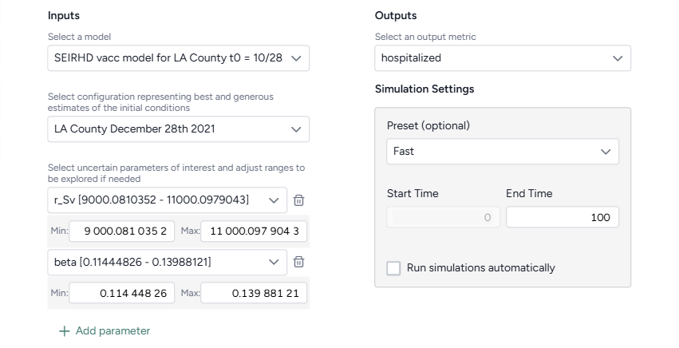

# Sensitivity analysis

You can conduct a sensitivity analysis to determine how changes in model parameters affect the outcome variables of interest. For example, you can see how varying vaccination rates and transmission impact hospitalizations.

The sensitivity analysis is performed within the [Simulate](simulate-model.md) operator.

## Build a sensitivity analysis workflow

You can build a sensitivity analysis workflow manually or use a template to automatically set up the required components. 

<figure markdown><figcaption markdown>Sensitivity analysis for COVID-19 hospitalizations in LA county.</figcaption></figure>

Before you get started, you'll need a:

- [Model](../modeling/index.md).
- [Model configuration](../config-and-intervention/configure-model.md).

    ???+ tip

        In your model configuration, make sure the parameters you want to analyze have [uncertainty](../config-and-intervention/configure-model.md#edit-or-create-a-model-configuration) in their values. 

Once you've set up and run the workflow, you'll have a set of sensitivity analysis simulation results, which you can use as a dataset.

??? list "Create a sensitivity analysis workflow from a template"
  
    1. In the Workflows section of the Resources panel, click :octicons-plus-24:{ aria-hidden="true" } **New**.
    2. Select **Sensitivity analysis**.
    3. Give the workflow a unique name.

        

    4. Choose the inputs for the analysis:

        1. Select the model and configuration you want to simulate.
        2. Select the model parameters you're interested in. If needed, edit the **Min** and **Max** values to define the uncertainty around a parameter.

            ???+ note

                If you adjust a parameter's uncertainty, Terarium automatically makes a copy of the selected model configuration and applies your edits to the new version.

    5. Select the model states you want to visualize.
    6. Click **Create**.

??? list "Manually create a sensitivity analysis workflow"

    1. Add your model to a workflow, hover over its output, and click Link :octicons-plus-24:{ title="Link" aria-labelledby="link-icon-label" } > **Configure model**.
    2. [Set the initial values for state variables and parameters](../config-and-intervention/configure-model.md#edit-or-create-a-model-configuration). Make sure to apply uncertainty to your parameters of interest. 
    3. Hover over the output of the Configure model operator and click Link :octicons-plus-24:{ title="Link" aria-labelledby="link-icon-label" } > **Simulate**.

## Conduct a sensitivity analysis

Once you've built your workflow, you can edit the Simulate run and output settings to generate the sensitivity analysis.

??? list "Conduct a sensitivity analysis"

    1. On the Simulate operator, click **Open**.
    2. Select the Simulate [run settings](../simulation/simulate-model.md).
    3. Click **Run** to start the simulation.

??? list "Edit the sensitivity analysis output settings"

    1. Click Expand :fontawesome-solid-angles-left:{ title="Expand" aria-labelledby="expand-icon-label" } to expand the Output settings.
    2. In the Sensitivity analysis section, complete the sentence to choose the outcomes and parameters to analyze:
        - **Outcomes of interest**: Choose the model states or observables you're interested in. Selecting more than one outcome of interest creates a unique sensitivity analysis for each selection.
        - Choose the timepoint you're interested in:
            - **Value at timepoint**: Enter the timepoint of interest.
            - **Peak value**: The timepoint at which the selected outcome is highest.
            - **Peak timepoint**: The last timepoint.
        - **Model parameters**: Choose the parameters whose impact your want to understand. Each selected parameter is compared against itself and all other selected parameters.

## Understand sensitivity analysis results

The results of each analysis are represented as a sensitivity analysis graph, a sensitivity score ranking chart, and a set of parameter comparisons.

In the sensitivity analysis graph, color coding represents variations in the output variable (such as hospitalizations or case counts) across different parameter values or combinations. Cool colors represent lower values of the output variable, while warm colors represent higher values. 

<figure markdown><figcaption markdown>Sensitivity analysis graph showing the number of humans exposed to Mpox at day 365.</figcaption></figure>

The sensitivity score ranking chart shows how much each parameter influences the outcome. The bar chart shows which parameters have the greatest effect, with values ranging from -1 to 1, indicating the direction and magnitude of impact on the outcome.

???+ note

    - The sensitivity score chart lists the up to the top 20 parameters.
    - Parameters with no uncertainty are note included in the sensitivity score ranking.

In the parameter comparisons:

- The **x and y-axes** represent the parameters being varied (such as vaccination rate and transmission rate). Each point on the graph corresponds to a specific combination of parameter values.
- The **color gradient** reveals transitions across the graph. Areas with cool colors represent parameter combinations that lead to less severe outcomes, while warm colors highlight conditions where outcomes worsen.

<figure markdown><figcaption markdown>Comparison graphs for different Mpox infection rate parameters based on gender.</figcaption></figure>

??? list "Customize the parameter comparison charts"

    You can view the comparisons as scatterplots to either examine detailed relationships and outliers in your data or as heatmaps allows to visualize overall trends and patterns.

    1. Click Expand :fontawesome-solid-angles-left:{ title="Expand" aria-labelledby="expand-icon-label" } to expand the Output settings.
    2. In the Sensitivity analysis section, select **Scatter** or **Heatmap**.