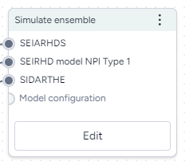

# Simulate ensemble

More info coming soon.

## Simulate ensemble operator

<figure markdown><figcaption markdown>How it works: [PyCIEMSS](https://github.com/ciemss/pyciemss/blob/main/pyciemss/interfaces.py#L35) :octicons-link-external-24:{ alt="External link" title="External link" }</figcaption></figure>

-   :material-arrow-collapse-right:{ .lg .middle aria-hidden="true" } __Inputs__

    ---

    Model configurations

-   :material-arrow-expand-right:{ .lg .middle aria-hidden="true" } __Outputs__

    ---

    Simulation data

## Run an ensemble simulation

???+ list "Run an ensemble simulation"

    1. [Configure two or more models](../config-and-intervention/configure-model.md).
    2. Right-click anywhere on the workflow graph and select **Simulation** > **Simulate ensemble**.
    3. Connect the Configure model outputs to the Simulate ensemble inputs.
    4. Click **Open**.
    5. Create a mapping between the state variables of the model configurations.
    6. Enter custom weights for the model configurations to specify your confidence in them.
    7. Select a **Preset**, Fast or Normal.
    8. Set the time span:
        - **Start** and **End Step**
        - **Number of samples**
    9. Choose a **Solver method**, *dopri5*, *rk4*, or *euler*. 
    9. Click :material-play-outline:{ aria-hidden="true" } **Run**.

## Troubleshooting

### Recommended run settings

It's recommended you run simulations on the *Normal* **Preset** using the *dopri5* **Solver method**.

### Simulate each model first

Try simulating each model independently to confirm the models are composed and configured correctly.
 
### Relative certainty

Set the **Relative certainty** in the Model weights to *1* for each model. When using this setting, proceed slowly and cautiously. To include a preference for one model over the others, start by increasing its **Relative certainty** to *2*, then *3*, and so on.
 
### Uncertainty and number of samples

If your models have no uncertainty in parameter values, only one sample is needed. Change **Number of samples** to *1* (the default zis set to 100).

### Simulation length and number of samples

If you plan to run your simulation for a long time or with a large number of samples (for example, **End time** or **Number of samples** > **100**), set them to a lower value (*10* or *20*) first and run a check for errors. 
 
### Error messages

`PyCIEMSS` error messages should offer guidance on how to proceed. Error messages from `Pyro` or `torchdiffeq` may be less clear. 

If you see a messages referencing Cholesky factorization (including `The factorization could not be completed because the input is not positive-definite`) or `AssertionError` with `underflow in dt 0.0`:

- If you successfully simulated each model independently, check that the models are on the same scale and have similar initial conditions. Errors are likely if: 
    - One model assumes a population of 10 million, while another has a population of 1,000. 
    - One model is normalized to a population of one while the others are not.