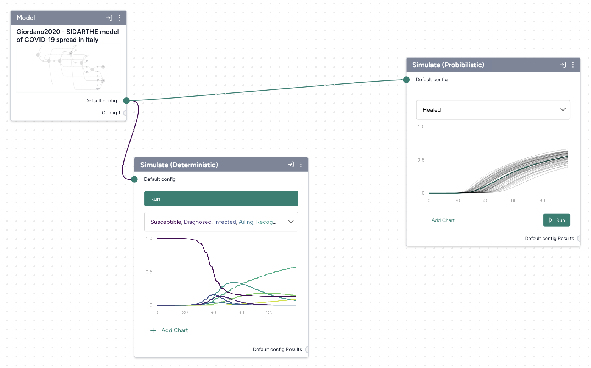
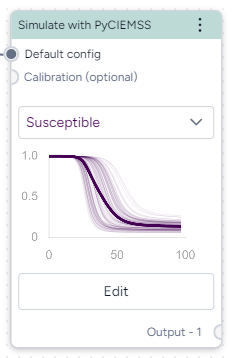

# Simulate a model

Simulating a model lets you understand how the underlying system might behave under specific conditions.

<figure markdown>
  
  <figcaption>A deterministic simulation (center) showing various variables in a COVID-19 model (left) and a probabilistic simulation (right) showing the distribution of a single variable with uncertainty.</figcaption>
</figure>

???+ tip

    Simulating early with a simple model (one with a population of 1,000) can help you spot issues and fix them before you start using a more complex model.

## Simulate

Simulations take a model configuration and an optional intervention as inputs and run an editable number of samples to account for uncertainty in results.

<figure markdown><figcaption markdown>How it works: [PyCIEMSS](https://github.com/ciemss/pyciemss/blob/main/pyciemss/interfaces.py#L323) :octicons-link-external-24:{ alt="External link" title="External link" }</figcaption></figure>

-   :material-arrow-collapse-right:{ .lg .middle aria-hidden="true" } __Inputs__

    ---

    - Model configuration
    - Interventions (optional)

-   :material-arrow-expand-right:{ .lg .middle aria-hidden="true" } __Outputs__

    ---

    Simulation data

???+ list "Run a simulation"

    1. Add the model to a workflow graph.
    2. Hover over the Model output and click Link :octicons-plus-24:{ title="Link" aria-labelledBy="link-icon-label" } > [**Configure**](../config-and-intervention/configure-model.md). 
    3. Right-click anywhere on the workflow graph and select **Simulation** > **Simulate**.
    4. Connect the Configure model operator output to the Simulate input.
    5. Click **Edit** on the Simulate operator.
    6. Configure the simulation options as needed:
        - **Start** and **End time**: Specify the simulation time range.
        - **Number of samples**: Enter the number of stochastic samples to generate.
        - **Method**: Choose whether to solve ordinary differential equations using [dopri5](https://en.wikipedia.org/wiki/Dormand-Prince_method) or [euler](https://en.wikipedia.org/wiki/Euler_method).

            ??? tip

                Using a low number of samples and the dopri5 method can speed up your runtime for debugging purposes.

    7. Click :material-play-outline:{ aria-hidden="true" } **Run**.
    8. Review the output and click :fontawesome-solid-floppy-disk:{ aria-hidden="true" } **Save as new dataset** to add the results to your project resources.

## View and save simulation results

Simulation results are summarized on each Simulate operator and in the operator details. You can choose which variables to plot.

??? list "View simulation results"

    1. In the output section of the Simulate operator details, use the dropdown list to choose the variables you want to visualize. If you choose multiple variables, Terarium overlaps them on the same plot.
    2. To add an additional chart, click :octicons-plus-24:{ aria-hidden="true"} **Add chart** and repeat the previous step.

        ??? tip

            It's recommended to use multiple charts if the variables you want to display have very different magnitudes.

??? list "Save simulation results as a new dataset"

    - On the Simulate pane, click :material-content-save-outline:{ aria-hidden="true" } **Save as new dataset**.