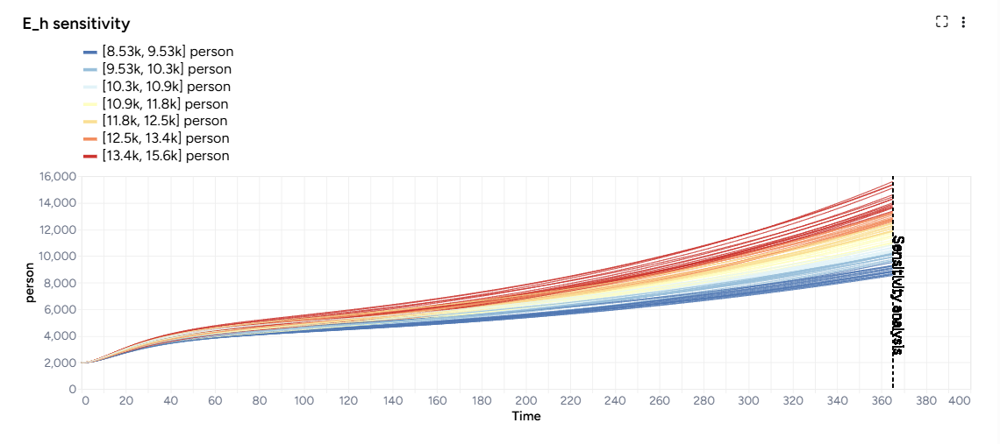

# Simulate a model

Simulating a model lets you understand how the underlying system might behave under specific conditions.


???+ tip

    Simulate early with a simple model. Using a model with a population of 1,000, for example, can help you spot issues and fix them before you incorporate more complexity.

## Simulate operator

In a workflow, the Simulate operator takes a model configuration and an optional [intervention](../config-and-intervention/create-intervention-policy.md) as inputs. Based on a customizable number of samples (to account for uncertainty) it outputs a set of simulation data.

<figure markdown><figcaption markdown>How it works: [PyCIEMSS](https://github.com/ciemss/pyciemss/blob/main/pyciemss/interfaces.py#L323) :octicons-link-external-24:{ alt="External link" title="External link" }</figcaption></figure>

<div class="grid cards" markdown>

-   :material-arrow-collapse-right:{ .lg .middle aria-hidden="true" } __Inputs__

    ---

    - Model configuration
    - Intervention policy (optional)

-   :material-arrow-expand-right:{ .lg .middle aria-hidden="true" } __Outputs__

    ---

    Simulation data

</div>


??? list "Add a Simulate operator to a workflow"

    - Do one of the following actions:
    
        - On an operator that outputs a model configuration or intervention policy, click <span class="sr-only" id="link-icon-label">Link</span> :octicons-plus-24:{ title="Link" aria-labelledby="link-icon-label" } > **Simulate**.
        - Right-click anywhere on the workflow graph, select **Simulation** > **Simulate**, and then connect a model configuration to the Simulate input.

## Simulate a model

The Simulate run settings allow you to fine-tune the time frame and solver behavior. By adjusting these settings, you can balance performance and precision.

??? list "Open a Simulate operator"

    1. Make sure you've connected a model configuration to the Simulate operator. 
    2. Click **Open**.

??? list "Configure the run settings"

    1. Select a **Preset**, Fast or Normal.
    2. Choose the **Start** and **End time** to specify the simulation time range.

        ???+ note

            If you included a [starting timestep in your model configuration](../config-and-intervention/configure-model.md#edit-or-create-a-model-configuration), the start and end dates also appear in your simulation.

??? list "Advanced settings"

    Using the following advanced settings, you can further optimize the computational efficiency and thoroughness of the simulation:

    - **Number of samples**: Number of stochastic samples to generate.
    - **Method**: How to solve ordinary differential equations, [dopri5](https://en.wikipedia.org/wiki/Dormand-Prince_method) :octicons-link-external-24:{ alt="External link" title="External link" } or [euler](https://en.wikipedia.org/wiki/Euler_method) :octicons-link-external-24:{ alt="External link" title="External link" }.

        ???+ tip

            Using a low number of samples and the dopri5 method can speed up your runtime for debugging purposes.

## Run the simulation

Once you've configured all the simulation settings, you can run the operator to generate a new simulation results dataset. The new dataset becomes a temporary output for the Simulate operator; you can connect it to other operators in the same workflow. If you want to use it in other workflows, you can save it for reuse. 

??? list "Create a new simulation run"

    - Click :material-play-outline:{ aria-hidden="true" } **Run**.


??? list "Choose a different output for the Simulate operator"

    - Use the **Select an output** dropdown.

??? list "Save simulation results as a new dataset"

    - On the Simulate pane, click :material-content-save-outline:{ aria-hidden="true" } **Save as new dataset**.

## View simulation results

When the simulation is complete, Terarium shows the results on the operator in the workflow and in the operator details. An AI-generated description summarizes results, and you can choose the variables to plot.

<div class="grid cards" markdown>

-   __Interventions over time__

    ---

    These charts are only available if you connected an intervention policy to the Simulate input. For more information, see [Simulate an intervention policy](../config-and-intervention/simulate-intervention-policy.md).

    <figure markdown><figcaption markdown>At day 2, vaccination rate increases from 10,000 people per day to 25,000 people per day.</figcaption></figure>

-   __Variables over time__

    ---

    To aid visual validation, the variables over time charts compare the effects of simulation for state variables and observables.

    

-   __Comparison charts__

    ---

    The comparison charts let you plot two or more parameters, model states, or observables to visualize how they differ over the course of the simulation.

    

    Additional options for comparison charts let you split the selected variables into separate small multiples charts. You can further customize the small multiples charts to show the same Y axis for all charts or incorporate before and after plots of the variables.

    

    ???+ tip

        Use multiple charts if the variables you want to compare have very different ranges or values.

-   __Sensitivity analysis__

    ---

    Sensitivity analysis charts show how changes in model parameters affect the outcome variables of interest. For more information, see [Sensitivity analysis](sensitivity-analysis.md).

    <figure markdown><figcaption markdown>Sensitivity analysis graph for men infected with Mpox.</figcaption></figure>

</div>


??? list "Access the Output settings"

    Settings for the various chart types are available in the Output settings panel.

    - Click <span class="sr-only" id="expand-icon-label">Expand</span> :fontawesome-solid-angles-left:{ title="Expand" aria-labelledby="expand-icon-label" } to expand the Output settings.

??? list "Choose which variables to plot"

    - Select the variables from the dropdown list.

??? list "Access additional chart settings"

    Some chart sections let you select additional options for each chart or variable. To access these settings: 

    - Click <span class="sr-only" id="options-icon-label">Options</span> :octicons-gear-24:{ title="Options" aria-labelledby="options-icon-label" }.

#### Annotate charts

Adding annotations to charts helps highlight key insights and guide interpretation of data. You can create annotations manually or using AI assistance.

??? list "Add annotations that call out key values and timesteps"

    To highlight notable findings, you can manually add annotations that label plotted values at key timesteps. This applies to interventions over time, variables over time, and comparison charts.

    1. Click anywhere on the chart to add a callout.
    2. To add more callouts without clearing the first one, hold down ++shift++ and click a new area of the chart.

??? list "Prompt an AI assistant to add chart annotations"

    You can prompt an AI assistant to automatically create annotations on the variables over time and comparison charts. Annotations are labelled or unlabelled lines that mark specific timestamps or peak values. Examples of AI-assisted annotations are listed below.

    - Describe the annotations you want to add and press ++enter++.

        ```{ .text .wrap }
        Draw a vertical line at day 100
        ```
        ```{ .text .wrap }
        Draw a line at the peak S
        ```
        ```{ .text .wrap }
        Draw a horizontal line at the peak of default configuration Susceptible. Label it as "important"
        ```
        ```{ .text .wrap }
        Draw a vertical line at x is 10. Don't add the label
        ```
        ```{ .text .wrap }
        Draw a line at x = 40
        ```

#### Display options

You can customize the appearance of your charts to enhance readability and organization of the results.

??? list "Change the chart scale"

    By default, charts are shown in linear scale. You can switch to log scale to view large ranges, exponential trends, and improve visibility of small variations.

    - Select or clear **Use log scale**.

??? list "Hide in node"

    The variables you choose to plot appear in the results panel and as thumbnails on the Simulate operator in the workflow. You can hide the thumbnail preview to minimize the space the Simulate node takes up.

    - Select **Hide in node**.

??? list "Change parameter colors"

    You can change the color of any variable on the interventions over time, variables over time, and sensitivity charts to make your charts easier to read.

    - Click the color picker and choose a new color from the palette or use the eye dropper to select a color shown on your screen. 

#### Save charts

You can save Simulate charts for use outside of Terarium. Download charts as images that you can share or include in reports, or access structured JSON that you can edit with [Vega](https://vega.github.io/) :octicons-link-external-24:{ alt="External link" title="External link" }.

??? list "Save a chart for use outside Terarium"

    - Click <span class="sr-only" id="menu-icon-label">Menu</span> :fontawesome-solid-ellipsis-vertical:{ title="Menu" aria-labelledby="menu-icon-label" } and then choose one of the following options:
        - Save as SVG
        - Save as PNG
        - View source (Vega-Lite JSON)
        - View compiled Vega (JSON)
        - Open in [Vega Editor](https://vega.github.io/editor/#/) :octicons-link-external-24:{ alt="External link" title="External link" }

## Troubleshooting

### Recommended run settings

It's recommended you run simulations on the *Normal* **Preset** using the *dopri5* **Solver method**.

### Uncertainty and number of samples

If your models have no uncertainty in parameter values, only one sample is needed. Change **Number of samples** to *1* (the default is set to 100).
 
### Simulation length and number of samples

If you plan to run your simulation for a long time or with a large number of samples (for example, **End time** or **Number of samples** > **100**), set them to a lower value (*10* or *20*) first and run a check for errors. 
 
### Error messages

`PyCIEMSS` error messages should offer guidance on how to proceed. Error messages from `Pyro` or `torchdiffeq` may be less clear. 
  
If you see a messages referencing Cholesky factorization (including `The factorization could not be completed because the input is not positive-definite`) or `AssertionError` with `underflow in dt 0.0`:

- There is an issue with the model, likely a model state blowing up to infinity or rapidly decreasing to negative infinity. Go back and check your model equations and configuration. Make sure the flow between compartments is correct, and then try adjusting your parameter values or initial conditions (are they too big?).