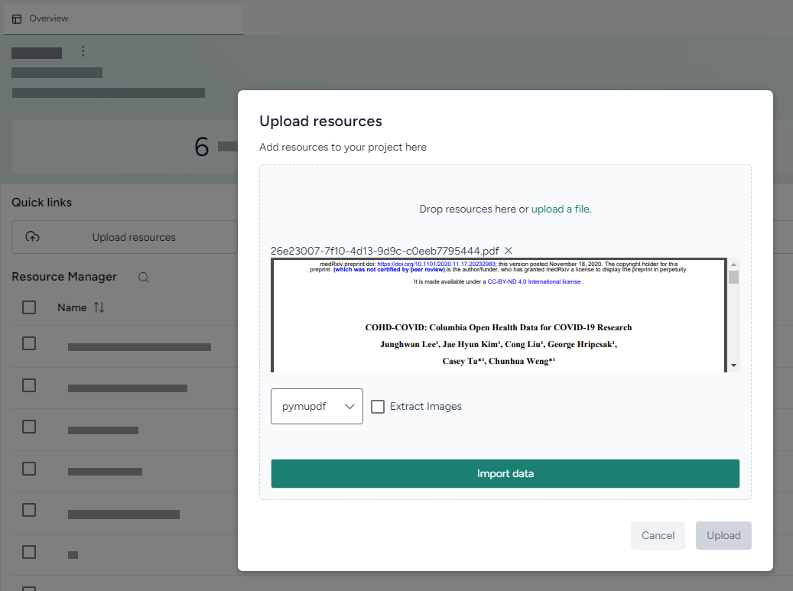

# Gather modeling resources

With Terarium, you can gather, store and manage resources needed for your modeling and simulation workflows. You can pull in documents, models, and datasets from: 

- [Your computer](#upload-resources).
- [Other projects in Terarium](#search-for-and-copy-resources-from-other-projects).

Documents, models, and datasets appear in your project resources. You can transform and simulate them by dragging them into a workflow.

## Upload resources

Using **Upload** in the Resources panel, you can import resources of the following types:

-   :octicons-file-24:{ .lg .middle aria-hidden="true" } __Documents__

    ---

    - PDF files (.PDF)
    - Markdown files (.MD)
    - Text files (.TXT)
    
    !!! note

        Uploaded documents run through an [extraction process](#pdf-extraction) that, depending on the size of the PDF, may take some time.  

-   :octicons-share-android-24:{ .lg .middle aria-hidden="true" } __Models__

    ---

    - PetriNet models in Systems Biology Markup Language (SBML) format (.XML or .SBML)
    - Terarium model and model configuration formats (.JSON and .modelconfig)
    - StockFlow models in Vensim format (.MDL)
    - StockFlow models in Stella formats (.XMILE, .ITMX, .STMX)

-   :material-file-table-outline:{ .lg .middle aria-hidden="true" } __Datasets__

    ---

    - Comma-separated values (.CSV)
    - NetCDF (.NC)

???+ list "Upload resources"

    1. In the Resource panel, click **Upload**.
    2. Perform one of the following actions:
        - Drag your files into the Upload resources dialog.
        - Click **open a file browser** to navigate to the location of the files you want to add.
    3. Click **Upload**.

### PDF Extraction

Most resources you upload are available for use right away. When you upload a PDF document however, Terarium begins extracting any linear ordinary differential equations it finds in the text. Depending on the size of the PDF, this process can take some time.

!!! note

    The extractor isn't optimized to handle every way that equations can represent models. Before using any extracted equations to [create a model from equations](../modeling/create-model-from-equations.md), check and edit them if necessary.

???+ list "Check the status of a PDF extraction"

    - Click Notifications :material-bell-outline:{ title="Notifications" aria-labelledBy="notifications-icon-label" }.

## Search for and copy resources from other projects

You can get resources by copying them from other projects in Terarium. If you know their location, you can get them directly from the source project. Otherwise, use the project search on the home page to find relevant resources.

??? list "Find projects containing resources of interest"

    The project search finds projects and resources by keyword. Keywords are checked against the names of projects and resources such as models, datasets, documents, model configurations, intervention policies, and workflows.

    1. Click the Terarium logo to return to the home page.
    2. Enter your keywords in the search field and press ++enter++.
    3. In the results, click the project name to view the source project overview or click the resource name to open it.

??? list "Get a model or dataset from another project"

    1. Open the project that contains the model or dataset.
    2. Open the model or dataset by clicking its name in the Resources panel.
    3. Next to the model or dataset name, click Menu :fontawesome-solid-ellipsis-vertical:{ title="Menu" aria-labelledBy="menu-icon-label" } > :octicons-plus-24:{ aria-hidden="true" } **Add to project** and select your project.

??? list "Get a document from another project"

    1. Open the project that contains the document.
    2. Open the document by clicking its name in the Resources panel.
    3. Click Menu :fontawesome-solid-ellipsis-vertical:{ title="Menu" aria-labelledBy="menu-icon-label" } > :octicons-download-24:{ aria-hidden="true"} **Download this file** and save it to your computer.
    4. Open your project and [reupload the document](#upload-resources).