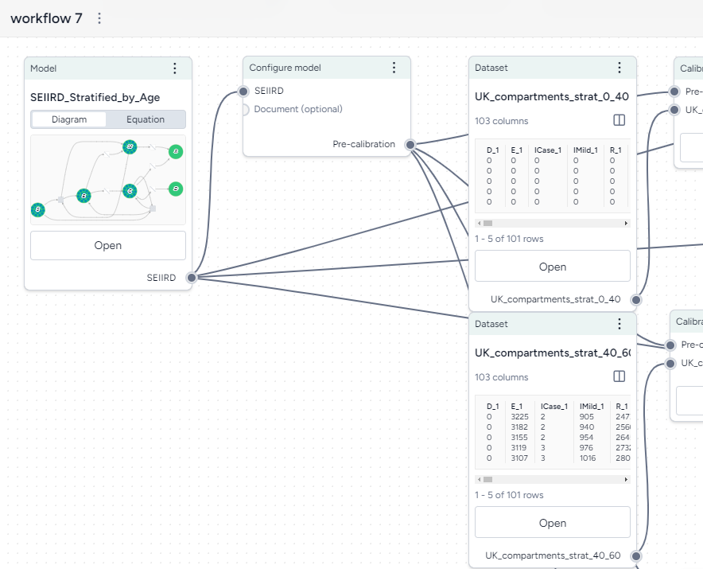
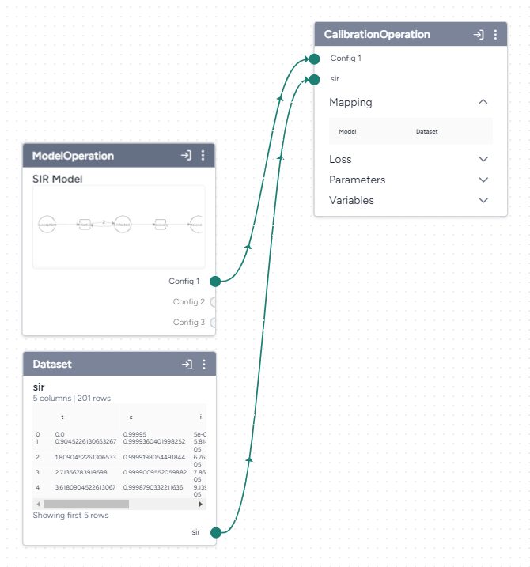

# Build a workflow graph

A workflow is a visual canvas for building and running complex operations (calibration, simulation, and stratification) on models and data.

???+ list "Create a new workflow"

    * In the Resources panel, click :fontawesome-solid-plus:{ aria-hidden="true"} **New** in the Workflows section.

## Add resources and operators to a workflow

Workflows consist of resources (models, datasets, and documents) that you can feed into a series of operators that transform or simulate them. 

Each resource or operator is a "node" with a title, thumbnail preview, and a set of inputs and outputs. 

??? list "Add a resource to the workflow"

    + Drag the model, dataset, or document in from the Resources panel.

??? list "Add an operator to the workflow"

    Perform one of the following actions:

    + Right-click anywhere on the graph and then select an operation from the menu.
    + Click :octicons-plus-24:{ aria-hidden="true"} **Add component** and then select the operation from the list.

### Connect resources and operators

Inputs and outputs on nodes let you resources and operators together to form complex model operations.

??? list "Connect resources and operators already in the workflow"

    - Click the output of one resource or operator and then click the corresponding input on another operator.

    ???+ example

        - To configure a Calibrate operation to use a dataset, first click the output on the right side of the Dataset operator and then click the **Dataset** input on the left side of the Calibrate operator.

??? list "Connect resources and operators to a new operator"

    - Hover over the output of the resource or operator, click Link :octicons-plus-24:{ title="Link" aria-labelledBy="link-icon-label" }, and then select an operator.

??? list "Remove a connection between resources and operators"

    - Hover over the input or output and click :octicons-unlock-24:{ aria-hidden="true" } **Unlink**.

???+ note "Operators with yellow headers"

    An operator with a yellow header indicates that a resource or indicator that flows into it has changed and the operator needs to be rerun.

### Edit resource and operator details

Resources and operators in the workflow graph summarize the data and inputs/outputs that they represent. You can drill down to view more details or settings.

??? list "View resource or operator details"

    Perform one of the following actions:

    - Click **Open** or **Edit**.
    - Click Menu :fontawesome-solid-ellipsis-vertical:{ title="Menu" aria-labelledBy="menu-icon-label" } > :fontawesome-solid-up-right-from-square:{ aria-hidden="true" } **Open in new window**.

??? list "Duplicate a resource or operator"

    - Click Menu :fontawesome-solid-ellipsis-vertical:{ title="Menu" aria-labelledBy="menu-icon-label" } > :octicons-copy-24:{ aria-hidden="true"} **Duplicate**

## Manage a workflow

To organize your workflow graph, you can move, rearrange, or remove any of the operators.

???+ note "Save a workflow"

    Terarium automatically saves the state of your workflow as you make changes.

??? list "Rename a workflow"

    * Click Menu :fontawesome-solid-ellipsis-vertical:{ title="Menu" aria-labelledBy="menu-icon-label" } > :octicons-pencil-24:{ aria-hidden="true"} **Rename**, type a unique name for the workflow, and press ++enter++.

??? list "Move a workflow operator"

    * Click the title of the operator and drag it to another location on the graph.

??? list "Remove a workflow operator"

    * Click Menu :fontawesome-solid-ellipsis-vertical:{ title="Menu" aria-labelledBy="menu-icon-label" } > :fontawesome-regular-trash-can:{ aria-hidden="true" } **Remove**.